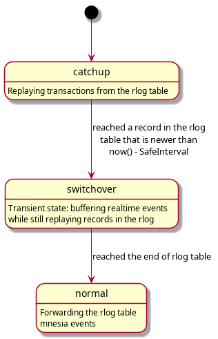
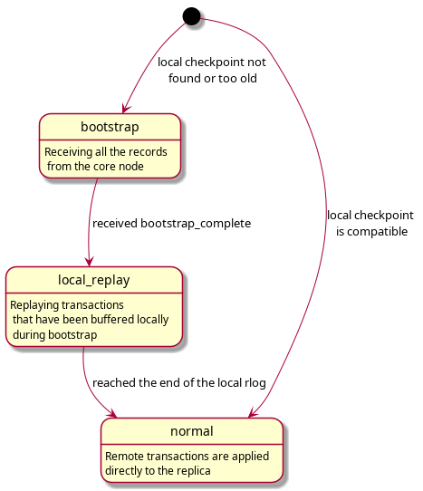
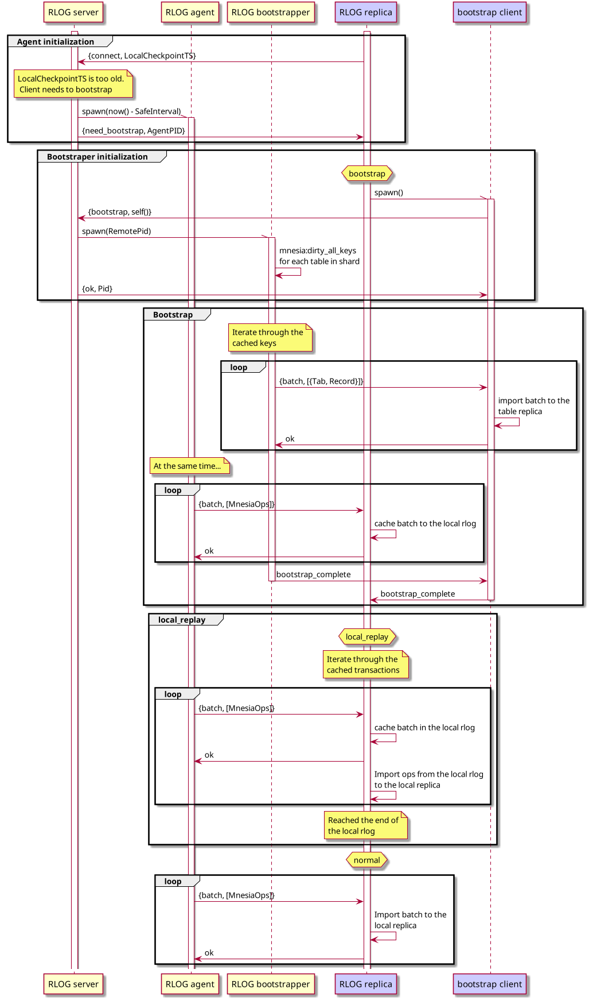

# Async Mnesia transaction replication in EMQ X 5.0

## Change log

* 2021-02-21: @zmstone Add more details
* 2021-03-01: @k32 Minor fixes
* 2021-03-05: @k32 Add more test scenarios and elaborate on the push model.
* 2021-03-11: @k32 Elaborate transaction key generation
* 2021-03-11: @k32 Add MSC diagrams for the bootstrap process

## Abstract

Escape from Erlang distribution mesh network, embrace `gen_rpc`.

## Motivation

The current replication (Mnesia) is based on full-mesh Erlang distribution which
does not scale well and has the risk of split-brain.

## Design

### Log-based replication for Mnesia

Log-based replication is the most commonly use approach in distributed
databases.

Typically when strong consistency is required, database operations or
transactions will have to be serialized by an elected leader which means all
nodes will have to delegate the operations through the leader.
The drawback of this approach is that the leader will easily become a bottleneck
when the cluster size grows.

For key-value stores, one way to solve it is to shard the database, e.g. Riak
and Cassandra, nodes form a hash ring, and only manage keys hashed to their
ranges. The DB entrypoint may also not have to be the leader, or there is simply
no leader at all, as soon as this happens, the consistency is no longer 'strong'
and there is a need to resolve conflicts. e.g. when two clients try to write the
same key concurrently and hitting two different nodes in the cluster which do
not sync with each other.

If the value is a primitive value set operation, typically last-write-wins is
good enough to resolve conflicts. If the writes update a small part of an
object, CRDT is for the rescue.

While we there is still a lack of full investigation on how much of the data
in EMQ X requires CRDT to get away from ACID transactions, below two types
of data seem to be of simple enough schema for last-write-wins.

* Routing tables `emqx_route`, `emqx_trie` and `emqx_trie_node`.
* Global channel registry table `emqx_channel_registry`.

After all, we use Mnesia dirty APIs to write some of the tables.

### Async-replication of Mnesia changes

TODO: check if dirty operations in transaction triggers activity logging

* Log Mnesia changes in the Mnesia cluster

A pseudo implementation of the transaction layer:

```
transaction(Fun, Args) ->
  Fun2 = fun() ->
    ok = Fun(Args),
    Changes = get_mnesia_activity(),
    Key = generate_key(erlang:timestamp(), node()),
    %% Note: Real code should avoid traversing Ops list multiple times:
    [ok = write_ops_to_another_table(Shard, Key, find_ops_for_shard(Ops, Shard)) || Shard <- shards()],
    ok
  end,
  {atomic, ok} = mnesia:transaction(Fun2)
end.
```

Where `Changes` is essentially a list of table operations like:

```
[ {{TableName, Key}, Record, write},
  {{TableName, Key}, Record, delete}
]
```

Changes are pushed to the replicant nodes over `gen_rpc`.
Replicant nodes issue a `watch` call to one of the core nodes.
The core node creates an agent process that issues `gen_rpc` calls to the replicant nodes using data about transactions that were recorded to the rlog.
Once the replication is close to the end of the rlog, the agent process subscribes to the realtime stream of mnesia events for the rlog table, and starts feeding the replicant with realtime stream of OPs.
The time threshold to identify 'close to the end of rlog' should be configurable, and realtime stream should start after (with maybe a bit overlapping) the agent reaches the last historical event.

Note that `generate_key` function in the above pseudocode can affect the overall design of the system in a rather fundamental way, so let's consider some alternatives.

#### Alternative 1: using monotonic timestamp + node id for the key

This kind of key guarantees uniqueness, but not ordering.
It can be used to prevent lock conflicts while writing to the rlog table, but it MUST NOT be used to establish the order of events.
Consider the following situation: there are two core nodes `N1` and `N2`, and a replicant node `N3`.
Let's use `N1`'s clock as the reference.
Suppose `N2`'s clock drift is `Dt > 0`.
Consider the following timeline of events:

1. At `T1`, `N2` commits a transaction that sets value of key `K` to `V1`, with the transaction key `{T1 + Dt, N2}`
1. At `T2`, `N1` commits another transaction that sets value of `K` to `V2`, with the transaction key `{T2, N1}`.
   Suppose `T2 - T1 < Dt`.
1. `N3` replays the records in the rlog table, and it first replays the transaction `{T2, N1}`, then `{T1 + Dt, N2}`.
   This leads to inconsistency: value of `K` on the core nodes equals `V2`, but on the replicant nodes it equals `V1`.

Therefore traversing the rlog table in the natural key order can lead to inconsistencies and must not be used.
The rlog table must be used for mnesia events only, and the actual contents of this table can be discarded.
In order to keep the historical transactions used to bootstrap the replicant, a separate storage is needed.
It could be a disk log that contains the rlog table events.
(TODO: How to deal with the gaps in the transaction log while the core node is down?)

#### Alternative 2: using a globally (or partially) ordered transaction key

A naive implementation of the global ordering key can be the following: there is a global server generating transaction keys.
The keys look like this: `{GenerationId, Counter}`.
For each shard, there is one core node that runs such server.
This node is elected using a textbook distributed consensus algorithm.
Every time the shard key server restarts, `GenerationId` counter increments.
`Counter` is an integer that is incremented every time anyone talks to the server, and resets to 0 when the server restarts.

The obvious downside of this naive implementation is the additional latency added to the transaction.
It's an open question whether or not this additional latency will hurt the throughput of the database in a significant way.

The benefit of this solution is that it allows to use the contents of the `rlog` table in a meaningful way.

### Actors

#### RLOG Server

RLOG server is a `gen_server` process that runs on the core node.
It is responsible for the initial communication with the RLOG replica processes, and spawning RLOG agent and RLOG bootstrapper processes.

#### RLOG Agent

RLOG agent is a `gen_statem` process that runs on the core node.
This processes' lifetime is tied to the lifetime of the remote RLOG replica process.
It is responsible for pushing the transaction ops from the core node to the replicant node.
The agent operates in two modes: `catchup` where it reads transactions from the rlog, and `normal` where it forwards realtime mnesia events.
There should be a third transient state called `switchover` where the agent subscribes to the mnesia events, while still consuming from the rlog.
This is to ensure overlap between the stored transactions and the events.



#### RLOG Replica

RLOG replica is a `gen_statem` process that runs on the replicant node.
It spawns during the node startup under the `rlog` supervisor, and is restarted indefinitely.
It talks to the RLOG server in its `init` callback, and establishes connection to the remote RLOG agent process.
In some cases it also creates a bootstrap client process and manages it.



Full process of shard replication:



#### RLOG bootstrapper (client/server)

RLOG bootstrapper is a temporary `gen_server` process that runs on both core and replicant nodes during replica initialization.
RLOG bootstrapper server runs `mnesia:dirty_all_keys` operation on the tables within the shard, and then iterates through the cached keys.
For each table and key pair it performs `mnesia:dirty_read` operation and caches the result.
If the value for the key is missing, such record is ignored.
Records are sent to the remote bootstrapper client process in batches.
Bootstrapper client applies batches to the local table replica using dirty operations.

### Bootstrapping Empty Nodes

The transaction logs should have a limited retention, so it is impossible to keep all the changes from the very beginning.

An empty node will have to fetch all the records from transaction log before applying the real-time change logs.

Bootstrapping can be done using dirty operations.
Transaction log has an interesting property: replaying it can heal a partially corrupted replica.
Transaction log replay can fix missing or reordered updates and deletes, as long as the replica has been consistent prior to the first replayed transaction.
This healing property of the TLOG can be used to bootstrap the replica using only dirty operations. (TODO: prove it)
One downside of this approach is that the replica contains subtle inconsistencies during the replay, and cannot be used until the replay process finishes.
It should be mandatory to shutdown business applications while bootstrap and syncing are going on.

### Zombie fencing in push model

In push model, a replicant node should make sure *not* to ingest transaction pushes from a stale core node which may have a zombie agent lingering around.
i.e. A replicant node should 'remember' which node it is watching, and upon receiving transactions from an unknown node,
it should reply with a rejection error message for the push calls.

With this implementation, there should not be a need for the core nodes to coordinate with each other.

### Preventing infinite bootstrap / catchup loop

There is a problem of catchup never completing, when bootstrap takes longer than the rlog retention time.
In order to work around this problem the replicant node shall start consuming transactions from the rlog in parallel with bootstrapping.

## Configuration Changes

Two new configuration needs to be added to `emqx.conf`:

1. `node_role`: enum [`core`, `replicant`]
2. `core_nodes`: a list of core nodes for a `replicant` node to 'watch'
   and from which transaction logs are fetched.

## Backwards Compatibility

A `replicant` node should never originate data `write`s and `delete`s.
Due to the fact that the nodes are still all clustered using erlang
distribution. So some of the `rpc`s, (such cluster_call) should not be made
towards the replicant nodes if they are intended for writes.

## Document Changes

1. New clustering setup guide
2. Update configuration doc for new config entries

## Testing Suggestions

1. Regression: clustering test in github actions.
1. Functionality: generate data operations (write and delete),
   apply operations and compare data integrity between core and replicant nodes
1. Performance: benchmark throughput and latency
1. Regression: test clock skews.

   1. Create a cluster of two core nodes (A and B) and a replicant node C.
   1. Set time to the future on one of the core nodes, say A
   1. Restart the replicant node, make sure A node detects that first and removes the routes to C
   1. Immediately connect some clients to the replicant node
   1. Check that the replicant node didn't lose its own routes after replaying the transactions from the rlog

## Declined Alternatives

* `riak_core` was the original proposal, it's declined because the change is
  considered too radical for the next release. We may re-visit it in the future.

* Bootstrapping replicant nodes using mnesia checkpoints is the easiest option, that guarantees consistent results.
  Mnesia checkpoint is a standard feature that is used, for example, to perform backups.
  Core node can activate a local checkpoint containing all the tables needed for the shard, and then iterate through it during bootstrap process.
  Records from the mnesia checkpoint can be sent in batches using the same protocol as the online replication.

  This solution has downsides, though:

  + Checkpoints take non-trivial amount of resources and may slow down Mnesia: in order to make the checkpoint consistent, mnesia spawns a retainer process and installs a hook before the transaction commits.
    This hook forwards values of the records to the retainer process, before they are overwritten.
    Retainer process saves the values of the old records in a separate table.
    Given that the snapshot is going to be updated with all the recent transactions as soon as bootstrapping completes, this is excessive.

  + Checkpoint API in mnesia is designed in imperative style, and lifetime management of the checkpoints can be nontrivial, considering that core nodes can restart, replicant nodes can reconnect, and so on.

* Pull-based model transaction replication model, where agent processes don't subscribe to mnesia events, but replicant nodes periodically poll for new records in the transaction log on the core nodes.
