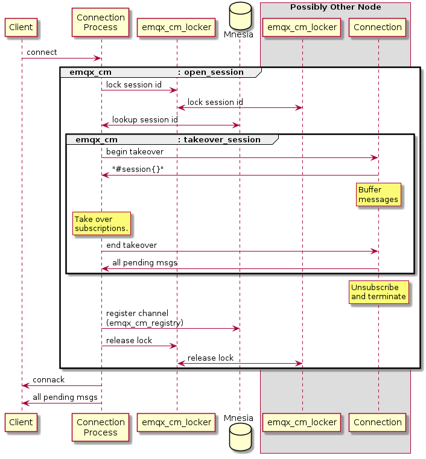
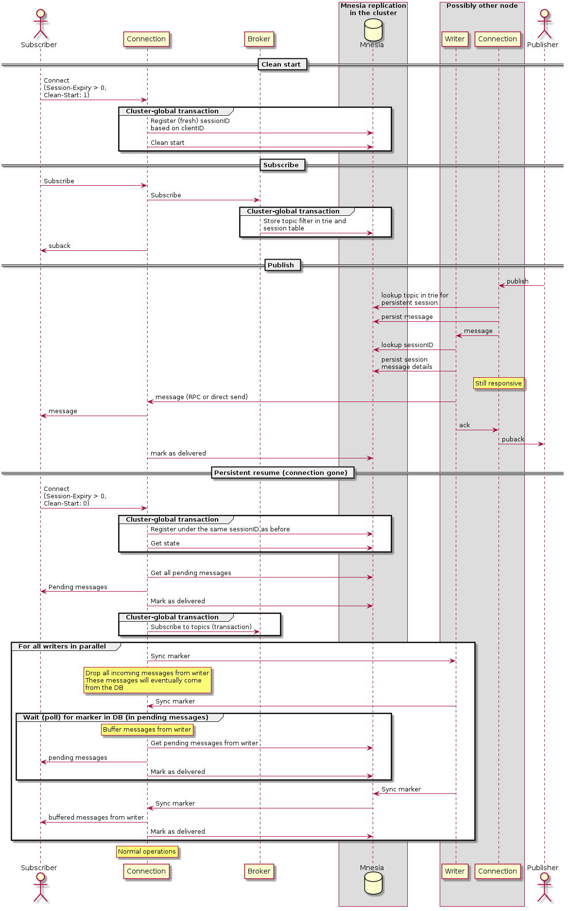
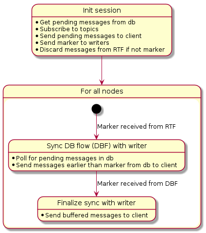

# Persistent sessions

## Change log

* 2021-06-01: @gorillainduction Initial draft
* 2021-06-28: @gorillainduction Updates after workshop
  * Add rejected proposal using standby processes
  * Add rejected proposal using restarting processes without message
    storing.
  * Add technical notes on the chosen alternative.
* 2021-08-18 Expand on syncing of messages to persistent sessions
* 2021-08-24 Expand on impact on the system
## Abstract

Persistent sessions is today relying on that there is a process alive
to collect all delivered messages. The queue of undelivered messages
to the session is stored in memory in the context of this process.

We propose a way of persisting sessions and messages so that they
survive a node restart.

## Motivation

A cluster of brokers should be able to maintain persistent sessions
even if the node the session last was seen on goes away or is
restarted.

## Design

The foundation of a persistent session is setting the
`'Session-Expiry-Interval'`.

* The Client and Server MUST NOT discard the Session State while the
  Network Connection is open `[MQTT-4.1.0-1]`.
* The Server MUST discard the Session State when the Network
  Connection is closed and the Session Expiry Interval has passed
  `[MQTT-4.1.0-2]`.

When connecting with a new client, using the same session id as an
active session will eiter take over the session or create a new
session with the same name.

* If a CONNECT packet is received with `Clean Start` is set to 1, the
  Client and Server MUST discard any existing Session and start a new
  Session. `[MQTT-3.1.2-4]`
* If a CONNECT packet is received with `Clean Start` set to 0 and
  there is a Session associated with the Client Identifier, the Server
  MUST resume communications with the Client based on state from the
  existing Session. `[MQTT-3.1.2-5]`

### Current implementation

In the current implementation, this is handled by keeping the
connection process alive even after a disconnect until the session
expiry interval has passed.

When a new connection with a given client id is established:
* A session is opened through `emqx_cm` (channel manager).
* The session id is locked through `emqx_cm_locker`.
* The `emqx_cm_registry` is searched for an active session.

For non-persistent sessions (i.e., `Clean Start` is set to 1) the
handling is straightforward. For persistent sessions (i.e., `Clean
Start` is set to 0) the session state needs to be taken over.

1. The active session is told to pause its handling of messages. This
   entails buffering any new messages that arrive (through a
   `gen_server:call`).
1. The active session confirms that it is on hold and sends the
   session state to the new process (i.e., the `#session{}`).
1. The new process inherits the session state.
1. The session state contains information about its active
   subscriptions, which the new process can use to subscribe to the
   same topics.
1. The new process tells the old process to shut down (through a
   `gen_server:call`).
1. The new process confirms that it is shutting down and sends any new
   messages it got while being on hold.
1. The new process registers itself as the new process for the session
   id through `emqx_cm_registry`. This data is stored in Mnesia (in a
   `ram_copies` table)
1. The new process releases the lock on the session id.
1. The new process sends an `CONNACK` to the client with the flag
   `Session Present` set to 1, indicating that the broker had knowledge
   of the session and that it was taken over.
1. Any pending messages are delivered to the client.

### Problems with the current implementation

The current implementation works fine as long as the old connection
process is still alive when the new connection to the same client id
is established. The process could have died because of a bug or, more
prominently, the node it resided on is restarted.

The current implementation relies on that there is an active process
acting as the subscriber for the session, and the session state is
only stored in the memory of this process.

### Alternative for implementation

There are two major parts of the problem at hand:
1. The session state (e.g., subscriptions) needs to be preserved.
1. All messages should be delivered even if the connection is down.

The session state can be handled by storing the session state in the
database so that it can be resumed even if the old connection process
dies.

Handling messages in subscriptions in the absence of an active process
is a larger challange.

#### Persistent session storage using database
The relevant information about the session (e.g., `#session{}`) can be
stored on update by the connection process as well as any undelivered
messages. A new database table would store the session. The initial
version would probably be stored in a disk-based Mnesia table, but
there could probably be pluggable backends for this.

When a node goes down, some new component would restart sessions that
were lost but still were not due for expiration. Some care would need to
be taken to not lose messages that were sent during the time when no
session process existed.

Pros:
* Relatively stable information in the DB instead of keeping the
  information in volatile memory (i.e., process memory).
* Information survives node restarts.

Cons:
* It is somewhat hard to bridge the gap of messages to a subscription
  while the session is unavailable.

#### Store subscribed messages on publish

The safest way of preserving messages for persistent sessions is to
store messages on publish. The messages can still take the same path
as today (i.e., as messages to the broker, and then sent to the
connection process), but for persistent sessions the messages can also
be stored in the database.

When the message is delivered by a connection process, it can be
marked in the database as being delivered, allowing a garbage
collection process to delete the message. On resuming a session, the
database table can be used to ensure that all messages are delivered.

To ensure the QoS the messages should be uniquely identifiable. The
key should also be sortable by publisher, so a possible key would
include the publishing pid and the publish timestamp.

*NOTE:* The (internal) message id already fullfills these requirements
as it consists of the binary `<< TS:64, (NodeID + Pid):48, SeqNo:16>>`
which is guaranteed to preserve the order of messages from the same
publisher/connection.

To avoid bloating the db with undelivered messages, the actual message
can be stored using the messageID. The suscribers can then be
references to the message. The messages can be garbage collected by
traversing the root set of message references.

This solution could come with different storage backends. One could
imagine storing the messages in an external storage (e.g., MySQL) or
use mnesia either as ram or disc persistence. This should be
configurable, probably even based on zones. In this way, the node
administrator can make tradeoffs based on the importance of sessions.

Pros:
* The safest alternative for subscriptions
* A clean configurable solution for different reliability levels.
* Session takeovers can probably use the same mechanism, making it
simpler.

Cons:
* More storage needs.
* Slighly impacts delivery times.

## Technical notes

### High level description
The major alternatives for persisting messages on publish for
persistent sessions are:
* Persist all messages on publish and find out later which ones are
  needed.
* Persist only the messages that are needed for a persistent session
  on publish, and find out for which sessions later.
* Persist only the messages that are needed, alongside the information
  about which session they belong to.

Since we are dealing with a distributed environment, we need to
address the delta time of information spread, and we need to limit the
stored information.

We propose to spread knowledge about subscriptions for persistent
sessions in the same manner as the ordinary routing. Either by
piggy-backing on the same data structures as today, or by introducing
a parallel set of data structures for persistent sessions.

Subscriptions are today handled with a global lock or a transaction to
ensure information spread throughout the cluster. The content of the
transaction is the topic filter and which node has further
information. The routing is staged into

1. Lookup the topic in a trie to find relevant subscribe topic filters.
1. Lookup the topic filter in a database table to find which node the
   subscriber is on.
1. Send the message to the relevant nodes, where a local lookup finds
   the pids.

We propose using a trie to store the global information about which
wildcard topic filters that are subscribed by a persistent session. In
addition, a global mapping from topic filter (including non-wildcards)
to sessionID should be kept for direct lookup. This can be done either
in a separate trie and table, or by extending the content of the
current tables.

We propose a database backend for storing the actual messages, and a
mapping between sessionID and a reference to the message (i.e.,
messageID) for retrieval of messages for a persistent session. The
message store could be external to save space on the node.

We propose that the messages from the database backend only should be
used when resuming a persistent session, i.e., the messages to a
persistent session that has an online connection should be delivered
in the normal way.

We can accept a longer delay when connecting a persistent session, so
the database backend can be outside the node. We can also accept the
extra latency on publishing, but the connection process needs to be
responsive during this latency. Therefore the connection process can
delegate to another process to persist the published message, but no
publish acknowledgement can be given until the message is
persisted.

On resuming a session, the existing takeover proceedure should be used
if it is possible (i.e., if there is a running connection process),
but otherwise fall back to retrieving the last known state from the
local db and request any missed messages from the external db using
the message markers.

### Dataflows for persistent sessions

### ClientID and SessionID

In the external client API a persistent session is called `clientID`,
but inside the system `clientID` and `sessionID` is currently used
interchangably. We propose to introduce a difference between the two
terms.

* `clientID` - The external name for a session that can be persistent
  , used in communication with clients.
* `sessionID` - The name for a persistent session externally described
  by `clientID`.

Whenever a client requests a clean session, a fresh sessionID can be
constructed, containing the original clientID (or a hash thereof) to
find if a sessionID belongs to a certain clientID.

Since a clean start should discard the old session, we want to prevent
messages routed for any old session with the same clientID to reach
the client. Subscriptions should be made using the sessionID rather
than the clientID to cut off the flow of messages to the new session.

### Database model

Persistent sessions can be implemented using the following tables

* Session state
* Session routing trie
* Session subscriptions
* Session messages
* Messages

The session state is represented by the `#session{}` record, keyed by
the `clientID`, and containing the current `sessionID`. It contains
the current subscriptions, in-flight messages (i.e., messages
delivered but not acked), some queued messages etc.

The session routing trie and the session substriptions tables is
similar to the normal routing trie, but it contains only persistent
sessions, and instead of the node/pid of the connection process, it
contains the `sessionID`.

The session messages table is keyed by a combination of the
`sessionID`, the `messageID` (which is sortable by time by
construction), and a new flag marking the entry as `DELIVERED` or
`UNDELIVERED`. Note that the flag is part of the key. This will make
messages eventually having two entries, after which both entries can
be removed by a garbage collector. This model is chosen to avoid
database transactions to flip the flag once the message is delivered.

The session messages table can also contain an entry to mark a
`sessionID` as abandoned by a clean start. This information can then
tell the garbage collection to discard all messages for this
`sessionID` (i.e., even the undelivered ones).

The messages table is the store for messages, keyed by the `messageID`
to avoid duplication of the message payload.

### Message routing to persistent sessions

When a message is received from the publishing client, the route is
looked up in mnesia. If the receiver is a persistent session, the
message is persisted to the DB.

In order to ensure message delivery without duplication or gaps, the
message is sent to a writer process. This is important only on
resuming a persistent session from the DB state, but since we can't
tell when this would be happening, the serialization through the
writer needs to happen always.

The writer is responsible for persisting the delivery details to the
session messages table, and then for sending the message in the normal
way, i.e., either through a rpc to the remote node or by erlang
message send if the receiver is on the same node.

When the subscriber receives the message, it delivers it and marks it
as delivered in the DB table.

### Writer processes

The serialization of published messages to persistent sessions is
needed to ensure delivery of messages without gaps or duplications (as
described above). To ensure this serialization writer processes are
introduced. The writers can be in a pool as long as the same session
is always picking the same writer. This can be solved by hashing on
the sessionID.

Since the serialization is only needed while a persistent session is
initializing, the writer could only be engaged during this time. The
sync marker sent from the initializing process can engage the
serialization, and another marker could end it and revert to ordinary
flow. *TODO: Investigate this train of thought*

### Resuming a persistent session from DB

Resuming a session from a live connection (takeover) is not affected
by the new implementation apart from persisting the state once the
session is resumed. Resuming a session from the DB state if the
connection is gone is a bit more involved.

The connection process is registered under the same sessionID as
before since this is not a clean start. The state is retrieved from
the DB. This happens in the context of a cluster-global transaction.

All pending messages are fetched from the DB, but we cannot be sure
that these are all the messages that we need to deliver.

After this, all the sessions' subscriptions are resubscribed in a
cluster-global transation. Once this is done a sync message is sent to
the relevant writers on all nodes. The writers will send the marker in
response through both the routing protocol and persist the marker to
the database.

The session process drops all messages from a writer until the marker
appears. When it has received the marker, it starts buffering all
messages from the writer. It polls the database for pending messages
until the marker appears in the result. All messages before the marker
in the database are sent to the client, and all messages in the DB
after the marker are discarded since they should be among the buffered
messages.

In the final stage of initialization, the buffered messages are
delivered. When this procedure is done for all writers, the session
goes into normal operation mode.

### Garbage collection of persistent data

To limit the data growth of the system garbage collection should be
implemented.

* Any session message marked as both `UNDELIVERED` and `DELIVERED` can
  be deleted.
* All session messages for a session marked with clean start can be
  deleted. The same goes for expired sessions.
* Session state for a session abandoned by a clean start can be
  deleted. The same goes for expired sessions.
* Messages with no references from the session message table can be
  deleted.

Only the last garbage collection is problematic to implement, and it
also concerns the table that is likely to grow the most.

## Impact on the system

In the current implementation, the system is not following mqtt
standard with respect to persistent sessions if a node goes down while
a persistent session is connected to it. Any knowledge of this
persistent session is lost. The suggested solution will close this
gap, but it comes at a price.

#### Increased storage
The storage of a node will increase with the new tables. This also
means more database replication between nodes. The described solution
does not incur more cluster-global transactions than today, but the
amount of data in them will increase.

#### Increased work for publishers
Since connection processes are now tasked with persisting data on
publish, either in their own context or by sending data to writer
processes, the amount of work will increase in the presence of
persistent sessions.

#### Increased node tasks
The amount of work for the nodes will increase by adding garbage
collection and writer processes.

#### Increased node communication
Apart from increased database replication, a new synchronization point
is added between an initializing session process and remote writers.

#### Increased work for persistent sessions
The start-up time for persistent sessions will increase because of
more complicated initialization work. Apart from that, it also needs
to persist its state whenever it changes.

## Configuration Changes

> This section should list all the changes to the configuration files
> (if any).

## Backwards Compatibility

> This sections should shows how to make the feature is backwards compatible.
> If it can not be compatible with the previous emqx versions, explain how do you
> propose to deal with the incompatibilities.

## Document Changes

> If there is any document change, give a brief description of it here.

## Testing Suggestions

> The final implementation must include unit test or common test code. If some
> more tests such as integration test or benchmarking test that need to be done
> manually, list them here.

## Declined Alternatives

### Declined: Semi-persistent storage in ram

When a connection with 'Session-Expiry-Interval' is started at one
node corresponding processes could be started at all (or some) other
nodes, without a connection process. This would mimic the current
behavior and require some interaction between the different session
processes. As long as one node would remain up, the session would be
persisted.

Pros:
* Relatively small changes to the current approach.
* Easy to ensure subscriptions keeps all messages.
* Can probably make the current split brain of sessions situation
  better on netsplits.

Cons
* Requires some coordination from the "master" process to the replicants.
* Requires more resources since all persistent sessions are replicated
  troughout the cluster.
* If the whole cluster restarts, information is lost.

#### Major rejection reasons

Keeping the standby process up-to-date with the connection process
would require a lot of interaction between the processes which means a
lot of node traffic. The behavior of getting messages from the broker
is relatively straightforward, but the changes in state because of
messages messages (e.g., acknowledgements) between the connection
process and the client would require a fast information exchange
between the standby process and the connection process.

### Declined: Monitor connections and start placeholder.

All connections are today monitored by the node local
`emqx_cm_registry` process. When a connection process dies, the
process state is cleaned up (e.g., subscriptions are cancelled).

Instead, a placeholder process can be started. This process would
inherit the subscriptions from the connection process, and would
register itself as the governing process for the session. When a new
connection is established, the takeover protocol would target this
placeholder process, instead of the connection process.

To survive a node down, the monitoring needs to be extended to all
nodes, i.e., the monitoring cannot be limited to the local node. The
local registry servers also needs a way of deciding which node should
start the placeholder process.

The placeholder process would need to store undelivered messages in
the session state. This could either be permanent (e.g., on a disk db
table), or transiently in ram. If the storage is persistent, the
object runs the risk of getting pretty large if the absence of a
connection is long.

Summary:
* Process state is kept in DB.
* New placeholder process replaces the connection process on
  termination.
* Inter-node monitoring of connection processes is added.
* New protocol needed for deciding where the placeholder is started.

Pros:
* Relatively small changes to the current approach.
* Does not require much more resources.

Cons:
* A small time gap where subscribed messages would be lost while the
  placeholder is started.
* Does not survive cluster restart unless session state is persisted
  on disk.

#### Major rejection reasons

This approach has an inherit problem with losing messages during the
restart. There is no way around that problem, so we should not invest
in it.
