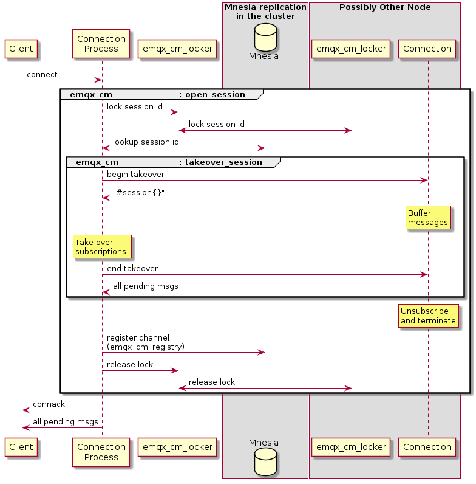

# Persistent sessions

## Change log

* 2021-XX-XX: @gorillainduction Initial draft

## Abstract

Persistent sessions is today relying on that there is a process alive
to collect all delivered messages. The queue of undelivered messages
to the session is stored in memory in the context of this process.

We propose a way of persisting sessions and messages so that they
survive a node restart.

## Motivation

A cluster of brokers should be able to maintain persistent sessions
even if the node the session last was seen on goes away or is
restarted.

## Design

The foundation of a persistent session is setting the
`'Session-Expiry-Interval'`.

* The Client and Server MUST NOT discard the Session State while the
  Network Connection is open `[MQTT-4.1.0-1]`.
* The Server MUST discard the Session State when the Network
  Connection is closed and the Session Expiry Interval has passed
  `[MQTT-4.1.0-2]`.

When connecting with a new client, using the same session id as an
active session will eiter take over the session or create a new
session with the same name.

* If a CONNECT packet is received with `Clean Start` is set to 1, the
  Client and Server MUST discard any existing Session and start a new
  Session. `[MQTT-3.1.2-4]`
* If a CONNECT packet is received with `Clean Start` set to 0 and
  there is a Session associated with the Client Identifier, the Server
  MUST resume communications with the Client based on state from the
  existing Session. `[MQTT-3.1.2-5]`

### Current implementation

In the current implementation, this is handled by keeping the
connection process alive even after a disconnect until the session
expiry interval has passed.

When a new connection with a given client id is established:
* A session is opened through `emqx_cm` (channel manager).
* The session id is locked through `emqx_cm_locker`.
* The `emqx_cm_registry` is searched for an active session.

For non-persistent sessions (i.e., `Clean Start` is set to 1) the
handling is straightforward. For persistent sessions (i.e., `Clean
Start` is set to 0) the session state needs to be taken over.

1. The active session is told to pause its handling of messages. This
   entails buffering any new messages that arrive (through a
   `gen_server:call`).
1. The active session confirms that it is on hold and sends the
   session state to the new process (i.e., the `#session{}`).
1. The new process inherits the session state.
1. The session state contains information about its active
   subscriptions, which the new process can use to subscribe to the
   same topics.
1. The new process tells the old process to shut down (through a
   `gen_server:call`).
1. The new process confirms that it is shutting down and sends any new
   messages it got while being on hold.
1. The new process registers itself as the new process for the session
   id through `emqx_cm_registry`. This data is stored in Mnesia (in a
   `ram_copies` table)
1. The new process releases the lock on the session id.
1. The new process sends an `CONNACK` to the client with the flag
   `Session Present` set to 1, indicating that the broker had knowledge
   of the session and that it was taken over.
1. Any pending messages are delivered to the client.

### Problems with the current implementation

The current implementation works fine as long as the old connection
process is still alive when the new connection to the same client id
is established. The process could have died because of a bug or, more
prominently, the node is resided on is restarted.

The current implementation relies on that there is an active process
acting as the subscriber for the session, and the session state is
only stored in the memory of this process.

### Alternative for implementation

There are two major parts of the problem at hand:
1. The session state (e.g., subscriptions) needs to be preserved.
1. All messages should be delivered even if the connection is down.

The session state can be handled by storing the session state in the
database so that it can be resumed even if the old connection process
dies.

Handling messages in subscriptions in the absence of an active process
is a larger challange.

#### Persistent session storage using database
The relevant information about the session (e.g., `#session{}`) can be
stored on update by the connection process as well as any undelivered
messages. A new database table would store the session. The initial
version would probably be stored in a disk-based Mnesia table, but
there could probably be pluggable backends for this.

When a node goes down, some new component would restart sessions that
was lost but still was not due for expiration. Some care would need to
be taken to not lose messages that were sent during the time when no
session process existed.

Pros:
* Relatively stable information in the DB instead of keeping the
  information in volatile memory (i.e., process memory).
* Information survives node restarts.

Cons:
* It is somewhat hard to bridge the gap of messages to a subscription
  while the session is unavailable.

#### Alternative: Monitor connections and start placeholder.

All connections are today monitored by the node local
`emqx_cm_registry` process. When a connection process dies, the
process state is cleaned up (e.g., subscriptions are cancelled).

Instead, a placeholder process can be started. This process would
inherit the subscriptions from the connection process, and would
register itself as the governing process for the session. When a new
connection is established, the takeover protocol would target this
placeholder process, instead of the connection process.

To survive a node down, the monitoring needs to be extended to all
nodes, i.e., the monitoring cannot be limited to the local node. The
local registry servers also needs a way of deciding which node should
start the placeholder process.

The placeholder process would need to store undelivered messages in
the session state. This could either be permanent (e.g., on a disk db
table), or transiently in ram. If the storage is persistent, the
object runs the risk of getting pretty large if the absence of a
connection is long.

Summary:
* Process state is kept in DB.
* New placeholder process replaces the connection process on
  termination.
* Inter-node monitoring of connection processes is added.
* New protocol needed for deciding where the placeholder is started.

Pros:
* Relatively small changes to the current approach.
* Does not require much more resources.

Cons:
* A small time gap where subscribed messages would be lost while the
  placeholder is started.
* Does not survive cluster restart unless session state is persisted
  on disk.

#### Alternative: Semi-persistent storage in ram

When a connection with 'Session-Expiry-Interval' is started at one
node corresponding processes could be started at all (or some) other
nodes, without a connection process. This would mimic the current
behavior and require some interaction between the different session
processes. As long as one node would remain up, the session would be
persisted.

Pros:
* Relatively small changes to the current approach.
* Easy to ensure subscriptions keeps all messages.
* Can probably make the current split brain of sessions situation
  better on netsplits.

Cons
* Requires some coordination from the "master" process to the replicants.
* Requires more resources since all persistent sessions are replicated
  troughout the cluster.
* If the whole cluster restarts, information is lost.

#### Alternative: Store subscribed messages on publish

The safest way of preserving messages for persistent sessions is to
store messages on publish. The messages can still take the same path
as today (i.e., as messages to the broker, and then sent to the
connection process), but for persistent sessions the messages can also
be stored in the database.

When the message is delivered by a connection process, it can be
deleted from the database, thus limiting the storage need, but keeping
the persistence of the message. On resuming a session, the database
table can be used to ensure that all messages are delivered.

To ensure the QoS the messages should be uniquely identifiable. The
key should also be sortable by publisher, so a possible key would
include the publishing pid and the publish timestamp.

To avoid bloating the db with undelivered messages, the actual message
can be stored using the message hash or something similar. The
suscribers can then be references to the message. The message then
needs to be reference counted to enable garbage collection.

A simpler solution would be to duplicate the message for each
persistent subscriber, but that would increase storage.

This solution could come with different storage backends. One could
imagine storing the messages in an external storage (e.g., MySQL) or
use mnesia either as ram or disc persistence. This should be
configurable, probably even based on zones. In this way, the node
administrator can make tradeoffs based on the importance of sessions.

Note that this solution is dependent on having another mechanism for
preserving the session state other than the subscribed messages.

Pros:
* The safest alternative for subscriptions
* A clean configurable solution for different reliability levels.
* Session takeovers can probably use the same mechanism, making it
simpler.

Cons:
* More storage needs.
* Slighly impacts delivery times.

## Configuration Changes

> This section should list all the changes to the configuration files (if any).

## Backwards Compatibility

> This sections should shows how to make the feature is backwards compatible.
> If it can not be compatible with the previous emqx versions, explain how do you
> propose to deal with the incompatibilities.

## Document Changes

> If there is any document change, give a brief description of it here.

## Testing Suggestions

> The final implementation must include unit test or common test code. If some
> more tests such as integration test or benchmarking test that need to be done
> manually, list them here.

## Declined Alternatives

> Here goes which alternatives were discussed but considered worse than the current.
> It's to help people understand how we reached the current state and also to
> prevent going through the discussion again when an old alternative is brought
> up again in the future.
