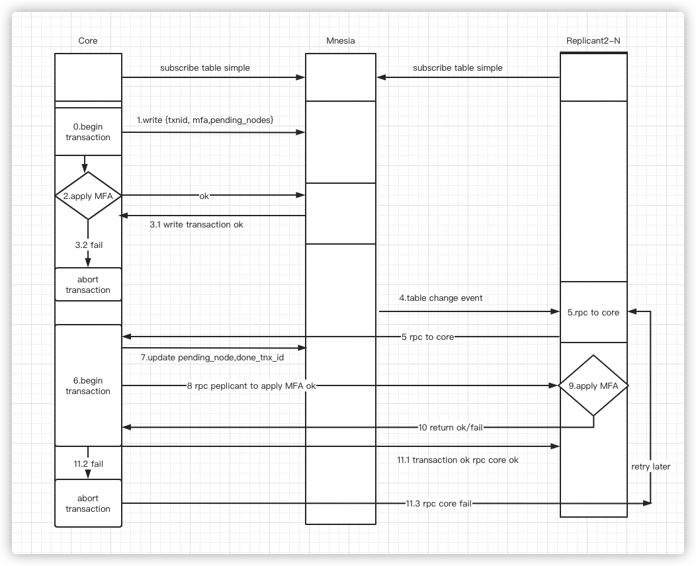

# Cluster call transaction

## Changelog

* 2021-08-11: @zhongwencool Initial draft

## Abstract

When EMQX updates the cluster resources via HTTP API,  it first updates the local node resources, and then updates all other nodes via RPC Multi Call to ensure the consistency of resources (configuration)  in the cluster.

**In order to ensure consistency, it must ensure that the updates will be be eventually applied on all nodes in the cluster**.

## Motivation

The current solution is to update the resources of the local node successfully, and then RPC calls to update the resources of other nodes synchronously.

Update resources may be lost during the RPC call.

- If there is a network disturbance during RPC, it may cause the RPC to fail.
- If a remote operation to update a resource fails, there is no retry or any other remedy, causing inconsistent configuration in the cluster.
- If multiple updates are performed concurrently, it may happen that node 1 performs updates in order 1, 2, 3, but node 2 updates in order 1, 3, 2. There is no order guarantee.
- Lack of replay. If a node is down for a while, there is a lack of history event replay to catch up with the changes happened during the down time.

## Design

This proposal uses mnesia to record the execution status of MFA, to ensure the consistency of the final resources & data in the cluster.

This proposal is not applicable to high frequency request calls, all updates are performed in strict order.

### mnesia table structure

```erlang
-record(cluster_rpc, {tnx_id :: pos_integer(), mfa :: mfa()}).
-record(cluster_tnx_id, {node :: node(), tnx_id :: intger()}).

mnesia(boot) ->
    ok = ekka_mnesia:create_table(emqx_cluster_rpc, [
        {type, ordered_set},
        {disc_copies, [node()]},
        {local_content, true},
        {record_name, activated_alarm},
        {attributes, record_info(fields, cluster_rpc)}]),
    ok = ekka_mnesia:create_table(emqx_cluster_tnx_id, [
        {type, set},
        {disc_copies, [node()]},
        {local_content, true},
        {record_name, cluster_tnx_id},
        {attributes, record_info(fields, cluster_tnx_id)}]);
```

`tnx_id` is strictly +1 incremental, all executed transactions must be executed in strict order, if there is node 1 executing transaction 1, 2, 3, but node 2 keeps failing in executing transaction 2 after executing transaction 1, it will keep retrying transaction 2 until it succeeds before executing transaction 3.

### Interaction flow



1. `emqx_cluster_trans` register on each node, subscribes to the mnesia table simple event, and is responsible for the execution of all transactions.
2. The first transaction must be executed in the `emqx_cluster_trans` process on the core node. if this transaction succeeds, the call returns success directly, if the transaction fails, the call aborts with failure.

```erlang
    Node = node(),
    case apply_self_unfinished_mfa_trans(Node) of
        {error, Reason} -> {error, Reason};
        ok ->
            Trans = fun() ->
                mnesia:write_lock_table(emqx_cluster_rpc),
                mnesia:write_lock_table(emqx_cluster_tnx_id),
                FinishId = get_finished_tnx_id(Node),
                LatestId = get_latest_tnx_id(),
                %% make sure node's local mfa all finished again.
                case apply_self_unfinished_mfa(FinishId, LatestId, Node) of
                    {error, Reason} -> mnesia:abort({error, Reason});
                    ok ->
                        TnxId = incr_tnx_id(),
                        mnesia:write(#cluster_rpc{tnx_id = TnxId, mfa = MFA}),
                        %% check new node join in but execute none transaction yet.
                        [begin
                             case mnesia:read(emqx_cluster_tnx_id, N) of
                                 [] -> mnesia:write(#cluster_tnx_id{node = N, tnx_id = TnxId - 1});
                                 _ -> ok
                             end
                         end || N <- ekka:nodelist()],
                        mnesia:write(#cluster_tnx_id{node = Node, tnx_id = TnxId}),
                        case apply_mfa(Node, MFA) of
                            ok -> ok;
                            {error, Reason} -> mnesia:abort({error, Reason})
                        end
                end
                    end,
            ekka_mnesia:transaction(?COMMON_SHARD, Trans)
    end.
```

- In order to keep the transactions in strong order, the previous uncompleted transactions should be executed in advance. The reason for not merging this behavior into the main transaction is to ensure that if the main transaction abort, don't need to abort those unfinished MFA transactions.
- Start main transation: apply unfinished MFA on local node again to ensure all pre MFA already finished in order. When other nodes are doing updates at the same time, there will be competing conditions that may create a new MFA update between the previous transactions and this one. So we must check again inside the main transaction to see if a new update is coming in.
  **Risk point**: If the previous unfinished MFA in the main transaction is executed successfully, but the latest MFA fails and leads to abort,  it will roll back the previous unfinished MFA as well, thus causing the MFA to be executed again later. So MFA must be idempotent.
- Generate the incremental `tnx_id`, alway striktly +1.

- Check if all nodes have `tnx_id`, if not, it means a new node join in, set current tnx_id as the  tnx_id of the new node.
- update the current node's tnx_id to current_id.
- Execute MFA successfully then return.
- Abort this transaction, If MFA fails.

3. All `emqx_cluster_trans` receive table change event, then execute later transaction in this process, find the latest TnxID of this node which was executed successfully, and recursively execute transactions from this ID to the newest transaction ID.

   ```erlang
   %% as same as apply_self_unfinished_mfa_trans(Node).
   handle_table_event(Node) ->
       Trans = fun() ->
           mnesia:write_lock_table(emqx_cluster_rpc),
           mnesia:write_lock_table(emqx_cluster_tnx_id),
           #cluster_tnx_id{tnx_id = LastDoneId} = mnesia:read(emqx_cluster_tnx_id, Node),
           #cluster_tnx_id{tnx_id = LatestId} = mnesia:read(emqx_cluster_tnx_id, 'latest-tnx-id'),
           CurrId = LastDoneId + 1,
           case LatestId =< CurrId of
               false -> done;
               true ->
                   #cluster_rpc{mfa = MFA} = mnesia:read(emqx_cluster_rpc, CurrId),
                   mnesia:write(#cluster_tnx_id{node = Node, tnx_id = CurrId}),
                   delete_mfa_record_if_all_node_tnx_id_greater_than_lastdone_id(),
                   case apply_mfa(Node, MFA) of
                       ok -> ok;
                       {error, Reason} -> mnesia:abort({error, Reason})
                   end
           end end,
       Res = ekka_mnesia:transaction(?COMMON_SHARD, Trans),
       case Res of
           {atomic, ok} -> handle_table_event(Node);
           {atomic, done} -> ok;
           _ -> retry_later_on_origin_node(Node)
       end.
   ```

   - Delete mfa record if all nodes tnx_id greater than LastdoneId.

   - Update tnx_id in `cluster_tnx_id` to the current tnx_id.
   - Return if execution MFA succeeds.
   - Abort this transaction if the execution of MFA fails.

If there is a failure in those transaction group, the transaction aborts and is re-executed from this failed transaction after a certain period of time.

All transaction function should be MFA, not anonymous function.

### API Design

```erlang
-spec(emqx_cluster_rpc:call(Nodes,MFA) -> {ok,TnxId}|{error,Reason} when
                          Nodes :: [node()],
                          MFA :: {module(),atom(),[term()]},                          
                          TxnId :: pos_integer()}].  
-spec(emqx_cluster_rpc:reset() -> ok.
-spec(emqx_cluster_rpc:status() -> [#{tnx_id => pos_integer(), mfa => mfa(), pending_node => [node()]}]).
```

## Configuration Changes

N/A.

## Backwards Compatibility

N/A

## Document Changes

N/A

## Testing Suggestions

The final implementation must include unit test or common test code. If some
more tests such as integration test or benchmarking test that need to be done
manually, list them here.

## Declined Alternatives

Here goes which alternatives were discussed but considered worse than the current.
It's to help people understand how we reached the current state and also to
prevent going through the discussion again when an old alternative is brought
up again in the future.

