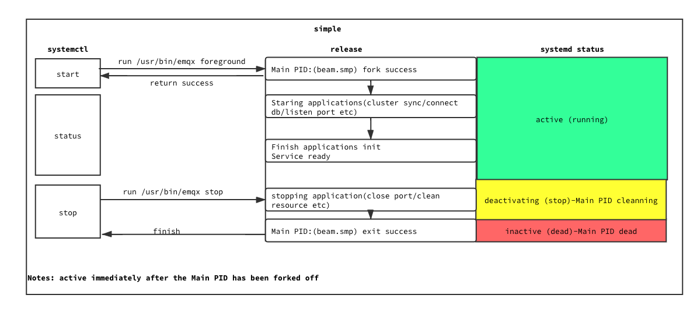
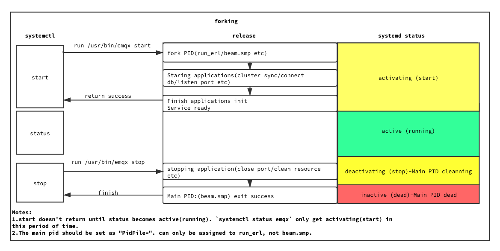

# Integration with Systemd

## Changelog

* 2021-06-09: @zhongwencool Initial draft


## Abstract

Emqx currently uses a simple systemd forking type to start emqx in demon mode. The other benefits of systemd are not fully exploited, for example, systemd does not restart all emqx processes that exit abnormally (`kill GroupChildrenPid`). Systemd  just acts as a starter.

## Motivation

The benefits of [systemd](https://github.com/systemd/systemd) include, but are not limited to:

- The ability to configure specific system parameters for service such as `LimitNOFILE`.
- The reboot interval can be configured, and restart after the machine reboots.
- Journalctl logging can be configured.
- Very stable, easy and configurable way to manage services.

This will make the node more robust and the user will see more information about the operation of the node via `systemctl status emqx`, Make `start/stop/restart` work as expected.

## Design

Systemd is built into the mainstream Linux,  flexible configuration with fine control, Read [the full configurations first](https://www.freedesktop.org/software/systemd/man/systemd.exec.html). 

#### 1. [Unit].After

Ensure emqx.service start after network and Journallog start,  syslog.target replace by journaling(explain later).

```yaml
[Unit]
Description=emqx broker
After=network.target systemd-journald
```

#### 2.[Service].Type

Launching the Erlang release will generate a set of processes, such as beam.smp inet_gethost, erl_child_setup, (run_erl, memsup, cpu_sup as option), we want **systemd monitor main PID, restart all process if main PID exit abnormally**.

[Type](https://www.freedesktop.org/software/systemd/man/systemd.service.html#Type=): `simple`, `exec`, `forking`, `oneshot`, `dbus`, `notify` or `idle`:



- `simple`:default type, also be recommend for long-running services, the service manager will consider the unit started immediately after the main service process has been forked off. when release start failed, the main PID exit abnormal, service status is inactive. This allows the service to become available very quickly(even release is not ready yet), Release must start as foreground mode to keep running,   systemd will conside service is active when release main pid been forked off, we can't tell systemd we are actually ready(active) after  batch of applications already started. 

- `exec`:is similar to `simple`,the service manager will consider the unit started immediately after the main service binary has been executed(**Don't consider fork() result**. not suitable for our case.

  

- `forking`:it is expected that the process configured with `ExecStart=` will call `fork()` as part of its start-up. The parent process is expected to exit when start-up is complete and all communication channels are set up. The child continues to run as the main service process, and **the service manager will consider the unit started when the parent process exits.** it is recommended to also use the `PIDFile=` option, so that systemd can reliably identify the main process of the service. systemd will proceed with starting follow-up units as soon as the parent process exits.

  Often, a traditional daemon only consists of one process. Therefore, if only one process is left after the original process terminates, systemd will consider that process the main process of the service. In that case, the `$MAINPID` variable will be available in `ExecReload=`, `ExecStop=`, etc.

  In case **more than one process remains, systemd will be unable to determine the main process, so it will not assume there is one. In that case, `$MAINPID` will not expand to anything.** However, if the process decides to write a traditional PID file, systemd will be able to read the main PID from there. Please set `PIDFile=` accordingly. Note that the daemon should write that file before finishing with its initialization. Otherwise, systemd might try to read the file before it exists.
  if setting emqx as forking, we must run emqx in daemon mode, and set `PidFile=/var/lib/emqx/emqx_erl_pipes/emqx@xxx.xx.xx.xxx/`, and if we don't setting it:

  ```shell
  $> systemctl status emqx
  ● emqx.service - emqx daemon
     Loaded: loaded (/usr/lib/systemd/system/emqx.service; enabled; vendor preset: disabled)
     Active: active (running) since 四 2021-06-10 10:29:15 CST; 36s ago
    Process: 17094 ExecStop=/bin/sh /usr/bin/emqx stop (code=exited, status=1/FAILURE)
    Process: 31208 ExecStart=/bin/sh /usr/bin/emqx start (code=exited, status=0/SUCCESS)
   Main PID: 31492 (run_erl)
     CGroup: /system.slice/emqx.service
             ├─31492 /usr/lib/emqx/erts-11.1.8/bin/run_erl -daemon //var/lib/emqx/emqx_erl_pipes/emqx@127.0.0.1/ /var/log/emqx exec "/usr/bin/emqx" "console"
             ├─31776 emqx -P 2097152 -Q 1048576 -e 256000 -spp true -A 4 -IOt 4 -SDio 8 -- -root /usr/lib/emqx -progname usr/bin/emqx -- -home /var/lib/emqx -- -boot /usr/lib/emqx/releases/4...
             ├─32568 erl_child_setup 1048576
             ├─32651 sh -s disksup
             ├─32652 /usr/lib/emqx/lib/os_mon-2.6.1/priv/bin/memsup
             ├─32653 /usr/lib/emqx/lib/os_mon-2.6.1/priv/bin/cpu_sup
             ├─32744 inet_gethost 4
             └─32745 inet_gethost 4
  
  6月 10 10:29:06 k8s-master systemd[1]: Starting emqx daemon...
  6月 10 10:29:15 k8s-master systemd[1]: Started emqx daemon.
  
  $> emqx pid
  31776
  ```

  The main PID is `31492(run_erl)`, not emqx pid( `31776)`.  (PS: I have encountered in the prod environment that the beam.smp process suddenly disappeared, only the run_erl process was there, maybe only pipe file exist, no time to analyze why. After reboot, it was normal again.)

  `[PIDFile=]` document says: Note that **PID files should be avoided in modern projects. Use `Type=notify` or `Type=simple` where possible**, which does not require use of PID files to determine the main process of a service and avoids needless forking.

- `oneshot`: is similar to `simple`, the service manager will consider the unit up after the main proces exits.

  ```yaml
  [Unit]
  Description=Cleanup old Foo data
  [Service]
  Type=oneshot
  ExecStart=/usr/sbin/foo-cleanup
  [Install]
  WantedBy=multi-user.target
  ```

   [a good use case is setup network environment](https://gist.github.com/bketelsen/828045a8b90cfe87d1d6#file-cloud-config-yaml-L83-L102)(`DEFAULT_IPV4=172.253.33.xx`) before etcd start.[setup-nework-environment](https://github.com/kelseyhightower/setup-network-environment). Obviously this one doesn't fit our solution.

- `dbus` and `idle` is also not an option for release.

  

- `notify`: is similar to `exec`, it is expected that the service sends a notification message via [sd_notify(3)](https://www.freedesktop.org/software/systemd/man/sd_notify.html#) or an equivalent call when it has finished starting up, In other words, we can manually tell systemd that it's available after all applications launched.  Since OTP/19 supports Unix sockets, we can integrate systemd's notify mode directly without relying on non-Erlang libraries. https://github.com/hauleth/erlang-systemd. 

In summary, `simple`, `forking`, and `notify` are suitable for us: , `simple` is the simplest and has a fast startup time, `forking` requires starting daemon mode,  add a `run_erl` as the main pid(if we consider systemd manager restart mechanism, `beam.smp` as the main pid is the best choice). `notify` is more functional and can tell systemd the status at will, also fast startup time. 

Personally, I prefer the `notify` solution, which allows the user to find out more real-time status via systemd commands.

Special Note: By default, all logs exported to `standard_io` will be placed on `/var/log/messages` when started in foreground mode, so **don't print too many debug logs on standard_io handle**.  Integrate the logs that users care by `journalctl -f` is a better choice.

#### 3.[service].User/Group

Run emqx.service as emqx user/group.

```shell
[root@k8s-master ~]# ll /proc/24220
总用量 0
dr-xr-xr-x 2 emqx emqx 0 6月  10 19:19 attr
-rw-r--r-- 1 emqx emqx 0 6月  10 19:19 autogroup
-r-------- 1 emqx emqx 0 6月  10 19:19 auxv
-r--r--r-- 1 emqx emqx 0 6月  10 19:19 cgroup
--w------- 1 emqx emqx 0 6月  10 19:19 clear_refs
-r--r--r-- 1 emqx emqx 0 6月  10 19:19 cmdline
-rw-r--r-- 1 emqx emqx 0 6月  10 19:19 comm
-rw-r--r-- 1 emqx emqx 0 6月  10 19:19 coredump_filter
-r--r--r-- 1 emqx emqx 0 6月  10 19:19 cpuset
lrwxrwxrwx 1 emqx emqx 0 6月  10 19:19 cwd -> /usr/lib/emqx
-r-------- 1 emqx emqx 0 6月  10 19:19 environ
lrwxrwxrwx 1 emqx emqx 0 6月  10 19:19 exe -> /usr/lib/emqx/erts-11.1.8/bin/run_erl
```

If user/group does not exist, it will be created automatically.

#### 4.[service].UMask

When the umask is set to `0027`, the file permissions will be set to 640. This is preferred for security reasons because this will restrict others not to read/write/execute that file/folder.

#### 5.[service].NotifyAccess

- `none`, no daemon status updates are accepted from the service processes.
-  `main`, only service updates sent from the main process of the service are accepted.
- `exec`, only service updates sent from any of the main or control processes originating from one of the `Exec*=` commands are accepted.
- `all`, all services updates from all members of the service's control group are accepted.

This option should be set to open access to the notification socket when using `Type=notify` or `WatchdogSec=.` So we should set `NotifyAccess=all`.

#### 6.[service].TimeoutStartSec

the time to wait for start-up. If a daemon service does not signal start-up completion within the configured time, the service will be considered failed and will be shut down again.  we set 10 minutes `TimeoutStartSec=600` . 

Additional, in the extreme case, the application needs to recover more than 10mins of data to start, and we want the start time to be longer, we can send  `EXTEND_TIMEOUT_USEC=120`, this may cause the start time to be extended. Repeats "`EXTEND_TIMEOUT_USEC=…`" within the interval specified until the service startup status is finished by "`READY=1`".

So 10 miniutes is  an appropriate value for this.

#### 7.[service].ProcessLimited

[All Process Properties](https://www.freedesktop.org/software/systemd/man/systemd.exec.html#Process%20Properties): `LimitCPU=`, `LimitFSIZE=`, `LimitDATA=`, `LimitSTACK=`, `LimitCORE=`, `LimitRSS=`, `LimitNOFILE=`, `LimitAS=`, `LimitNPROC=`, `LimitMEMLOCK=`, `LimitLOCKS=`, `LimitSIGPENDING=`, `LimitMSGQUEUE=`, `LimitNICE=`, `LimitRTPRIO=`, `LimitRTTIME=`:

- Set number of file descriptors by  `LimitNOFILE=1048576` to avoid too many file error. 1048576 = 2^20
- Set max locked memory (kbytes) by  `LimitMEMLOCK=infinity` . equivalent to `ulimit -l unlimited`.
- Set number of processes by `LimitNPROC=infinity`. equivalent to `ulimit -u unlimited`.
- set core file size by `LimitCORE=infinity`.equivalent to  `ulimit -c unlimited`. Make sure core file will generate when the VM crash down.

 The user can override these parameters by creating a file in `/etc/systemd/system/emqx.service.d/limits.conf`.

#### 8.[service].Restart

`Restart`: whether the service shall be restarted when the service process exits.

- `no`:the default, the service will not be restarted.

- `on-success`:it will be restarted only when the service process exits cleanly. A clean exit means:  exit code of 0 or exit statuses and signals specified in `SuccessExitStatus=`.

- `on-failure`, the service will be restarted when the process exits with a non-zero exit code,including on core dump, but excluding the four signals:`SIGHUP, SIGINT, SIGTERM, SIGPIPE`.

- `on-abnormal`, the service will be restarted when the process is terminated by a signal,including on core dump, but excluding the four signals:`SIGHUP, SIGINT, SIGTERM, SIGPIPE`.

- `on-abort`, the service will be restarted only if the service process exits due to an uncaught signal not specified as a clean exit status.

- `always`, the service will be restarted regardless of whether it exited cleanly or not.

  `on-failure` is Similar to `on-abnormal`, but `on-failure` will restart even meet `Unclean exit code`, so we choose `on-failure`.

#### 9.[service].RestartSec

`RestartSec`: the time to sleep before restarting a service. Set it 10 seconds to let the system finish its resource(such as ports) work.

#### 10.[service].Exec

- ` ExecStart=/usr/bin/emqx foreground`: emqx foreground to make main PID not exit when `Type=notify`.
- `ExecStop=/usr/bin/emqx shutdown`: emqx shutdown normal with 0 exit code.
- `WorkingDirectory=/var/lib/emqx`: emqx store scripts and data places.

#### 11.[service].SuccessExitStatus

In most cases we use `systemctl stop emqx` to stop release, but a few users may use `emqx stop` to stop it. In this case, Need to consider the exit status of `emqx stop` as a normal end signal. so we set `SuccessExitStatus=69`.

#### Finally  `emqx.service`:

```yaml
[Unit]
Description=emqx broker
After= network.target systemd-journald

[Service]
Type=notify
User=emqx
Group=emqx

# https://www.freedesktop.org/software/systemd/man/systemd.service.html

# When the umask is set to 0027, the file permissions will be set to 640. This is #
# preferred for security reasons because this will restrict others not to
# read/write/execute that file/folder.
UMask=0027

# All services updates from all members of the service's control group are accepted.
NotifyAccess=all
# If a daemon service does not signal start-up completion within the configured time,
# the service will be considered failed and will be shut down again
TimeoutStartSec=600

# To override LimitNOFILE, create the following file:
#
# /etc/systemd/system/emqx.service.d/limits.conf
#
# with the following content:
#
# [Service]
# LimitNOFILE=65536

LimitNOFILE=1048576
LimitMEMLOCK=infinity
LimitNPROC=infinity
LimitCORE=infinity

# Restart:
Restart=on-failure
RestartSec=10

WorkingDirectory=/var/lib/emqx
ExecStart=/usr/bin/emqx foreground
ExecStop=/usr/bin/emqx stop
# when exec emqx stop, conside the exit code as successExitStatus todo find out emqx stop exit code
SuccessExitStatus= 1

[Install]
WantedBy=multi-user.target
```


## Configuration Changes

It is easy to integrate journal log by [erlang-systemd's systemd_journal_h](https://github.com/hauleth/erlang-systemd#logs) .

Add journal log configurations.

```yaml
log.journald = true
log.journald.level = debug/info/notice/warning/error/critical/alert/emergency
log.journald.fields = SYSLOG_IDENTIFIER="emqx" syslog_timestamp syslog_pid priority ERL_PID=pid
```

`journalctl -f`  output:

```bash
6月 09 17:26:36 172.xx.xx.xx emqx[1024]: Starting emqx....
```


## Backwards Compatibility

NONE.

## Document Changes

**TODO**

## Testing Suggestions

**TODO**

### Declined Alternatives

Erlang build in `-heart` option.


### Refer

- [systemd](https://github.com/systemd/systemd).
- [the biggest myths about systemd](http://0pointer.de/blog/projects/the-biggest-myths.html).
- [sytemd configurations documents](https://www.freedesktop.org/software/systemd/man/systemd.exec.html).
- [Learning to love systemd](https://opensource.com/article/20/4/systemd).
- [Linux Logging with Systemd](https://www.loggly.com/ultimate-guide/linux-logging-with-systemd/).
- https://www.freedesktop.org/software/systemd/man/systemd-journald.service.html

