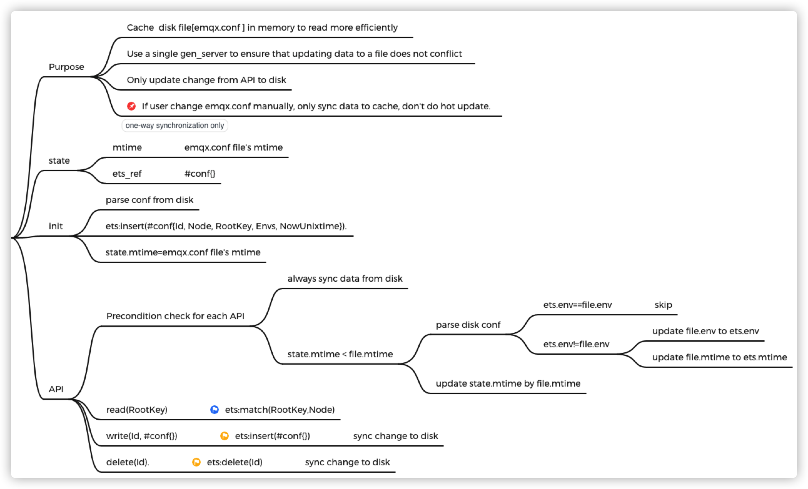
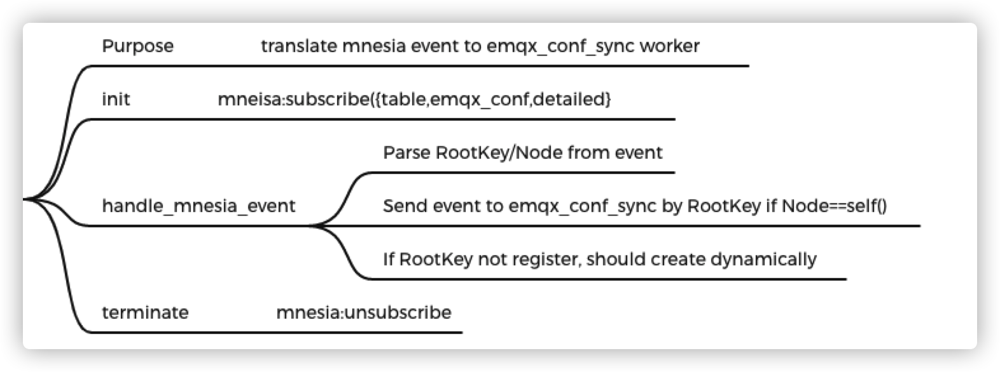
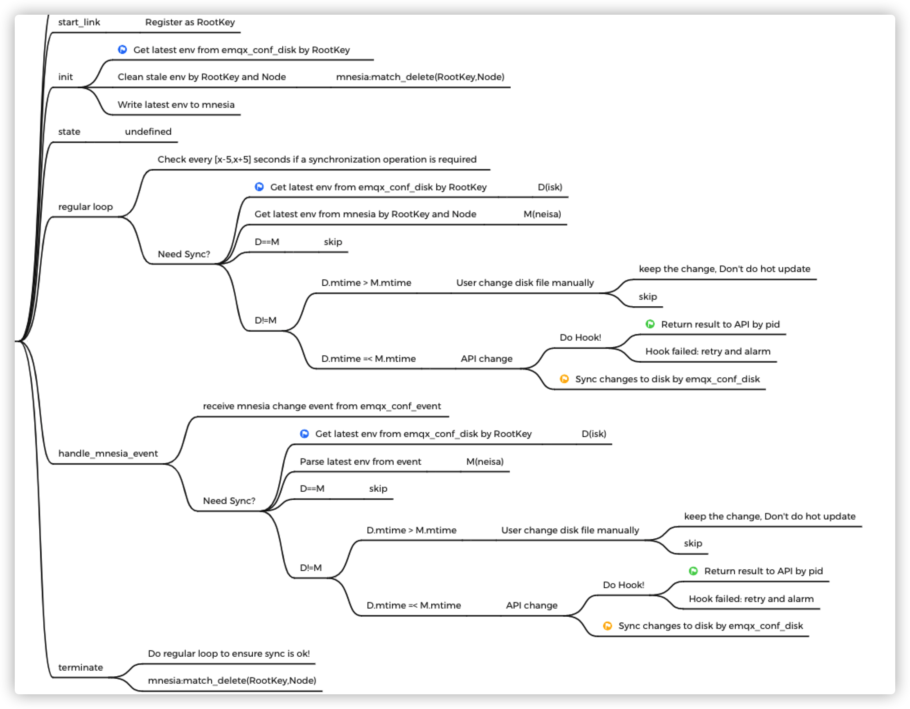

# New Config CRUD for EMQ X v5.0

## Changelog

* 2021-07-14: @zhongwencool Initial draft

## Abstract

Introduce a new application(`emqx_conf`) to manage configuration file(`emqx.conf`) updates.

## Motivation

A cluster usually have more than 3+ nodes. Managing configuration files manually is an error-prone and time-consuming task.

Provides the ability to update all configurations via the REST API while making every effort to keep configurations hot updateable.

We can consider providing an page similar to [nginxconfig.io](https://github.com/digitalocean/nginxconfig.io) to configure a performant, secure, and stable EMQX server on the official website.

## Design

- Cache the configuration items of `emqx.conf` into mnesia by Node and RootKey.
- Manipulate this table via the REST API.
- All nodes subscribe to the mnesia table event.
- Triggers a configuration change hook action when the node receives a event notification.
- Persisted changes to `emqx.conf` on disk.
- Return result to the REST API.

### Mnesia Table Structure

```erlang
-record(emqx_conf, {id, node, rootkey, env, mtime, pid}).
```

- `id`: unique key, `"emqx@127.0.0.1/zones"`.
- `node`: blong to which node, `emqx@127.0.0.1`.
- `rootkey`: the top level of the configuration item, `'zones'`.
- `env`: environment variables, `[{external，[{use_username_as_clientid,false}...].`
- `mtime`: the unix time of the configuration item change, `1625555056`.
- `pid`: the process that caused the change, used to return the result of the change to the REST API.

All Mnesia data is just cached, and the application will clear the old data and re-cache the latest data from `emqx.conf` when it starts.

### Actors

#### emqx_conf_disk

emqx_conf_disk is a `gen_server` which cache `emqx.conf` in memory to read more efficiently.
Single process to read and write disk files to avoid conflicts.



#### emqx_conf_event

`emqx_conf_event` is gen_server which subscribe mnesia table event  and translate event to `emqx_conf_sync` workers.



#### emqx_conf_sync_sup

`emqx_conf_sync_sup` is supervisor which manage  `emqx_conf_sync` workers dynamically  based on the RootKey.

Each rootkey spawns a `emqx_conf_sync` process to accept configuration change events, execute hook functions, and persist these changes to disk.

Allow users to modify the configuration file directly, but this way the configuration will not be hot loaded and will only take effect on reboot.
If the user modifies the configuration file directly and then uses the API to modify the same configuration item, the API modification will  be applied.



## Configuration Changes

This section should list all the changes to the configuration files (if any).

## Backwards Compatibility

This sections should shows how to make the feature is backwards compatible.
If it can not be compatible with the previous emqx versions, explain how do you
propose to deal with the incompatibilities.

## Document Changes

If there is any document change, give a brief description of it here.

## Testing Suggestions

The final implementation must include unit test or common test code. If some
more tests such as integration test or benchmarking test that need to be done
manually, list them here.

## Declined Alternatives

Here goes which alternatives were discussed but considered worse than the current.
It's to help people understand how we reached the current state and also to
prevent going through the discussion again when an old alternative is brought
up again in the future.


- [The full mind map can be viewed here](./0013-assets/emqx_conf_manager.xmind).
- [digitalocean nginxconfig.io](https://www.digitalocean.com/community/tools/nginx).

