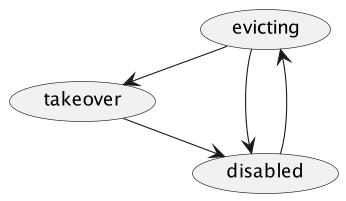

# Load rebalancing in EMQX 4.x

## Abstract

Cluster load rebalancing is the enforced process of client and session migration from a set of nodes to some other ones.
Node evacuation is a special case of rebalancing when we want to migrate all connections and sessions from
a particular node.

## Motivation

A user might want to shut down arbitrary nodes, e.g., to maintain the underlying
software or hardware. Or move connections from higher-loaded nodes to lower.

We need to minimize data loss when a node is switched off. The aim of node evacuation
is to minimize session data loss.

Since an MQTT client may choose to preserve its session between reconnects, we should
keep it, no matter whether the client is connected or not.
In EMQX 4.x, without an external database as the session storage extension (which is only available in the Enterprise edition)
the session is kept in the memory of the last node to which the client was connected.

So if a node shuts down, sessions of the clients currently or recently connected to it are lost.

Node evacuation should transfer the maximum possible amount of connections and sessions to the other nodes.

Node rebalancing should transfer a calculated (balanced among the nodes) number of connections and sessions from higher loaded nodes to other nodes.

The nodes from which connections and sessions are transferred should not receive new connections.

For evacuation, after it's completed in one node, the node can be shut down by sysadmin (but not automatically).
For rebalancing, when the cluster reaches balance, all nodes should start receive connections again.

## Concepts

### Takeover process

One of the core concepts concerning EMQX sessions is the _session takeover process_.

_Takeover_ process happens when a client with a permanent session reconnects.
During this process, the session migrates
* from the node to which the client was previously connected
* to the node used for serving the new connection.

## Design

We choose to implement node evacuation in two steps.

* Node evacuation without enforced session takeover. In this variant we
    * Reject new connections to the node being evacuated;
    * Disconnect existing node clients;
    * Fix some timeout during which we expect the disconnected clients to reconnect themselves
    to some other node and takeover their sessions.
* Node evacuation with enforced session takeover. In this variant, we additionally start takeover processes
for the sessions kept on the node. Session data is preserved on some other node even if a client does not reconnect itself
to a new node.

To implement this logic, we introduce two major components:
* _Eviction Agent_  (`emqx_eviction_agent` application);
* _Rebalance Coordinator_ (`emqx_node_rebalance` application);

_Eviction Agent_ is an entity that:
* Blocks incoming connection on its node.
* Serves as a facade for connection/session eviction operations.
* Reports blocking status via HTTP API.

The Eviction Agent is relatively passive and has no eviction logic.


_Rebalance Coordinator_ is an entity that
* Enables/Disables Eviction Agent on nodes.
* Sends connection/session eviction commands according to the evacuation logic.

Rebalance Coordinators contain logic for active connection eviction but know little about connection/session nature.


This component decomposition is chosen to decouple working with low-level details from the high-level logic of evacuation:
* Eviction Agent is aware of connection handling details (hooks, connections, sessions, connection managers, ...);
* Rebalance Coordinators know the general algorithm and handle connection arithmetics.

That should allow us to reuse Eviction Agents in different scenarios, like node evacuation and node rebalancing.

## Components

### Virtual Connection pool

To preserve sessions for clients that do not reconnect, we implement a _virtual_
connection. It is a simplified version of `emqx_connection`/`emqx_ws_connection`
that does not have a real associated socket or WS connection.

These virtual connections do not run under `esockd` or `ranch` supervisors but under
their own supervisor.

### Eviction Agent

Eviction Agent is a stateful process and a collection of supporting modules. Eviction Agent is
passive and responsible for disconnecting clients.
It includes:
* Stateful process that handles commands to manage eviction state.
* `connect` and `connack` hook logic.
* Facade internal API for
    * connection, session eviction;
    * reporting current connection & session stats.
* HTTP API reporting current status.

Eviction Agent has two states: `enabled` and `disabled`.

In the `enabled` state, Eviction Agent has _kind_, a label that indicates the purpose for which the agent is used.
This label is used to avoid a clash between different Rebalance Coordinators, like evacuation and rebalancing.

Eviction Agent always starts in disabled state. It is up to other application to persist enabled state.

#### Internal API

Eviction Agent exposes API for the following actions:
* In disabled state:
    * enable the agent;
* In either of enabled states:
    * disable the agent;
    * provide stats about connected/disconnected client count;
    * provide stats about session count;
    * disconnect certain amount of connected clients;
    * evict certain amount of sessions.

#### HTTP API

Eviction Agent exposes one endpoint: `/node_eviction/status`.

#### Algorithm

##### `disabled` state

The disabled state is the default. In the `disabled` state Eviction Agent does not influence the node anyhow.

HTTP responses are the following:

Request:
```
GET /api/v4/node_eviction/status
```

Response:
```
HTTP/1.1 200 OK

{"status": "disabled"}
```

The internal API behavior is the following:

```erlang
disabled = emqx_eviction_agent:status().
```

##### Enable

Enabling Eviction Agent requires two arguments:
* `kind` label.
* Server reference for [Server redirect](https://docs.oasis-open.org/mqtt/mqtt/v5.0/os/mqtt-v5.0-os.html#_Toc3901255)

When being enabled, Eviction Agent enables prohibiting hooks: `client.connect` and `client.connack`;

The internal API is the following:

```erlang
ok = emqx_eviction_agent:enable(node_evacuation, <<"host1:port1 host2:port2">>).
```

##### Enabled (`enabled`)

When enabled, Eviction Agent has two working hooks. Their logic is:
* `client.connect` hook returns `CONNACK_SERVER` (for MQTT 3) or `RC_USE_ANOTHER_SERVER` (for MQTT 5) error.
* `client.connack` sets `'Server-Reference'` property to the specified servers `host1:port1 host2:port2 ...` for MQTT 5
clients acked with `RC_USE_ANOTHER_SERVER`. `'Server-Reference'` property is not set if servers are not specified or
for MQTT 3 clients.

HTTP responses are the following:

Request:
```
GET /api/v4/node_eviction/status
```

Response:
```
HTTP/1.1 200 OK

{
    "status": "enabled",
    "stats": {
        "connections": 25,
        "sessions": 50
    }
}
```


The internal API behavior is the following:

```erlang
{enabled, Kind,
   #{connections := ConnectionCount,
     sessions := TotalCount}} = emqx_eviction_agent:status(),
ConnEvictCount = 10,
ok = emqx_eviction_agent:evict_connections(ConnEvictCount),
SessionEvictCount = 10,
ok = emqx_eviction_agent:evict_sessions(ToNode, SessionEvictCount).
```

##### Disabling
On disable either being enabled, Eviction Agent disables installed hooks.


### Evacuation Coordinator (**without** enforced session evacuation)

The Evacuation Coordinator is a stateful process that governs evacuation, a kind of Rebalance Coordinator.

The Evacuation Coordinator has two states: `evicting` and `disabled`. It preserves its settings in a local file,
so it restores its state even after node restart.

Its logic is relatively straightforward.

#### Algorithm

##### Starting

At the start, the Evacuation Coordinator reads the settings from the local file.
* If evacuation is enabled Evacuation Coordinator tries to pass to the `evicting` state. It enables the local Eviction Agent.
    * If the local Eviction Agent is successfully enabled, then the Evacuation Coordinator passed to the `evicting` state.
    * If the local Eviction Agent is already enabled with a different `kind` (i.e., is occupied by some other coordinator, like rebalancing), then the Evacuation Coordinator passes to the `disabled` state.
* The Evacuation Coordinator passes to the `disabled` state if evacuation is not enabled.

##### `disabled` state
This is the default no-op state.

##### Enabling
On enabling, Evacuation Coordinator:
* preserves settings in the local file;
* evacuation Coordinator enables local Eviction Agent;
* passes to the evicting state.

The internal API is:
```erlang
ok = emqx_node_rebalance_evacuation:start(
    #{
        conn_evict_rate => 10,
        server_reference => <<"srv:123">>
    }
).
```

##### `evicting` state
In evicting state Evacuation Coordinator with the help of Eviction Agent:
 * constantly requests Eviction Agent to evict portions of connected clients if there are any;
 * prohibits new connections.

##### Disabling
On disabling, Evacuation Coordinator:
* Disables Eviction Agent.
* Passes to the `disabled` state.

The internal API is:
```erlang
ok = emqx_node_rebalance_evacuation:stop().
```

### Evacuation Coordinator (**with** enforced session evacuation)

The states of this Evacuation Coordinator are: `disabled`, `evicting_conns`, `waiting_takeover`, `evicting_sessions` and `prohibiting`.



#### Algorithm

##### Starting

At the start, the Evacuation Coordinator reads the settings from the local file.
* If evacuation is enabled Evacuation Coordinator tries to pass to the `evicting` state. It enables the local Eviction Agent.
    * If the local Eviction Agent is successfully enabled, then the Evacuation Coordinator passed to the `evicting` state.
    * If the local Eviction Agent is already enabled with a different `kind` (i.e., occupied by some other coordinator, like rebalancing), the Evacuation Coordinator passes to the `disabled` state.
* Evacuation Coordinator passes to the `disabled` state if evacuation is not enabled.

##### `disabled` state
This is the default no-op state.

##### Enabling
On enabling, Evacuation Coordinator:
* preserves settings in the local file;
* evacuation Coordinator enables local Eviction Agent;
* passes to the evicting state.

The internal API is:
```erlang
ok = emqx_node_rebalance_evacuation:start(
    #{
        conn_evict_rate => 10,
        sess_evict_rate => 10,
        wait_takeover => 60000,
        server_reference => <<"srv:123">>,
        migrate_to => [<<"node1@host1">>, <<"node2@host2">>]
    }
).
```

##### `evicting_conns` state
In evicting state, the Evacuation Coordinator, with the help of the Eviction Agent:
 * constantly requests to evict portions of connected clients if there are any;
 * prohibits new connections.
After all coonections are evicted Evacuation Coordinator passes to the `wait_takeover` state.

##### `wait_takeover` state
In `wait_takeover` state, the Evacuation Coordinator, with the help of the Eviction Agent prohibits new connections.
It waits for disconnected clients to reconnect themselves. After the configured amount of time
Evacuation Coordinator passes to the `evicting_sessions` state.

##### `evicting_sessions` state
In the `evicting_sessions` state, the Evacuation Coordinator:
 * constantly requests to Eviction Agent to evacuate portions of disconnected sessions
 to one of `migrate_to` nodes;
 * prohibits new connections.
After all sessions are migrated Evacuation Coordinator passes to the `prohibiting` state.

##### `prohibiting` state
In the `prohibiting` state, the Evacuation Coordinator prohibits new connections.

##### Disabling
On disabling, Evacuation Coordinator:
* Disables Eviction Agent.
* Removes persistent data indicating evacuation state.
* Passes to the `disabled` state.

The internal API is:
```erlang
ok = emqx_node_rebalance_evacuation:stop().
```

### Rebalance Coordinator

The states of this Rebalance Coordinator are: `disabled`, `wait_health_check`, `evicting_conns`, `wait_takeover` and `evicting_sessions`.


#### Algorithm

##### Starting

##### `disabled` state
This is the default no-op state.

##### Enabling
Rebalance is enabled for several (at least two) nodes.

On enabling, Rebalance Coordinator:
* Divides nodes into two groups: donor nodes having excess number of connections and recipient nodes that lack connections.
* Checks whether connecion/session count difference between donors and recipients exceeds the configured thresholds (see further).
* If not, the nodes are considered to be balanced and the rebalancing finishes. If yes — rebalancing proceeds further.
* Eviction Agents are enabled on donor nodes and _are linked_ to the coordinator.
* Rebalance Coordinator passes to the `wait_health_check` state.


The internal API is:
```erlang
ok = emqx_node_rebalance:start(
    #{
        wait_health_check => 60000,
        conn_evict_rate => 10,
        sess_evict_rate => 10,
        wait_takeover => 60000,
        abs_conn_threshold => 100,
        rel_conn_threshold => 1.1,
        abs_sess_threshold => 100,
        rel_sess_threshold => 1.1,
        nodes => [<<"node1@host1">>, <<"node2@host2">>]
    }
).
```

##### `wait_health_check` state
In this state the Rebalance Coordinator is
* waiting for a load balancer (if any) to exclude donor nodes from active backends;
* prohibits connections to the donor nodes.
After the configured timeout the Rebalance Coordinator passes to the `evicting_conns` state.

##### `evicting_conns` state
In `wait_takeover` state, the Rebalance Coordinator:
* prohibits connections to the donor nodes;
* constantly evicts connections from donor nodes with the specified `conn_evict_rate`.


Eviction terminates when difference bettween average connection counts on donors and recipients becomes within configured
threshold:
```
avg(DonorConns) < avg(RecipientConns) + abs_conn_threshold OR avg(DonorConns) < avg(RecipientConns) * rel_conn_threshold
```


Then the Rebalance Coordinator passes to the `wait_takeover` state.

##### `wait_takeover` state
In the `wait_takeover` state, the Rebalance Coordinator
* prohibits connections to the donor nodes;
* waits for the clients to reconnect.

After the configured amount of time the Rebalance Coordinator passes to the `evicting_sessions` state.

##### `evicting_sessions` state
In `wait_takeover` state, the Rebalance Coordinator:
* constantly evicts sessions from donor nodes to the recipient nodes with the specified `conn_evict_rate`;
* prohibits connections to the donor nodes.

The rule and the termination condition is simmilar to the one of `evicting_conns` state:
```
avg(DonorSess) < avg(RecipientSess) + abs_sess_threshold OR avg(DonorSess) < avg(RecipientSess) * rel_sess_threshold
```

Then the Rebalance Coordinator passes to the `disabled` state.

##### Disabling
On disabling, the Rebalance Coordinator disables Eviction Agents on donor nodes thus allowing connections to them.

The internal API is:
```erlang
ok = emqx_node_rebalance_evacuation:stop().
```


### REST API

HTTP responses are the following.

#### Health Check

This should be a node-local request.

Request:
```
GET /api/v4/load_rebalance/availability_check
```

Response when connections/sessions are being evacuated from the node:
```
HTTP/1.1 503 Service Unavailable
```

Response when the node does not participate in rebalacing and accepts connections:
```
HTTP/1.1 200 OK
```

#### Status

This is a node-local status. Enabled status indicates that the node is being evacuated
or is currently a donor node.

Request:
```
GET /api/v4/load_rebalance/status
```

Response when evacuation is enabled:
```
HTTP/1.1 200 OK

{
    "status": "enabled",
    "process": "evacuation",
    "connection_goal": 0,
    "session_goal": 0,
    "connection_eviction_rate": 100,
    "session_eviction_rate": 100,
    "stats": {
        "initial_connected": 25,
        "initial_sessions": 50,
        "current_connected": 25,
        "current_sessions": 50
    }
}
```

Response:
```
HTTP/1.1 200 OK

{
    "status": "disabled"
}
```

#### Global Status

This is global status, lists of all evacuations/rebalances across the cluster.

Request:
```
GET /api/v4/load_rebalance/global_status
```

Response:
```
HTTP/1.1 200 OK

{
    "evacuations": {
        "node5@host5": {
            "state": "waiting_takeover",
            "connection_goal": 0,
            "session_goal": 0,
            "connection_eviction_rate": 100,
            "session_eviction_rate": 100,
            "stats": {
                "initial_connected": 25,
                "initial_sessions": 50,
                "current_connected": 25,
                "current_sessions": 50
            }
        }
    },
    "rebalances": {
        "node0@host0": {
            "state": "evicting_conns",
            "coordinator_node": "node@host",
            "connection_eviction_rate": 10,
            "session_eviction_rate": 20,
            "donors": ["node1@host1", "node2@host2"],
            "recipients": ["node3@host3", "node4@host4"]
        }
    }
}
```

#### Start Rebalance

Start rebalance with the specified node as the coordinator.

Request:
```
POST /api/v4/load_rebalance/node1@host1/start

{
    "wait_health_check": 60000,
    "conn_evict_rate": 10,
    "sess_evict_rate": 10,
    "wait_takeover": 60000,
    "abs_conn_threshold": 100,
    "rel_conn_threshold": 1.1,
    "abs_sess_threshold": 100,
    "rel_sess_threshold": 1.1,
    "nodes": ["node1@host1", "node2@host2"]
}
```

Response:
```
HTTP/1.1 200 OK

{"code":0}
```

#### Stop Rebalance

Stop rebalance with the specified node as the coordinator.

Request:
```
POST /api/v4/load_rebalance/node1@host1/stop

{}
```

Response:
```
HTTP/1.1 200 OK

{"code":0}
```

#### Start Evacuation

Start evacuation on the specified node.

Request:
```
POST /api/v4/load_rebalance/node1@host1/evacuation/start

{
    "conn_evict_rate": 10,
    "sess_evict_rate": 10,
    "wait_takeover": 60000,
    "server_reference": "srv:123",
    "migrate_to": ["node1@host1", "node2@host2"]
}
```

Response:
```
HTTP/1.1 200 OK

{"code":0}
```

#### Stop Evacuation

Stop evacuation on the specified node.

Request:
```
POST /api/v4/load_rebalance/node1@host1/evacuation/stop

{}
```

Response:
```
HTTP/1.1 200 OK

{"data":[],"code":0}
```

### CLI Interface

```
rebalance start --evacuation \
    [--redirect-to "Host1:Port1 Host2:Port2 ..."] \
    [--conn-evict-rate CountPerSec] \
    [--migrate-to "node1@host1 node2@host2 ..."] \
    [--wait-takeover Secs] \
    [--sess-evict-rate CountPerSec]
rebalance start \
    [--nodes "node1@host1 node2@host2"] \
    [--wait-health-check Secs] \
    [--conn-evict-rate ConnPerSec] \
    [--abs-conn-threshold Count] \
    [--rel-conn-threshold Fraction] \
    [--conn-evict-rate ConnPerSec] \
    [--wait-takeover Secs] \
    [--sess-evict-rate CountPerSec] \
    [--abs-sess-threshold Count] \
    [--rel-sess-threshold Fraction]
rebalance node-status
rebalance node-status "node1@host1"
rebalance status
rebalance stop
```
