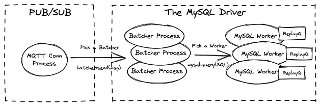
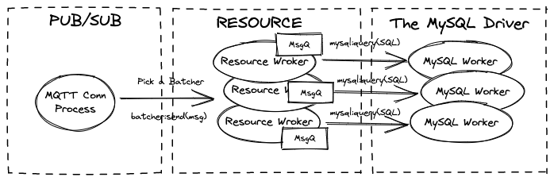
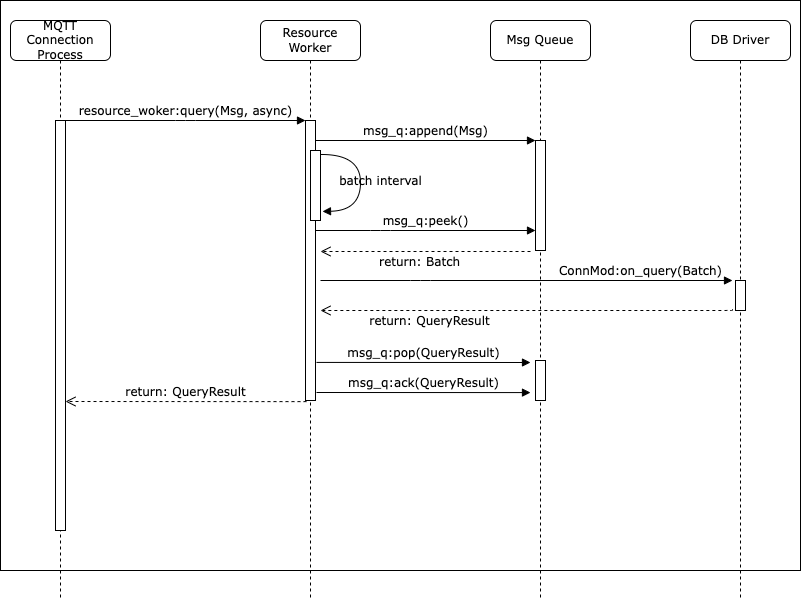
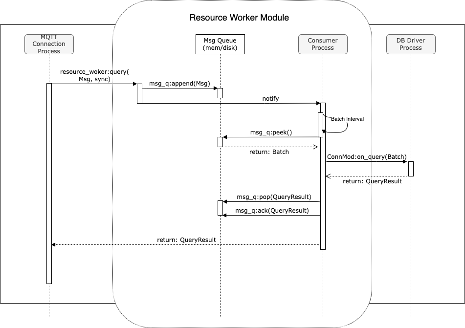
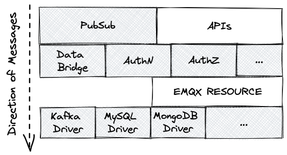
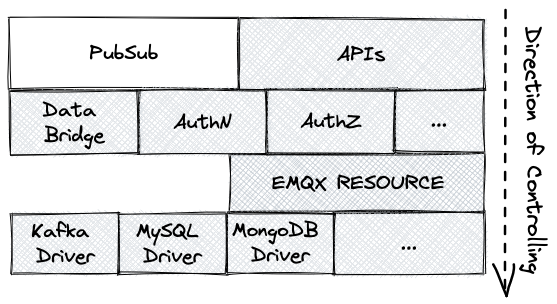
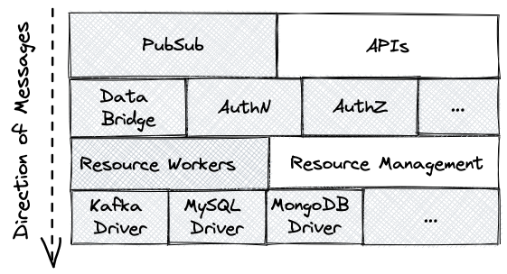

# The Message Batch for Resources

```
Author: <Shawn Liu> <liuxy@emqx.io>
Status: Draft
Created: 2022-07-11
```

## Abstract

This proposal suggests adding the message batching mechanism to the `emqx_resource` layer for emqx data integration.

## Motivation

We need a batching mechanism for all the external resources (MySQL, MongoDB, HTTP, Kafka, etc.) to enhance the throughput.

In 4.x the batching mechanism is implemented by adding a `batcher` process before calling each
DB driver. For example before starting a MySQL driver pool, we start a batcher process which keeps receiving
messages, it packs multiple messages into one big `INSERT` SQL (with multiple `VALUES` clauses), and then send it to the underlying MySQL driver.

On the other hand, we also need a message queue before sending messages to the external resources.
The purpose of message queue is to cache messages locally (possibly disk or memory) when the external resource service is interrupted, and then replay messages from the message queue after the resource is back to service.

In emqx 4.x and previous versions, only 2 drivers implemented the message queue, they are Kafka and MQTT Bridge (based on `replayq`).

**In 5.0 we suggest build the message queue as part of the resource layer**, and then implement the message batching as well as the sync/async querying mode based on this message queue. This way we have the advantage of no need to change any of the drivers.

## Design

### The Old Message Batching/Queuing Design Before the Change

Before this change, the batching mechanism is implemented by each driver.

Taking the MySQL as an example, we added a pool of `batcher` processes in front of the MySQL driver.
And if we want to queue the message locally before sending SQL queries, we have to add message queue to each of the `mysql worker`. This is shown by the following figure:



The MQTT connection pick a `batcher` process and send messages to it, then the `batcher` process accumulates messages to a big batched SQL query, and send it to the MySQL driver finally.

### The New Message Batching/Queuing Design After the Change

In this proposal we suggest move the `batcher` process into the resource layer (we name it `resource worker`), and also make it maintain the message queue. So we don't have to implement message queuing and batching mechanism for every driver:



### The Workflow of Resource Workers

In the current implementation, each time a resource is created, a resource manager process will be created for each resource ID, which is responsible for maintaining the relevant state of the resource. See the code of `emqx_resource_manager` module for details.

After the implementation of message queue is added, we also create a resource worker pool each time a resource is created, which is responsible for the process of accessing external resources and message sending.

The messages are first saved by the worker to the queue (which can be memory or disk queue), and then according to the batching policy, the worker takes the message out of the queue and sends it to the corresponding driver through the connector callback modules.

Here is the sequences for querying a resource after the resource workers are added:



- When creating the resource worker pool, we can specify the `max_batch_num`, `batch_interval` parameters to control the batching process.
- Every time a caller calls the resource worker, it can specify `query_mode = sync | async` for control whether wait the result or not.

An improved solution is to let the MQTT connection process append to the message queue directly, and then the resource worker (the consumer process) fetch messages from the queue:


This way we separate the producers (the MQTT connection processes) from the consumers (the resource workers). But for now the `replayq` doesn't support accessing by multiple modules concurrently, so we may need to refactor it for concurrent accessing, or use another underlying DB such as RocksDB.

### The Layers Before the Change

#### Sending Messages Directly to the DB Drivers

Before adding the message queue functionality, the hierarchical structure of the data integration part for sending a message is shown as the following figure:



When a message or an event is triggered in emqx, the MQTT connection process (in the PubSub layer) calls back the components in the second layer through `emqx_hooks`.

The second layer is the components related to external resources, such as Data Bridge, Authentication (AuthN), Authorization (AuthZ), etc. They calls `emqx_resource:query/3` to query the resources.

The `emqx_resource:query/3` directly calls back the DB drivers in the bottom layer, no messaging passing is needed.

#### Managing Resources through the Resource Layer

On the other hand, when the user creates resources via HTTP APIs, it calls creation APIs of the second layer (Data Bridges, AuthN and AuthZ), and then they call `emqx_resource:create/3` in the third layer.

The `emqx_resource:create/3` creates a resource manager process, all the subsequent management operations will go through the manager process:



The resource management calls through all the layers from the top to the bottom.

### The Layers After the Change

We suggest introduce the "resource workers" into the resource layer.
So that the old resource layer is divided into two parts: "resource workers" and "resource management". 

The "resource workers" is a pool maintains several worker processes.
It is the component for querying external resources, maintaining the message queue, and sending the messages to the drivers. 

The "resource management" part is the old resource layer, and remains unchanged as before, which is responsible for resource management operations.

#### Sending Messages through the Resource Workers



#### Managing Resources through the Resource Manager


### RocksDB vs. ReplayQ

There are two choices to implement the message queue. One is the mnesia database using [RocksDB](https://github.com/emqx/erlang-rocksdb) as the backend, and the other is the [ReplayQ](https://github.com/emqx/replayq).

The `ReplayQ` is a simple disk/mem queue based on segment files. It was first added to the EMQX's Kafka driver in 2018, it has experienced several emqx versions and has been proved to be very stable.

The `RocksDB` was added into emqx 5.0 as the backend of mneisa, it is a NIF of the upstream RocksDB written in C (https://github.com/facebook/rocksdb).

The persistent message queue feature is exactly the applicable scenario of `ReplayQ`, as messages are always added and accessed in a FIFO manner, we never access data by primary keys like a KV database. 
The data files will be stored in the specified directory of the local file system, which is very simple.

But there's some limitations in `ReplayQ`, mainly because it is a simple queue maintained in a single erlang process, it doesn't support concurrently accessing by multiple processes. So we may need some work to improve that.

Another way is implement a persistent queue based on RocksDB. It also need some more works.

## Configuration Changes

Some new (optional) config entries are added to the data-bridges, authentication and authorization components:

- **max_batch_num**: the maximum messages can be sent in a single batch.
- **batch_interval**: the maximum time in milliseconds the worker will wait before sending out a batch.
- **query_mode**: if set to true, the caller of `emqx_resource:query/3` will be blocked until
the driver returns or timeouts; if set to false, the `emqx_resource:query/3` returns immediately.

For example, here is a config for bridging EMQX to a remote MQTT broker at "broker.EMQX.io:1883":

```
bridges.mqtt.my_egress_mqtt_bridge {
    connector = {
        server = "broker.EMQX.io:1883"
        username = "username1"
        password = ""
        ssl.enable = false
    }
    direction = egress
    remote_topic = "from_emqx/${topic}"
}
```
After this feature, we can add the new config entries like this:

```
bridges.mqtt.my_egress_mqtt_bridge {
    connector = {
        server = "broker.EMQX.io:1883"
        username = "username1"
        password = ""
        ssl.enable = false
    }
    direction = egress
    remote_topic = "from_emqx/${topic}"

    max_batch_num = 100
    batch_interval = 20ms
    query_mode = async
}
```

## Backwards Compatibility

It is backward compatible to 5.0.4.

## Document Changes

Docs for Data Bridges/Authentication/Authorization need to be updated with the
newly added configurations.

## Testing Suggestions

Benchmarking need to be done to see how the resource workers impact on the performance.
