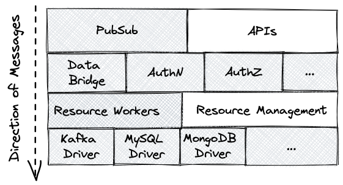
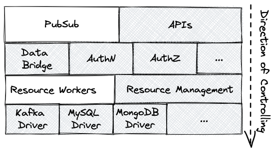

# The Message Cache for Resources

```
Author: <Shawn Liu> <506895667@qq.com>
Status: Draft
Created: 2021-07-11
```

## Abstract

This proposal suggests adding the message caching mechanism to the `emqx_resource` layer for emqx data integration.

## Motivation

The purpose of message caching is to cache messages locally (possibly disk or memory) when the external resource service is interrupted, and then replay messages from the message queue after the resource is back to service.

In emqx 4.x and previous versions, only a few drivers implemented the message caching function (Kafka and MQTT Bridge)

In 5.0 we suggest build the message caching function as part of the resource layer, which has the advantage of no need to change any of the drivers.

Based on the message caching, we can realize the sync/async querying mode and batching ability in the resource layer.

## Design

### RocksDB vs. ReplayQ

There are two choices to implement the message queue. One is the mnesia database using RocksDB as the backend, and the other is the [replayq](https://github.com/emqx/replayq).

We prefer the `replayq`, mainly because in this feature messages are always added and accessed in a queue, we never access data by primary keys like a KV database. This is exactly the applicable scenario of `replayq`. The data files will be stored in the specified directory of the local file system, which is very simple.

The `replayq` was added to the Erlang Kafka driver in 2018, it has experienced several emqx versions and has been proved to be very stable.

### The Layers Before the Change

#### Sending Messages Directly to the DB Drivers

Before adding the message cache functionality, the hierarchical structure of the data integration part for sending a message is shown as the following figure:


When a message or an event is triggered in emqx, the MQTT connection process (in the PubSub layer) calls back the components in the second layer through `emqx_hooks`.

The second layer is the components related to external resources, such as Data Bridge, Authentication (AuthN), Authorization (AuthZ), etc. They calls `emqx_resource:query/3` to query the resources.

The `emqx_resource:query/3` directly calls back the DB drivers in the bottom layer, no messaging passing is needed.

#### Managing Resources through the Resource Layer

On the other hand, when the user creates resources via HTTP APIs, it calls creation APIs of the second layer (Data Bridges, AuthN and AuthZ), and then they call `emqx_resource:create/3` in the third layer.

The `emqx_resource:create/3` creates a resource manager process, all the subsequent management operations will go through the manager process:


The resource management calls through all the layers from the top to the bottom.

### The Layers After the Change

We suggest introduce the "resource workers" into the resource layer.
So that the old resource layer is divided into two parts: "resource workers" and "resource management". 

The "resource workers" is a pool maintains several worker processes.
It is the component for querying external resources, maintaining the message cache (`replayq`), and sending the messages to the drivers. 

The "resource management" part is the old resource layer, and remains unchanged as before, which is responsible for resource management operations.

#### Sending Messages through the Resource Workers



#### Managing Resources through the Resource Manager



### Pool of Resource Workers with ReplayQs

In the current implementation, each time a resource is created, a resource manager process will be created for each resource ID, which is responsible for maintaining the relevant state of the resource. See the code of `emqx_resource_manager` module for details.

After the implementation of message caching is added, we also create a resource worker pool each time a resource is created, which is responsible for the process of accessing external resources and message sending.

The following figure is a schematic diagram of the resource worker pool. Each worker maintains a ReplayQ:


The messages are first saved by the worker to the queue (which can be memory or disk queue), and then according to the batching policy, the worker takes the message out of the queue and sends it to the corresponding driver through the connector callback modules.

Here is the sequences for querying a resource after the resource workers are added:


- When creating the resource worker pool, we can specify the `max_batch_num`, `batch_interval` parameters to control the batching process.
- Every time a caller calls the resource worker, it can specify `query_mode = sync | async` for control whether wait the result or not.

## Configuration Changes

Some new (optional) config entries are added to the data-bridges, authentication and authorization components:

- **max_batch_num**: the maximum messages can be sent in a single batch.
- **batch_interval**: the maximum time in milliseconds the worker will wait before sending out a batch.
- **query_mode**: if set to true, the caller of `emqx_resource:query/3` will be blocked until
the driver returns or timeouts; if set to false, the `emqx_resource:query/3` returns immediately.

For example, here is a config for bridging EMQX to a remote MQTT broker at "broker.EMQX.io:1883":

```
bridges.mqtt.my_egress_mqtt_bridge {
    connector = {
        server = "broker.EMQX.io:1883"
        username = "username1"
        password = ""
        ssl.enable = false
    }
    direction = egress
    remote_topic = "from_emqx/${topic}"
}
```
After this feature, we can add the new config entries like this:

```
bridges.mqtt.my_egress_mqtt_bridge {
    connector = {
        server = "broker.EMQX.io:1883"
        username = "username1"
        password = ""
        ssl.enable = false
    }
    direction = egress
    remote_topic = "from_emqx/${topic}"

    max_batch_num = 100
    batch_interval = 20ms
    query_mode = async
}
```

## Backwards Compatibility

It is backward compatible to 5.0.4.

## Document Changes

Docs for Data Bridges/Authentication/Authorization need to be updated with the
newly added configurations.

## Testing Suggestions

Benchmarking need to be done to see how the resource workers impact on the performance.
