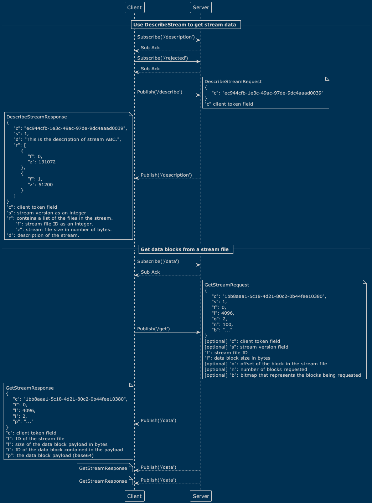
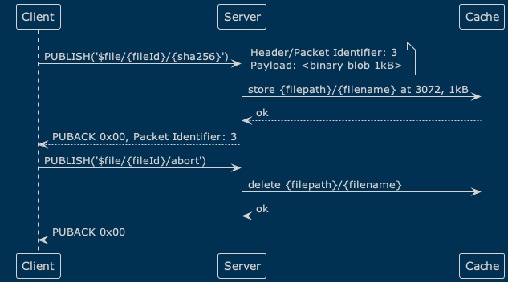
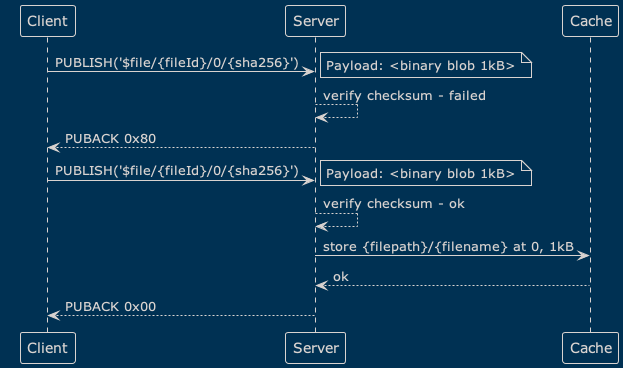

# File transfer over MQTT

## Changelog

* 2022-09-20: @qzhuyan, @id, @zmstone Initial draft

## Abstract

This document defines protocol to send files from MQTT clients to MQTT server. It is using only `PUBLISH` and `PUBACK` messages and does not require MQTT 5.0 features like topic aliases.

## Motivation

EMQX customers are asking for file transfer functionality from IoT devices to their cloud (primary use case), and from cloud to IoT devices over MQTT. Right now they are uploading files from devices via FTP or HTTPS (e.g. to S3), but this approach has downsides:

* FTP and HTTP servers usually struggle to keep up with large number of simultaneous bandwidth-intensive connections
* packet loss or reconnect forces clients to restart the transfer
* devices which already talk MQTT need to integrate with one more SDK, address authentication and authorization, and potentially go through an additional round of security audit

Known cases of device-to-cloud file transfer:

* [CAN bus](https://en.wikipedia.org/wiki/CAN_bus) data
* Image taken by industry camera for Quality Assurance
* Large data file collected from forklift
* Video and audio data from truck cars, and video data captured by inbound unloading cameras
* Vehicle real-time logging, telemetry, messaging
* Upload collected ML logs

Known cases of cloud-to-device file transfer:

* Upload AI/ML models
* Firmware upgrades

Even though devices could already send binary data in MQTT packets, it is not trivial to guarantee reliable file transfer without clear expectations from client and server side.

## Terminology

The keywords "MUST", "MUST NOT", "REQUIRED", "SHALL", "SHALL NOT", "SHOULD", "SHOULD NOT", "RECOMMENDED", "NOT RECOMMENDED", "MAY", and "OPTIONAL" in this document are to be interpreted as described in [BCP 14](https://www.rfc-editor.org/bcp/bcp14) [[RFC2119](https://www.rfc-editor.org/rfc/rfc2119)] [[RFC8174](https://www.rfc-editor.org/rfc/rfc8174)] when, and only when, they appear in all capitals, as shown here.

The following terms are used as described in [MQTT Version 5.0 Specification](https://docs.oasis-open.org/mqtt/mqtt/v5.0/os/mqtt-v5.0-os.html):
* Application Message
* Server
* Client
* Topic
* Topic Name
* Topic Filter
* MQTT Control Packet

*At least once*: a message can be delivered many times, but cannot be lost

## Requirements

* The protocol MUST use only PUBLISH type of MQTT Control Packet
* The protocol MUST support transfer of file segments
* Server MUST be able to verify integrity of each file segment and of the whole file
* Client MAY know total file size when initiating the transfer
* Client MAY abort file transfer
* Server MAY ask the client to pause file transfer
* Server MAY ask the client to abort file transfer
* The protocol MUST guarantee "At least once" delivery
* Server MUST NOT support subscription on topics dedicated for file transfer

## AWS IoT MQTT-based file delivery (reference design)

As an example of existing implementation we can look at AWS IoT Core [which provides functionality](https://docs.aws.amazon.com/iot/latest/developerguide/mqtt-based-file-delivery.html) to [deliver files to IoT devices](https://docs.aws.amazon.com/iot/latest/developerguide/mqtt-based-file-delivery-in-devices.html):



## Design

### Overview

* Files are split in segments, segments can be of arbitrary length
* Client SHOULD generate unique identifier for each file being transferred and use it as `fileId` in Topic Name (UUID according to [RFC 4122](https://www.rfc-editor.org/rfc/rfc4122) is recommended)
* Client SHOULD consider `fileId` as a unique identifier for the file transfer, and MUST NOT reuse it for other file transfers
* Broker SHOULD consider `clientId` + `fileId` pair as a Broker-wide unique identifier for the file transfer
* Client MAY calculate SHA-256 checksum of the segment it's about to send and send it as part of Topic Name
* Client MAY calculate SHA-256 checksum of the file it's about to send and include it in the `init` message payload or send is as part of the `fin` message
* If Client chooses to provide checksum for file segments, whole file, or both, it MUST use [SHA-256](https://www.rfc-editor.org/rfc/rfc6234)
* If checksum is included in the `init` message payload, the Broker MUST use it to verify integrity of the file after receiving the `fin` message for the corresponding file transfer
* If checksum is included in topic name, Broker MUST use it to verify integrity of corresponding data:
  * segment, if it's a segment transfer message
  * whole file, if it's a `fin` message
* If checksum verification fails, Broker MUST reject the corresponding data
* Client MUST use Topic starting with `$file/` to transfer files
* Broker MUST NOT let clients subscribe to Topics starting with `$file/` topics
* Segment length can be calculated on the server side by subtracting the length of the [Variable Header](https://docs.oasis-open.org/mqtt/mqtt/v5.0/os/mqtt-v5.0-os.html#_Toc3901025) from the [Remaining Length](https://docs.oasis-open.org/mqtt/mqtt/v5.0/os/mqtt-v5.0-os.html#_Toc3901105) field that is in the [Fixed Header](https://docs.oasis-open.org/mqtt/mqtt/v5.0/os/mqtt-v5.0-os.html#_Toc3901021)

### Protocol flow

Data is transferred in PUBLISH packets in the following order:

1. `$file/{fileId}/init`

    ```
    {
      "name": "ml-logs-data.log",
      "size": 12345,
      "checksum": "1234567890abcdef1234567890abcdef1234567890abcdef1234567890abcdef",
      "expire_at": 1696659943,
      "segments_ttl": 600
    }
    ```

2. `$file/{fileId}/{offset}[/{checksum}]`

    ```
    <file segment data>
    ```

3. `$file/{fileId}/{offset}[/{checksum}]`

    ```
    <file segment data>
    ```

4. ...

5. `$file/{fileId}/[fin/{fileSize}[/{checksum}] | abort]`

    No payload

#### `$file/{fileId}/init` message

Initialize the file transfer. Server is expected to store metadata from the payload in the session along with `{fileId}` as a reference for the rest of file transfer.

  * Qos=1
  * Payload Format Indicator=0x01
  * `{fileId}` is corresponding file UUID
  * Payload is a JSON document

Getting a successful `PUBACK` from the Broker means that the file transfer has been initialized successfully, and the metadata has been persisted in the storage.

Broker MAY refuse to accept the file transfer in case of the metadata conflict, e.g. if the transfer with the same `{fileId}` from the same Client has different `name` or `checksum` value. Client is expected to start the transfer with a different `{fileId}`.

Broker MAY abort incomplete file transfers after their respective sessions have been discarded, and clean up any resources associated with them.

Broker MAY refuse the file transfer if the `fileId` is too long, but generally `fileId`s of up to 255 bytes (in UTF-8 encoding) should be safe to use.

##### `init` payload JSON Schema

Available [here](https://github.com/emqx/mqtt-file-transfer-schema/blob/v1.0.0/init.json).

* Broker MAY use `name` value as a filename in a file system

    This generally means that it SHOULD NOT contain path separators, and SHOULD NOT contain characters or sequences
    of characters that are not allowed in filenames in the file system where the file is going to be stored. Also,
    the filename SHOULD be limited to 255 bytes (in UTF-8 encoding).

* Broker SHOULD consider `size` value as informational only, given it's not required to be provided by the client

    Mandatory file size should be specified in the `fin` message Topic anyway, and may be different from the value
    provided in the `size` field. The `size` field may be used for example to calculate the progress of the transfer,
    which thus may be inaccurate.

* Broker SHOULD have default setting for `segments_ttl`

* Broker MAY delete segments of unfinished file transfers when their TTL has expired

* Broker MAY NOT honor `segments_ttl` value that is either too large or too small

    What means _too large_ or _too small_ is up to the Broker implementation and/or configuration.

#### `$file/{fileId}/{offset}[/{checksum}]` message

One such message for each file segment.

  * Qos=1
  * Payload Format Indicator=0x00
  * Payload is file segment bytes
  * `{offset}` is byte offset of the given segment
  * optional `{checksum}` is SHA-256 checksum of the file segment

Getting a successful `PUBACK` from the Broker means that the file segment has been verified (if checksum was provided) and successfully persisted in the storage.

#### `$file/{fileId}/fin/{fileSize}[/{checksum}]` message

All file segments have been successfully transferred.

  * Qos=1
  * no payload
  * optional `{checksum}` is SHA-256 checksum of the file

Getting a successful `PUBACK` from the Broker means that the file being transferred is ready to be used. This implies a lot of things:
  * Broker has verified that it has corresponding metadata for the file
  * Broker has verified that it has all the segments of the file up to `{fileSize}` persisted in the storage
  * Broker has verified the file integrity (if checksum was provided)
  * Broker has published the file along with its metadata to the location where it can be accessed by other users

Clients MUST expect that handling of the `fin` message may take considerable time, depending on the file size and the
Broker implementation or configuration.

#### `$file/{fileId}/abort` message

Client wants to abort the transfer.

  * Qos=1
  * no payload

### Durability

This specification does not define how reliably the file transfer data SHOULD be persisted. It is up to the Broker implementation what specific durability guarantees it provides (e.g. datasync or replication factor). However, Broker is expected to support transfers that are interrupted by a network failure, Broker restart, or Client reconnect.

### PUBACK Reason codes

| Reason code | MQTT Name                     | Meaning in file transfer context                    |
|-------------|-------------------------------|-----------------------------------------------------|
| OMIT        |                               | Same as 0x00                                        |
| 0x00        | Success                       | File segment has been successfully persisted        |
| 0x10        | No matching subscribers       | Server asks Client to retransmit all segments       |
| 0x80        | Unspecified error             | For segment transmission, Server asks Client to retransmit the segment. For `fin`, Server asks Client to retransmit all segments |
| 0x83        | Implementation specific error | Server asks Client to cancel the transfer           |
| 0x97        | Quota exceeded                | Server asks Client to pause the transfer            |

#### 0x97, "Quota exceeded", "Pause Transfer"

Client is expected to wait before trying to retransmit file segment again.

### PUBACK from MQTT servers < v5.0

`PUBACK` messages prior to MQTT v5.0 do not carry Reason code, it's up to the Client to decide if, when and how to retry.

### Happy path


### Transfer abort initiated by client



### Transfer restart initiated by server



## Backwards Compatibility

Full backward compatibility with MQTT 5.x and MQTT 3.x.

## Innovation Opportunities

* Integration with rule engine
* Pluggable storage backends
* Multiple backend writes to a single file
* Do the entire MQTT message logging
* QUIC pure binary stream support
* ACL enables client-side control of file size
* Bulk upload at EMQX
* Multi-node local cache utilization similar to HDFS
* Cheaper (in computational costs) checksum algorithm
* Server-to-client file transfer protocol

## Declined Alternatives

* Use of MQTT extension headers
  * Poor compatibility and complex application layer implementation
* Capability negotiation
  * Poor client compatibility, complex application layer implementation
* Client supplied file name as file identifier instead of UUID
  * potential security issues
  * potential name clashing issues
* checksum value instead of UUID
  * will not work if client does not have full file when initiating the transfer
* checksum as part of the payload, not as part of topic name
  * Requires specification for payload serialization format leading to more complicated client code
* File segment offset as part of the payload
  * Same as above, Requires specification for payload serialization format and more complicated code
* Using constant segment size (per file) and sequential segment number instead of byte offset to reduce packet size
  * Clients may want to change segment size dynamically to account for changes in network properties (e.g. moving from faster to slower and spotty network, or vice versa)

