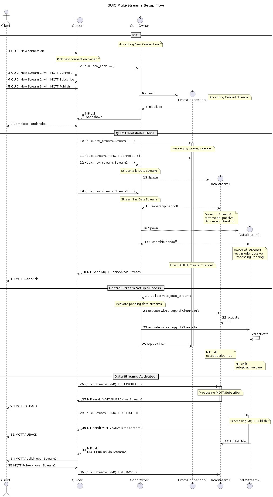

# MQTT over QUIC multstreams support

## Changelog

* 2022-12-13: @qzhuyan Initial draft

## Abstract

MQTT Over QUIC in EMQX 5.0 is an experimental feature with single stream support.

This EIP extends MQTT over QUIC to support multi-streams by utilizing the
multiplexing feature of QUIC transport protocol.

## Motivation

In EMQX5.0, Client and Server maintain a QUIC connection in between and
exchange MQTT messages over one single QUIC stream. When the stream
is closed by either side the connection is closed.

By enabling multi-streams, one could achieve:

1. Decouple connection control and application data exchanges.
1. Avoid head-of-line blocking among the Topics.
1. Decouple control plane traffic and data plane traffic.
1. Split channels for uplink data (publishing) and downlink data (receiving publish).
1. Priorities data from different MQTT Topics.
1. Improve parallelism of processing on the Client/Server side.
1. More robust handling of MQTT data that single stream abortion caused by the application will not cause connection close.
1. Flow control per data stream.
1. Reduce latency at application layer (application above MQTT)
   A client does not need to wait for connack before sending the subscribe or publish packets.

## Design

The QUIC connection handshake between the MQTT client and EMQX is the same as the original single stream mode.

Changes to support multi-streams.

1. Bidirectional Control Stream, initiated from the MQTT Client.
   There will be one and only one control stream from Client to Server.

   The first stream in the connection is the control stream.

   It has the same life cycle as the connection, either side of the connection closes the control
   the stream leads to a connection close.

   Keep alive with MQTT.PING and authentication with MQTT.AUTH is over the control stream.

   All types of MQTT packets are allowed over the control stream which is backward compatible to the
   original single stream mode.

1. Bidirectional Data Streams, initiated from the MQTT Client.

   MQTT Client has the freedom to choose how to utilize the multiple data streams.

   Data stream could carry egress publishing traffic, ingress subscribed traffic, or both.
   The data stream could carry data for one topic or from/to different topics.

   The client could also send the same topic data over different data streams but the receiving ordering is not guaranteed.
   (Data ordering is only guaranteed in the same stream by the design of QUIC protocol)

   Zero or more data streams are allowed. The max number of data streams is decided by the broker (EMQX).
   However, the client can request more allowed streams over QUIC protocol and it is upto the broker
   to decide if increase the limit or not.

   Duplicated subscriptions are allowed among different streams.

   Data Stream only accepts a subset of MQTT packets and they are:

   - PUBLISH
   - PUBACK
   - PUBREC
   - PUBCOMP
   - PUBREL
   - SUBSCRIBE
   - SUBACK
   - UNSUBSCRIBE
   - UNSUBACK

## Configuration Changes

At this stage, no.

## Backwards Compatibility

No Backwards Compatibility changes. Single stream mode is still supported.

## Document Changes

N/A

## Testing Suggestions

Multistream supports use more processes, the memory overhead need to be tested. 

## Declined Alternatives

1. In EMQX, use a single process to manage both the control stream and data streams

   This is the original idea used in PoC but it turns out to be too complicated to 
   manages the states per stream and requires major changes in `emqx_channel` and `emqx_routes`
      
   Using process per stream improves the parallelism, less blocking, and keeping 
   stream data and states isolated in each process is more secure and robust. 
   The overhead of memory footprints can be mitigated by using process hibernations. 
   
   
1. Split sending/receiving in two unidirectional streams.

   Not approved at this stage.
