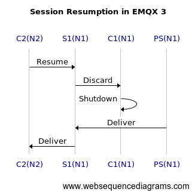
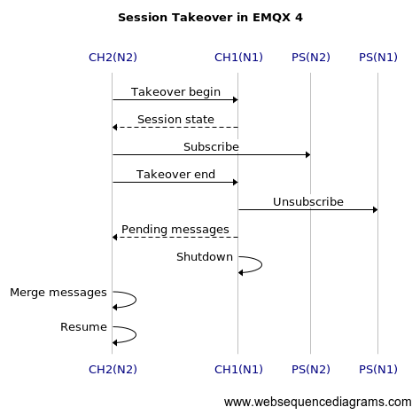
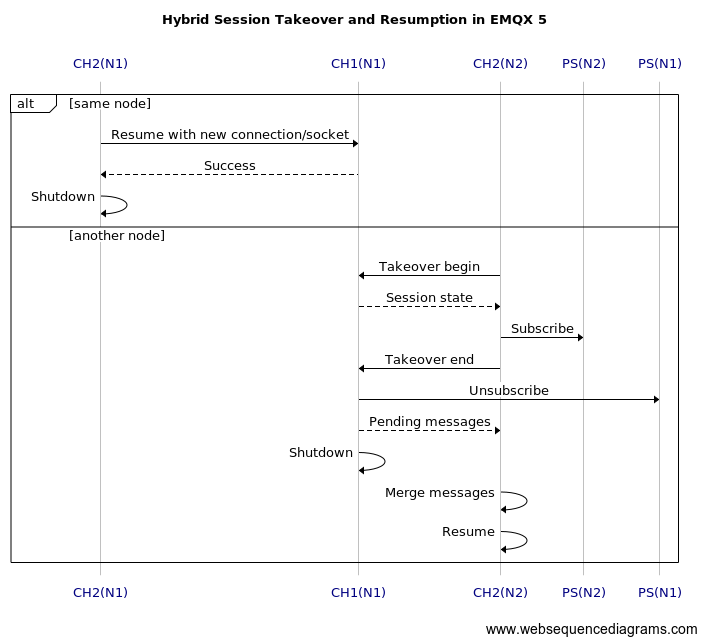

# Hybrid MQTT Session Takeover and Resumption

## Changelog

* 2023-06-27: @emqplus Initial commit

## Abstract

This proposal presents a hybrid architecture for MQTT session takeover and resumption in EMQX version 5.

## Motivation

MQTT is widely used in IoT systems, where devices may experience intermittent connectivity or transient network outages. In such scenarios, MQTT session resumption and takeover is an essential feature for helping to maintain reliable communication between the devices and the MQTT broker. I propose a new design for the MQTT session takeover and resumption in the later EMQX 5 release.

## Acronyms Used

| Name | Acronym | Description |
| --- | --- | --- |
| Node1 | N1 | Node 1 in a cluster |
| Node2 | N2 | Node 2 in a cluster |
| PubSub | PS | PubSub service on a node |
| Connection1 | C1 | MQTT Connection 1 |
| Connection2 | C2 | MQTT Connection 2 |
| Session1 | S1 | MQTT Session 1 |
| Session2 | S2 | MQTT Session 1 |
| Channel1 | CH1 | MQTT Channel 1 |
| Channel2 | CH2 | MQTT Channel 2 |

## MQTT Session Resumption in EMQX 3

EMQX 3 uses two separate Erlang processes for an MQTT connection and session:

- When a client disconnects, the connection process will be shut down while the session process is still alive and keep the session state;
- When a new client connects, a new connection process will be spawned and resume the session state from the existing session process

The process for session resumption is as follows:



```
title Session Resumption in EMQX 3

C2(N2)->S1(N1): Resume
S1(N1)->C1(N1): Discard
C1(N1)->C1(N1): Shutdown
PS(N1)->S1(N1): Deliver
S1(N1)->C2(N2): Deliver
```

After resumption, the session and connection processes are located on two different nodes. On delivery, MQTT messages will have to be forwarded between the nodes.

**Pros**

- Simple and fast to resume an MQTT session

**Cons**

- Much memory usage with two Erlang processes
- Low performance for MQTT message delivery

## MQTT Session Takeover in EMQX 4

EMQX 4 uses one Erlang process called the MQTT channel to wrap all the states of the connection and session.

- When a persistent MQTT client disconnects, the channel process will be changed to `disconnected` status, and keep the session state;
- When a new client connects, a new channel process will be created and take over the session state from the old one;
- The old channel process will be shut down when the takeover process is done.

The process for session takeover is as follows:



```
title Session Takeover in EMQX 4

CH2(N2)->CH1(N1): Takeover begin
CH1(N1)-->CH2(N2): Session state
CH2(N2)->PS(N2): Subscribe
CH2(N2)->CH1(N1): Takeover end
CH1(N1)->PS(N1): Unsubscribe
CH1(N1)-->CH2(N2): Pending messages
CH1(N1)->CH1(N1): Shutdown
CH2(N2)->CH2(N2): Merge messages
CH2(N2)->CH2(N2): Resume
```

**Pros**

- One Erlang process for an MQTT client, less memory usage, and fast message delivery.

**Cons**

- The takeover operation is a bit expensive, and use more CPU.
- High CPU usage will make the broker unserviceable when too many takeovers occur.

## Hybrid Takeover and Resumption in EMQX 5

I propose a hybrid session takeover and resumption with an MQTT-aware load balancer in EMQX 5.

- Still use one channel process to wrap the MQTT connection and session state;
- When an MQTT client disconnects, the persistent session state will be kept in the channel process;
- When a new client connects from the same node, resume the session by passing the socket control and connection state to the channel process;
- If the new client connects from a different node, just takeover the session like EMQX 4.



```
title Hybrid Session Takeover and Resumption in EMQX 5

alt same node
    CH2(N1)->CH1(N1): Resume with new connection/socket
    CH1(N1)-->CH2(N1): Success
    CH2(N1)->CH2(N1): Shutdown
else another node
    CH2(N2)->CH1(N1): Takeover begin
    CH1(N1)-->CH2(N2): Session state
    CH2(N2)->PS(N2): Subscribe
    CH2(N2)->CH1(N1): Takeover end
    CH1(N1)->PS(N1): Unsubscribe
    CH1(N1)-->CH2(N2): Pending messages
    CH1(N1)->CH1(N1): Shutdown
    CH2(N2)->CH2(N2): Merge messages
    CH2(N2)->CH2(N2): Resume
end
```

**Pros**

- Save CPU usage when session takeover occurs frequently
- Don’t need to unsubscribe and resubscribe

**Cons**

- A bit complex for test and debug

## Configuration Changes

N/A

## Backwards Compatibility

N/A

## Document Changes

Documentation related to MQTT session management should be updated.

## Testing Suggestions

- Add more test cases for session resumption from the same node.

