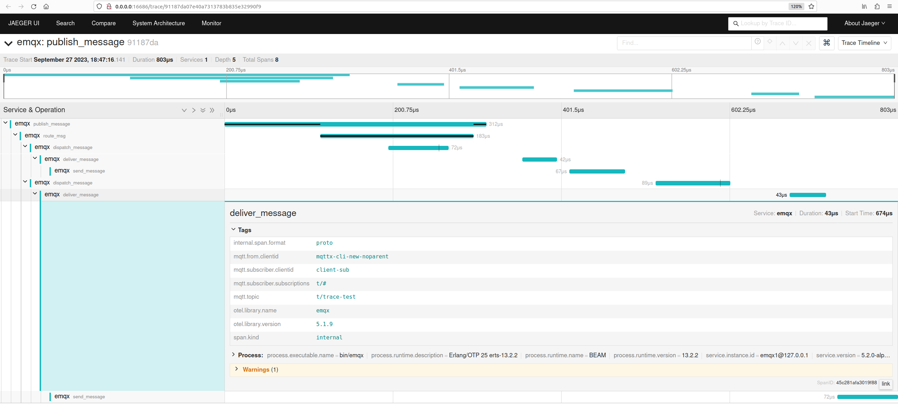

# OpenTelemetry Traces Integration

## Abstract

This document describes EMQX OpenTelemetry integration design proposal.

More details about related components, concepts and conventions can be found in the following resources:

- [OpenTelemetry Erlang lib documentation](https://opentelemetry.io/docs/instrumentation/erlang/)
- [OpenTelemetry main trace components overview](https://opentelemetry.io/docs/concepts/signals/traces)
- [MQTT trace context specification](https://w3c.github.io/trace-context-mqtt/)
- [Trace context header specification](https://www.w3.org/TR/trace-context-1/#tracestate-header)
- [OpenTelemetry messaging system semantic conventions](https://github.com/open-telemetry/semantic-conventions/blob/main/docs/messaging/messaging-spans.md)
- [Draft PR](https://github.com/emqx/emqx/pull/11696)

## Motivation

OpenTelemetry distributed trace integration is the part of EMQX Product Road-map.

## Design

### Core concepts and tracing scope

The core traceable entity for EMQX is a message. It means that one trace should be associated with one message.

For example, a single HTTP request is a common traceable entity for a HTTP server. HTTP server instrumented with OpenTelemetry receives a HTTP request, extracts trace context from headers (e.g., `traceparent`, `tracestate` headers) and traces any processing steps (spans) up to sending a HTTP response back to the client, associating all the spans with the same trace ID (1 request - 1 trace ID).
HTTP client after receiving the response may proceed executing some subsequent operations, tracing and linking them to the same trace ID.

Somewhat analogously, EMQX instrumented with OpenTelemetry, is expected to receive a published message, extract trace context (e.g., `traceparent`, `tracestate` User-Properties), and trace some/all processing steps under the same trace ID.
Producer/consumer of the message may proceed tracing any subsequent operations relating them to the same trace ID.

These traced steps (or spans) should include the following (**TBD**):

- Publish message (traced by a node that received a published message)

  - Send message to data bridges (traced by a node that received a published message)
  
    NOTE: if the external data system and/or communication protocol supports OpenTelemetry distributed tracing, trace context must be also propagated to it. EMQX bridge app should implement a function to inject the trace context into its own message. For example, the web-hook bridge should add `traceparent` / `tracestate` HTTP headers, so that the receiving end can continue tracing under the same trace ID.

  - Route message (traced by a node that received a published message)

    - Dispatch message (traced by all nodes that have matched subscribers)

      - Deliver/send message to a subscriber (traced by all nodes that have matched subscribers)

NOTE: the above list may be extended/changed, for now it follows the product requirements.

Any other processing steps/events like client connection, authentication, subscription are currently not considered for OpenTelemetry tracing (**TBD**) due to the following reasons:

- these actions are not directly associated with the main traceable entity (message) defined above
- these actions seem not absolutely suitable for distributed tracing, they can be probably traced only as internal EMQX events

### Implementation details

Erlang OpenTelemetry lib heavily relies on propagating trace context by means of process dictionary.
Obviously, this works fine when function calls are being traced within the context of the same process and needs little efforts when the context is to be propagated to a new spawned process.

However, this approach is not absolutely suitable for EMQX distributed architecture:

- correlated spans can be executed on different nodes and/or by different processes
- a batch of items relating to different traces can be processed together as a single unit of work, e.g., `emqx_connection`, `emqx_channel` modules process deliver messages in batches, where each message would have a unique trace ID if tracing is enabled.

That’s why the proposed implementation mostly relies on propagating the tracing context as a part of the message itself, which has the following advantages:

- inter-cluster communication doesn’t require any changes to support trace context propagation and is backward compatible (trace context is added to a reserved `#emqx_message.extra` field)
- tracing individual messages processed in batches is possible and doesn’t require any significant changes in the current implementation.

API and context propagation examples (see: [full draft implementation](https://github.com/emqx/emqx/pull/11696/files#diff-a0fac912929fe4c3aa6b99a65a070f1886f75b2586beb4a7e21d8329be9aaa32)):

```erlang
-spec trace_publish(Msg, fun((Msg) -> Res)) -> Res when
    Msg :: emqx_types:message(),
    Res :: emqx_types:publish_result().
trace_publish(Msg, PublishFun) ->
    ...

-spec trace_dispatch(Topic, Msg, fun((Topic, Msg) -> Res)) -> Res when
    Topic :: emqx_types:topic(),
    Msg :: emqx_types:message(),
    Res :: emqx_types:deliver_result().
trace_dispatch(Topic, Msg, DispatchFun) ->
   ...

put_ctx_to_msg(OtelCtx, Msg = #message{extra = Extra}) when is_map(Extra) ->
    Msg#message{extra = Extra#{?EMQX_OTEL_CTX => OtelCtx}};
%% extra field has not being used previously and defaulted to an empty list, it's safe to overwrite it
put_ctx_to_msg(OtelCtx, Msg) when is_record(Msg, message) ->
    Msg#message{extra = #{?EMQX_OTEL_CTX => OtelCtx}}.

get_ctx_from_msg(#message{extra = Extra}) ->
    from_extra(Extra).

get_ctx_from_packet(#mqtt_packet{variable = #mqtt_packet_publish{properties = #{internal_extra := Extra}}}) ->
    from_extra(Extra);
get_ctx_from_packet(_) ->
    undefined.

from_extra(#{?EMQX_OTEL_CTX := OtelCtx}) ->
    OtelCtx;
from_extra(_) ->
    undefined.
```

Some drawbacks of the proposed implementation should also be mentioned:

- internal tracing API (as of now, implemented in `emqx_otel_trace` module) is not decoupled from the rest of the code base: each traceable action (span) is traced by a specific function and all these functions are quite specific. For example, they may extract/propagate the context differently and/or rely on the previous (parent) span. For now, it doesn’t seem feasible to create a generic trace wrapper that can trace an arbitrary function.



### External trace context propagation

If EMQX receives trace context in a published message, e.g., `traceparent`/`tracestate` User-property for MQTT v5.0, it must be sent unaltered when forwarding the Application Message to a Client to conform with [MQTT specification 3.3.2.3.7](https://docs.oasis-open.org/mqtt/mqtt/v5.0/os/mqtt-v5.0-os.html#_Toc3901116).

This also perfectly follows [OpenTelemetry semantics for messaging systems](https://github.com/open-telemetry/semantic-conventions/blob/main/docs/messaging/messaging-spans.md#context-propagation):

> Messaging systems themselves may trace messages as the messages travels from producers to consumers. Such tracing would cover the transport layer but would not help in correlating producers with consumers. To be able to directly correlate producers with consumers, another context that is propagated with the message is required.
>
> A message creation context allows correlating producers with consumers of a message and model the dependencies between them, regardless of the underlying messaging transport mechanism and its instrumentation.
>
> The message creation context is created by the producer and should be propagated to the consumer(s).
>
> A producer SHOULD attach a message creation context to each message. If possible, the message creation context SHOULD be attached in such a way that it cannot be changed by intermediaries.

In fact, EMQX is capable of participating in distributed trace out of the box (without OpenTelemetry instrumentation), simply because it implements the above MQTT specification requirement and propagates User-Properties from a publisher to a subscriber.

However, if no trace context received but a message still should be traced, one of the following options should be chosen:

- create internal trace context and trace only internal EMQX events and do not propagate the context to receivers and/or external data systems (if bridges are set up)
- create internal trace context and propagate it to receivers and/or external data systems.

The option can be made configurable and should probably default to not propagating internally created trace context (**TBD**). 

### Attributes (TBD)

OpenTelemetry defines [some conventions](https://github.com/open-telemetry/semantic-conventions/blob/main/docs/messaging/messaging-spans.md#messaging-attributes) (status: Experimental at the time of writing this document).

The attributes are grouped under several name-spaces:

- `messaging.*`
- `network.*`
- `server.*`

It should be  decided whether to follow these conventions strictly or define our own (e.g. mqtt.topic, mqtt.clientid etc).
Another open question is whether to always include all the attributes or make them configurable, so that a user may select appropriate ones from the pre-defined list.

### Sampling

OpenTelemetry sampling is described in great depth in the [official documentation](https://opentelemetry.io/docs/concepts/sampling).

Erlang opentelemetry lib implements only head sampling. Head sampling implies that a sampling decision is made as early as possible, e.g., by following a configured percentage of traces to sample (100% by default). A decision to sample or drop a span or trace is not made by inspecting the trace as a whole.

Sampling rate option should be added to EMQX configuration.

Tail sampling that makes a sampling decision after all the spans are done would need to be implemented by extending opentelemetry lib (**TBD**).

Examples of tail sampling capabilities:

- sample traces based on their latency (e.g. sample only traces that take more than 5ms)
- sample traces only if they contain an error, a specific event or attribute value

### Filtering

The goal of filtering is similar to one of sampling: to narrow down the amount of traces.
However, filtering is considered as a EMQX/MQTT specific extension that doesn’t necessary follow OpenTelemetry sampling concepts.

NOTE: filters can be implemented using `otel_sampler` behavior, but it doesn’t seem to have any advantages.
It is suggested to implement a configurable filtering rules, so that a user can control which messages should be traced. It must be possible to leave filtering rules blank, so that all the incoming messages are traced (if tracing itself is enabled).

The filters may be similar to ones used in EMQX tracing:

- Client ID
- Topic
- IP address

The filtering rule should not probably be too complex to minimize performance impact.

## Configuration Changes

The existing EMQX OpenTelemetry schema (defined in emqx_otel_schema module) must be extended to include trace specific configuration.

Current HOCON config example:
```
opentelemetry {
  enable = true
  exporter {endpoint = "http://172.18.0.2:4317", interval = 10s}
}
```

Suggested HOCON config example:
```
opentelemetry {
  metrics {enable = true} # must be backward-compatible with opentelemetry.enable
  exporter {endpoint = "http://172.18.0.2:4317", interval = 10s}
  trace {
    enable = true
    filters {}
    sampling {}
    # whether to propagate trace context
    # if it was internally created by EMQX and not received in a publishedd message:
    downstream_context_propagation = false
    # select a list of attributes to be added to trace spans from the pre-defined list
    attributes = []
    ...
    }
}
```

## Backward Compatibility

All changes are backward compatible.

## Testing

Besides integration/unit tests, it is necessary to make performance tests/profiling to measure the impact of tracing on EMQX performance.
