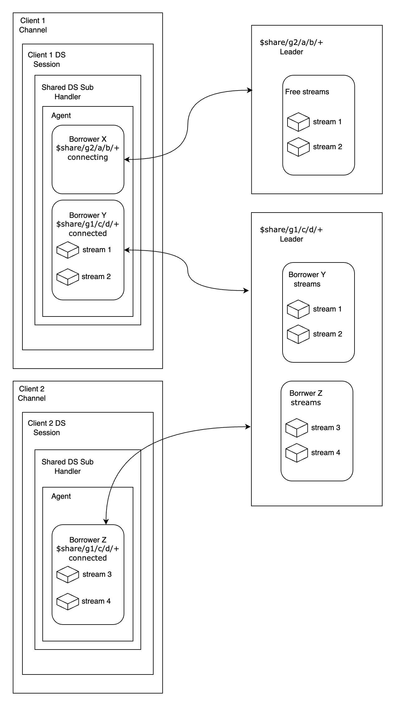
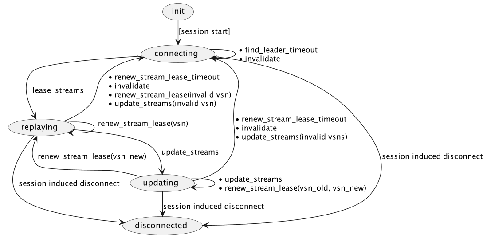

# Durable Shared Subscriptions

## Changelog

* 2024-05-10: @savonarola Initial draft

## Abstract

We describe the implementation of shared subscriptions based on the concept of durable storage.

## Motivation

Since we have durable storage-based implementation for the regular subscriptions, we want to extend its advantages over the shared subscriptions. That is, mainly:
* To have messages persisted, that is, not lost regardless of the crashes or absence of consumers.
* To be able to replay messages from the past.

## Design

### General Idea

Each group is managed by a unique shared group leader process (SGL) that is cluster-wide. It has a persistent state but does not always run. It spawns when any group consumer connects and exits for some time after the last consumer disappears.

An SGL is spawned by a shared group leader manager (SGLM) process. SGLM runs per node and is responsible for spawning SGLs, locating them in the cluster, and guaranteeing that there is only one SGL per group.

The global registration mechanism has not yet been chosen. It may be `ra`-based, `global`-based, or even DS-specific (like registering in FoundationDB).

SGL keeps track of topics belonging to the group, their streams, and stream states. It is the only entity that tracks the replay progress of these streams.

The groups' consumers are persistent sessions. They connect to the SGL, and the SGL leases them streams to consume. Sessions consume these streams together with their proper streams but do not persist the progress. Instead, they report the progress to the SGL.

SGL is responsible for reassigning streams to the other group consumers in case a consumer disconnects and for reassigning streams to the new consumers.



All communication between the consumers(sessions) and the SGL, SGLM, is done asynchronously because leaders may need to be spawned (this requires election) or may be running on a remote node.

### Session Side

The Shared Subscription-related data structures are kept as the session's private data. Still, they are encapsulated and isolated from the rest of the session data structures with a **Shared Subscription Session Handler** (SSubHandler) facade module (`emqx_persistent_session_ds_shared_sub`). So, the Shared Subscription data is opaque to the rest of the session code.

The SSubHandler is passive, i.e., it does not contain any running processes. It only reacts to invocations from the session side.

A session is responsible for:
* Initializing the SSubHandler data on session bootstrap.
* Delivering Shared Sub-related messages (from timers, from other entities) to the SSubHandler.
* Forwarding subscribe/unsubscribe `$shares/group/...` requests to the SSubHandler.
* Querying stream states (`stream_state()`) from SSubHandler for replay and reporting replay results to the SSubHandler.

### Shared Subscription Session Handler

SSubHandler data is a collection of Group Subscription FSMs (GSFSM) identified by the group ID.

```erlang
#{
    group_id() := #{
        state := state(),
        ...
    }
}
```

Each GSFSM contains the following states:
* `connecting` - the initial state, the GSFSM is looking for a Group Subscription Leader (SGL).
* `replaying` - the GSFSM is connected to the SGL and provides stream states for replay.
* `updating` - the GSFSM is connected to the SGL and is updating the set of streams.

### Protocol between Session and SGL

#### `connecting` state
In the `connecting` state, the GSFSM data is as follows:
* Topic(s)
* Subscription properties

GSFSM starts in the `connecting` state. When it enters this state, it sends a `find_leader` message to the local SGLM to find the SGL for the group.

The SGLM's responsibility is to find/spawn a cluster-unique SGL for the group and provide the subscriber's pid and other data to it. The SGL then provides the subscriber with the stream states, and the replay starts.

##### Messages sent in the `connecting` state

* `{find_leader, GroupId, Topic, ...}` - to the SGLM to find the SGL for the group.

##### Messages handled in the `connecting` state

* `{lease_streams, Version, ...}` — from the SGL with the stream states for replay. Version
* `find_leader_timeout` — self-scheduled timeout message, on which `find_leader` is resent to the SGLM.

#### `replaying` state

In the `replaying` state, the GSFSM data is as follows:
* Topic(s)
* Subscription properties
* Stream states, Version

In the `replaying` state, the GSFSM accepts replay requests from the session side and updates stream states after each replay interaction.

##### Messages handled in the `replaying` state

* `{renew_stream_lease, Version, ...}` — from the SGL with the stream IDs. If the Version does not match the GSFSM's stream set Version, it's abnormal, and the GSFSM returns to the `connecting` state.
* `{update_streams, VersionOld, VersionNew, StreamsNew, ...}` — from the SGL with the updated stream set.
The message contains the old Version of the stream set. The GSFSM returns to the `connecting` state if a mismatch is detected. Otherwise, it records the new stream states, marks the old stream states as taken over, and continues to the `update_stream_states` state.
* `renew_stream_lease_timeout` — self-scheduled timeout message, canceled on each `renew_stream_lease` message. The GSFSM returns to the `connecting` state if the timeout occurs.
* `invalidate` — from the SGL if it considers the state of the GSFSM invalid. The GSFSM goes back to the `connecting` state.

##### Messages sent in the `replaying` state

* `{update_stream_states, Version, SreamStates}` - to the SGL to update the stream states.

#### `updating` state

In the `updating` state, the GSFSM data is as follows:

* Topic(s)
* Subscription properties
* Stream states, VersionNew
* Taken over stream states, VersionOld

In the `updating` state, the GSFSM accepts replay requests from the session side and updates stream states after each replay interaction. It also accepts replay _results_ for Taken Over streams.

##### Messages handled in the `updating` state

* `{update_streams, VersionOld, VersionNew, StreamsNew, ...}` — from the SGL with the updated stream set. This update may continue to arrive unless the SGL is sure the GSFSM is updating.
* `{renew_stream_lease, VersionOld, VersionNew, ...}` — from the SGL indicating confirmation of ongoing stream update.
* `{renew_stream_lease, VersionNew, ...}` — from the SGL indicating that it accepted the final updates of fully acked streams. These messages coincide with the one handled in the `replaying` state. On receive, the GSFSM goes back to the `replaying` state.
* `renew_stream_lease_timeout` — self-scheduled timeout message, canceled on each `renew_stream_lease` message. The GSFSM returns to the `connecting` state if the timeout occurs.
* `invalidate` — from the SGL if it considers the state of the GSFSM invalid. The GSFSM goes back to the `connecting` state.

##### Messages sent in the `updating` state

* `{update_stream_states, VersionNew, StreamsNew, VersionOld, StreamsOld, ...}` - to the SGL to update the stream states. Both for active streams and for taken-over streams. If taken-over streams are fully acked, the according flag is sent for them.

### State transitions



### Configuration Changes

### Backwards Compatibility

One of the main difficulties is the coexistence of durable shared subscriptions with regular shared subscriptions. For example, consuming messages by an in-memory session from a shared group backed by durable storage.

### Document Changes

### Testing Suggestions

### Declined Alternatives


