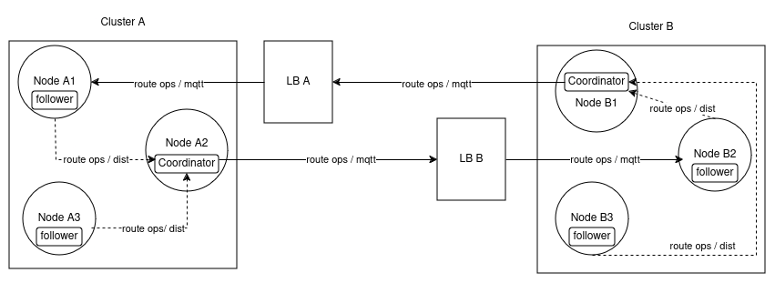
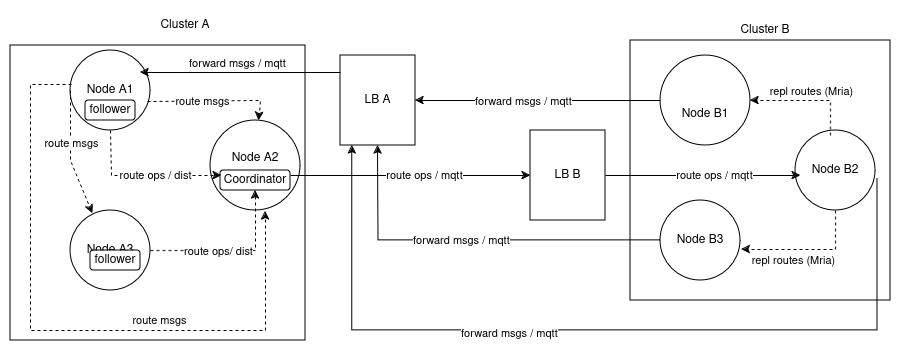

# Cluster linking


## Changelog

* 2024-04-05 @sergetupchii Initial draft
* 2024-04-09 @sergetupchii Review fixes
* 2024-04-15 @sergetupchii Review fixes, added protocol handshake example


## Abstract

This document describes EMQX cluster linking design proposal.
The goal of the feature is to establish links between several EMQX clusters that are likely to be deployed in different regions (network latency may be quite high).
These links shall allow forwarding relevant messages to linked (remote) clusters.
The rules for forwarding messages to the linked clusters shall be configurable.
The rules should be based on topic filters and include the option to forward all messages (match all topics).

## Motivation

The feature is demanded by EMQX customer(s) and is the part of EMQX Product Road-map.

## Configuration Changes

Root "cluster" config should be extended to configure linked clusters. The existing "cluster.name" field can be used as an an identifier of the local cluster.

### Example:

Nodes of the cluster "emqxcl_a" may define the following config to link with clusters "emqxcl_b" and emqxcl_c":

```
cluster {
  name = emqxcl_a
  enable_linking = true
  links = [
    {
        upstream = emqxcl_b
        server = "emqxcl_b.host:8883" # MQTT server
        ssl = {...} # ssl opts
        clientid = "emqxcl_a_client"
        # Auth:
        username = "emqxcl_a_user"
        password = "..."
        topics = ["t/global/#", "t/region-ab", "t/region-b", ...]
    }
    {
        upstream = emqxcl_c
        server = "emqxcl_c.host:8883" # MQTT server
        ssl = {...} # ssl opts
        clientid = "emqxcl_a_client"
        # Auth:
        username = "emqxcl_a_user"
        password = "..."
        topics = ["t/global/#", "t/region-c", ...]
    }

  ]
}
```

"emqxcl_b" config may look like this:
```
cluster {
  name = emqxcl_b
  enable_linking = true
  links = [
    {
        upstream = emqxcl_a
        server = "emqxcl_a.host:8883" # MQTT server
        ssl = {...} # ssl opts
        clientid = "emqxcl_b_client"
        # Auth:
        username = "emqxcl_b_user"
        password = "..."
        topics = ["t/global/#", "t/region-ab", "t/region-a", ...]
    }
    {
        upstream = emqxcl_c
        server = "emqxcl_c.host:8883" # MQTT server
        ssl = {...} # ssl opts
        clientid = "emqxcl_b_client"
        # Auth:
        username = "emqxcl_b_user"
        password = "..."
        topics = ["t/global/#", "t/region-c", ...]
    }

  ]
}
```

To be operational, the link must be be configured on both clusters.
Configuring a link only on one cluster can only set up an unidirectional link, i.e. cluster "a" configures a link to "b"
means that "a" is going to replicate its relevant routes to "b" and expects "b" to forward matching messages to "b".
Note, however, that "b" needs to know "a"'s server address, credentials to accomplish that, so it must be anyway pre-configured with this data.

If  "b" doesn't need to receive messages from "a", but must be able to forward messages to "a", the following config can be used on "b":
```
cluster {
  name = emqxcl_b
  enable_linking = true
  links = [
    {
        upstream = emqxcl_a
        server = "emqxcl_a.host:8883" # MQTT server
        ssl = {...} # ssl opts
        clientid = "emqxcl_b_client"
        # Auth:
        username = "emqxcl_b_user"
        password = "..."
        # Empty topics: emqxcl_b won't receive any messages from "emqxcl_a",
        # but can forward messages to "emqxcl_a" if the latter replicates some routes to "emqxcl_b"
        topics = []
    }
```
NOTE: this may be extended in future with some config propagation mechanism to allow establishing bi-directional links based on a configuration defined
by a seed cluster(s) or some alternative solution.

### Configuration API

Cluster linking should be full configurable at run-time. Adding a link, removing a link, changing links topics is expected
to be done by changing the corresponding configuration params. `config_handler` should be implemented to accomplish this requirement. No special CLI is to be developed, but the configuration is expected to be fully manageable via `emqx ctl conf` CLI. Configuration-based HTTP APi/UI is expected to be delivered in the future releases.


## Design

The communication between linked clusters includes (at least) two separate activities:
 - initiating the link and replicating relevant routes to the linked clusters
 - forward relevant messages to the linked clusters.

The proposed transport for linked clusters communication is MQTT.

Separate special topics shall be used for routes replication and message forwarding, e.g.:
 - "$LINK/cluster/route/${cluster_name}"
 - "$LINK/cluster/msg/${cluster_name}"

NOTE: `${cluster_name}` is always the name of the publishing peer.

A receiving side doesn't need a subscriber and can register a hook on 'message.publish' event.

NOTE: the hook should be registered every time cluster linking is enabled (`cluster.enable_linking = true`).


### Route Replication

A cluster shall replicate relevant routes (matched by the configured topic filters) to its links, so that the linked clusters can forward messages to that cluster.

#### Coordinator

To ensure route updates ordering, a single serialization point between a pair of linked clusters is needed. Thus, it's proposed to elect a coordinator process on a local cluster that will be responsible for publishing route updates to the linked cluster.

One coordinator should be elected for each linked cluster. The coordinator is also expected to make network communication between linked clusters more efficient: instead of direct connections from each node to each linked cluster, only one node serves as a coordinator and each other node forwards route updates through it, as depicted on the below diagram.



The elected coordinator process (or pool of processes) can additionally compact the payload by merging duplicated route operations from different nodes (similarly to `emqx_router_syncer` implementation).

Followers on other nodes are monitoring the coordinator and in case it's down, one of the followers is promoted to be the next coordinator.
Erlang `global` can be used to implement coordinator election. The coordinator shall be elected only on core nodes, since they are usually have more up-to-date data. However, async dirty Mnesia ops used for route replication don't guarantee that core nodes are always in sync.

NOTE: the pooling (picking a coordinator worker by the topic hash) may also be introduced to improve concurrency, as the route operations need to be serialized at the topic level but not globally.

The following example illustrates route replication sequence using a coordinator process:

1. Cluster "a" consists of three nodes: "a1", "a2", "a3" and defines a link to cluster "b":

```
cluster {
    name = a
    links = [
        {
            upstream = b
            server = "b.host:1883"
            topics = ["t/global/#", "t/region-a/test"]
    ]
}
```

2. Cluster "a" selects a coordinator on node "a1".
3. The coordinator on node "a1" starts and establishes a connection (connection pool) with cluster "b".
4. If cluster "b" is unavailable, the coordinator retries the connection after some time interval.
   NOTE: this is important, since a linked cluster may be not reachable simply because it is not up yet.
5. Once the connection to cluster "b" is established, the coordinator executes bootstrapping sequence:

    5.1 it selects all routes matching the topic filters: `["t/global/#", "t/region-a/test"]`.

    5.2 If there are matches, the coordinator replicates them to cluster "b", e.g.:

    ```
    [
        #route{topic = <<"t/global/1">>,dest = {external, {link, <<"a">>}}},
        #route{topic = <<"t/global/2/3">>,dest = {external, {link, <<"a">>}}},
        ...
    ]
    ```

    5.3 Cluster "b" runs a hook on 'message.publish' event on the pre-defined special topic and ads the routes to its routing table(s).
    NOTE: this should be synchronized, so at the point when cluster "a" connects to "b", the hook on "b" must be already added.

6. A client connected on node "a2" subscribes to topic  "t/region-a/test":

    6.1 A broker worker process on node "a2" matches the topic against the topic filters defined in the "cluster.links" config.

    6.2. As the topic matches one of the filters, it sends a message to the coordinator process residing on node "a1":
    `{add, <<"t/region-a/test">>}`

    6.3. The coordinator publishes this new route to cluster "b".

    6.4 cluster "b" adds the new route by applying a hook action.

7. If the coordinator on node "a1" goes down, the unprocessed messages are lost, but the next coordinator
is expected to execute the bootstrapping sequence and eventually bring the routing data to the consistent state.


#### Routes deletion

Introducing the coordinator doesn't solve all the possible consistency issues.
'Normal' route operations are done on 'per-node' node basis, so consistently reducing nodes routes state to the global cluster routes state is still
associated with the risk of some events reordering.

For example:
1. Node "a2" has a single subscriber to the global topic "t/global/1" (replicated to a linked cluster b").
2. The subscriber goes down so "a2" informs the coordinator on node "a1" that the local route is deleted.
3. Meanwhile a new subscriber to the topic "t/global/1" appears on node "a3", so it casts a request to the coordinator to add the route.

There is no guarantee that events 2, 3 will arrive to the coordinator in the correct order and a delete op won't cancel an actually more recent write op.
However, this can be mitigated be delaying delete operation by some time (keeping a stale route for a while is acceptable) and replicating them to linked clusters only if no 'add route' op canceled it in between:

1. Coordinator stashes a delete op for a pre-defined time, e.g. 5 s.
2. After 5s: if no 'add route' op for the same topic received, check that the cluster doesn't have any local routes to this topic (other nodes in this cluster may have subscribers).
3. If the local cluster has no subscriber, replicate 'route delete' op to the linked cluster.

Alternatively, routes deletion can be triggered on negative feedback: if a message forwarded from a linked cluster has no matching subscribers, the local cluster coordinator is notified and replicates route delete operation to the linked cluster. **TBD**

#### Routes cleanup and cluster unlinking

As stated earlier, the link is unidirectional. The bi-directinal link can be created if both clusters link to each other.
Thus, if the link is to be removed completely, the 'unlink' operation must be initiated on both clusters (it doesn't need to by synchronous or simultaneous).

If the cluster "a" defines a link to cluster "b", while cluster "b" defines the link to "a", the full unlinking sequence shall look like this:

1. Cluster "a" receives an unlink command (a configuration update via HTTP API or CLI).
2. Cluster "a" coordinator sends a "clear routes" msg to cluster "b".
3. Cluster "a" coordinator sends "shutdown message forwarding pool" msg to cluster "b".
4. Cluster "a" shutdowns routes replication connections pools to "b".
5. Cluster "a" shutdowns the coordinator for "b".
6. The same sequence (p. 1-4) is triggered on cluster "b", unless a cluster operator wants to keep the unidirectional link "b" -> "a".

#### Run-time routes updates

If link topic filters are changed by a user while cluster links are up and running, routes must be re-bootstrapped.
Re-bootstrapping should avoid cleaning previous routes before applying changes since it may lead to messages lost.
Instead, new matching routes must be bootstrapped on the linked clusters on top of any existing routes.
If there are any stale routes after the configuration update, they should be cleaned up later if possible (e.g. by using negative feedback approach).
If some irrelevant messages forwarding stale routes are forwarded, they must be ignored by the receiving end.


### Message forwarding

Message forwarding doesn't require the coordinator. Each node shall maintain a pool of MQTT connections to linked clusters to forward messages.
However, the pool for forwarding messages shall be initiated by the remote cluster.

1. Cluster "a" defines a link to b", cluster "b" may or may not link to "a" (managed independently, via "b"'s configuration).
2. Cluster "a" coordinator initiates the link to "b".
3. Cluster "b" shall start the pool for forwarding messages in response to the link request.
   Note: see the next section for more details about response/request pattern).

One direction of the link (cluster "a" replicates its global routes to "b", "b" forwards relevant messages to "a") is shown on the below diagram.



#### Message buffering

If the link is temporary down, the cluster shall buffer messages and send them as soon as the linked cluster is back.
The limit must be set for buffer byte size / messages length.

NOTE: basic main memory buffering can be implemented in the first release, while  on-disk persistence may be considered for development in the future.


### Linking protocol details and compatibility check

Simple push protocol with no response doesn't guarantee that the receiving end is the EMQX cluster implementing the linking feature. EMQX cluster can intentionally or unintentionally linked to the older EMQX version or a completely different MQTT broker.
Thus, it may be desirable to use request/response pattern, so that a cluster initiating a link can get a response from the 'linkee' to do some basic hand-shake. The protocol can be a simple Erlang map with "plain-text" fields. As there are only a few messages to exchange, a more compact binary protocol doesn't seem to be required.

1. cluster "cl-a" is configured to link with cluster "cl-b".
2. cluster "cl-a" elects the coordinator.
3. the coordinator initiates MQTT connections to cluster b" (MQTT Auth).
4. the coordinator subscribes (or adds a hook) to "$LINK/cluster/response/cl-b" (MQTT ACL check).
5. the coordinator publishes "init_link" message with additional meta data and adds correlation data.

   Example:

   ```
   Topic: $LINK/cluster/route/cl-a
   Response-Topic: $LINK/cluster/response/cl-b
   Correlation-Data: <<"123567890">>
   Payload:
       #{
           <<"op">> => <<"init_link">>,
           <<"upstream">> => <<"cl-b">>,
           <<"proto_ver">> => <<"1.0">>,
           <<"extra">> => #{}
       }
   ```

6. the cluster "cl-b" hook checks the local link config. If "cl-a" link is configured, it ensures that connection pool to "cl-a" for message forwarding and publishes a response to "cl-a":

   ```
   Topic: $LINK/cluster/response/cl-b
   Correlation-Data: <<"123567890">>
   Payload:
       #{
           <<"op">> => <<"init_link_ack">>,
           <<"proto_ver">> => <<"1.0">>,
           <<"result">> => <<"success">>,
           <<"extra">> => #{}
       }
   ```

   6.1 If the link can't be established (for example "upstream_name" doesn't match the actual "cluster.name"), the failure response is sent back:

   ```
   Topic: $LINK/cluster/response/cl-b
   Response-Topic: $LINK/cluster/response/cl-b
   Correlation-Data: <<"123567890">>
   Payload:
       #{
           <<"op">> => <<"init_link_ack">>,
           <<"proto_ver">> => <<"1.0">>,
           <<"result">> => <<"failure">>,
           <<"reason">> => <<"bad_link_name">>, %% more reasons may be added
           <<"extra">> => #{}
       }
   ```

7. If "init_link" message is delivered but no response is received from "cl-b" within a configured timeout, "cl-a" may retry establishing the link a limited number of times. If response is still missing, "cl-a" should remove the link and log the failure. cl-b" should log any failures to establish a link as well (for example, it receives "init_link" from "cl-a" request, but the link to "cl-a" is not configured, so it can't send a response.

#### Encoding

Message forwarding implies that Erlang records (`message`, `delivery`) need to be encapsulated in MQTT payload.
Thus, it seems reasonable to use Erlang External Term Format. Some optimizations shall be implemented to reduce the encoded payload size, for example, `{Topic, Cluster_name}` tuples can be encoded as binaries. Decoding must avoid creating new atoms: use `binary_to_term(Binary, [safe])`.


### Code structure

Cluster linking shall be implemented as a separate EE app under EMQX umbrella project.
The feature requires injection into the main `emqx` OTP app.
`dest` type defined in `emqx_router` module shall be extended to allow injecting the necessary route/dispatch callbacks outside `emqx` app:
```
-type dest() :: node() | {group(), node()} | {external, tern()}.
```

### Status API

CLI/HTTP API shall be implemented in future releases to allow a user to view and inspect the state of the links.
Possible link states: `up`, `setting_up` (e.g. routes bootstrapping is in progress), `{down, Reason}`.


### Rejected alternatives


#### Rote replication without the coordinator

A consistent implementation without the coordinator is possible if the following limitations are accepted:

   - each node adds its name to the route destination: `{ClusterName, NodeName}`, which increases the number of routing tables records. Moreover, direct dispatch to all nodes of the linked cluster doesn't seem to bring any advantages, so the stored `NodeName` would be practically unused.
   - linked cluster routes are only added and never deleted (adding a route is idempotent operation, so can be done concurrently and/or in any order).
