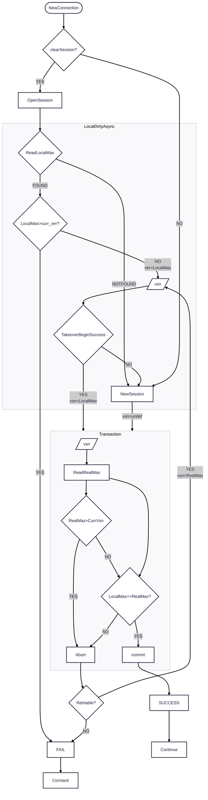

# Linear Channel Registry

## Changelog

* 2025-04-20: @qzhuyan First draft

## Abstract

For a new incoming MQTT connection, the node may look for an existing channel matching the same clientid 
within the cluster for taking further actions such as taking over the session, discarding the session, 
or creating a new session.

This channel registration info is a cluster wide global state maintained by the underlying database. 
It is replicated asynchronously (eventually consistent), and it leads to problems when replication is 
lagging or the old channel process is unresponsive.

In this EIP, we propose another channel registration subsystem called LCR ("Linear Channel Registry") that 
expands the channel prop with version (e.g., trpt_connected_at timestamp when transport connects) so that the 
yong and old channels could be determined to minimize the issues caused by race conditions during session takeover
while the client is reconnecting, especially in a massive volume.

## Motivation

For the current implementation of channel registry (emqx_cm_registry), it has eventual consistency.

The channel registration gets a dirty write on the core node from an RPC call.
The registration then gets replicated among the core nodes asynchronously (dirty).
The core nodes then replicate the registration to the replicant nodes.
When looking for existing channels while handling the new connection, EMQX do a lookup from the local copy.

This is a design for high availability and high performance, having the assumption that replication is finished 
before the next client connection. But when replication starts lagging due to various reasons, the following issues pop up:

- A node does not see that the channel exists. It creates a new session instead of taking over the existing one.

- A new channel could take over a session from the wrong channel due to the wrong order of receiving replications.

- The older channel with an unresponsive connection kicks the latest channel, causing the client to get disconnected unexpectedly.

- Wrong Session Present flag in MQTT.CONNACK is returned to the client.

- The deregistration may overrun the registration, leaving a registration unreleased.

- When a channel process starts to take over or create a new session, it runs the operation in an ekka locker transaction which uses 
a cluster-wide, domain-specific fine lock, ekka_locker. By involving all the core nodes, it protects the operation from being executed 
in parallel but not the registration data, leading to unexpected behaviors.

- The ekka_locker is error-prone in that it is very easy to leave a lock unreleased in the cluster such that when the channel process gets 
killed in the middle of the processing of session takeover, the deadlock detection needs 30s to detect and then remove the lock. 
This means the broker will be unavailable to that client for that period, and the retries from the client will just create more 
load (TLS handshake, client AUTH) on the cluster.

We need to explore other option to ensure correctness for mission-critical use cases with some performance loss as a trade-off.

## Design

### Reasoning

Based on real-world scenarios, we have the following assumptions:

- Client to brokers latency is higher than the latency between EMQX nodes.

- Clients do not reconnect within millisecond delays, so it is unlikely to have two channels race for the same clientid for session operations.

Therefore, we could use the transport connected timestamp (`trpt_connected_at`) in ms as the version of the channel.

@NOTE, we could use other timestamp too such as client provided timestamps embeded in MQTT user props. 

Based on the current EMQX implementation, we have the following facts:

- Most of the time, replication is not lagging, so it is efficient to read from local to check if the self channel is the latest 
  or already outdated (there exists a newer one).

- Removing the ekka locker transaction enables more than one channel to begin takeover of the session ({takeover, 'begin'}), but still, 
  only one can finish ({takeover, 'end'}).

- It is no harm if the current channel finished the 'begin' phase for a non-latest channel.

- For correctness, it should be okay to retry 'begin' takeover of another newly discovered latest channel.

- Combined with local dirty reads and transactional updates, we could balance correctness and performance.

- The channel of the latest connection from the client is preferred to wait and retry takeover of the session instead of getting a 
  negative MQTT.CONNACK immediately.

- Session registration is a bag table; multiple channels of the same client could co-exist. New design could follow this.

Based on the above, with versioning, channels from the same client become comparable, and EMQX could find the most recent channel or check if the current connection it is processing is outdated.

We use three versions during the processing:

- `ver_LocalMax`

  Max version of existing `channel`s from **local async dirty read**.
  
  Value is `undefined` if and only if no matching channel is found.

- `ver_RealMax`

  Max version of existing `channel`s from **transactional read**.
  
  Value is `undefined` if and only if no matching channel is found.

- `ver_curr`
  
  `channel` Version from the execution process stack.
  
With actions below:

IF `ver_curr` < `ver_LocalMax`, drops the processing early, returns negtive CONNACK. __HAPPY FAIL__

ELSEIF `ver_curr` < `ver_RealMax`, drops the processing late, returns negtive CONNACK. __EXPENSIVE FAIL__

ELSEIF `ver_RealMax` > `ver_LocalMax`, restart the processing with `ver_RealMax` with limited number of retries. __MOST EXPENSIVE PATH__

ELSEIF `ver_RealMax` == `ver_LocalMax`, write with `ver_curr` and continue with the processing. __HAPPY ENDING__

It is very unlikely to happen that `ver_curr` > `ver_RealMax` AND `ver_RealMax` < `ver_LocalMax`, but for correctness, it should abort the transaction and then return MQTT.CONNACK with a negative reason code then log with INFO message.

The transaction to run is micro and abortive, it only reads and writes the same key, only one lock is taken so it is unlikely to get restarted by mria/mnesia.

### record #lcr_channel{}

`lcr_channel` of LCR represents the EMQX channel that provides a global view and maintain a global state within the cluster.

Erlang
-record(lcr_channel, {
    id :: lcr_channel_id(),
    pid :: pid() | undefined,
    vsn :: integer() | undefined
}).

`lcr_channel` is bag table using the value of clientid as the key (id).

`#lcr_channel.pid` is the channel process pid, global unique, and contains embedded info of the node.
`#lcr_channel.vsn` is used to compare or sort the channels.

@TODO If we could prove that there max has two generations, we could convert it to ordered_set.

For write, it is done transactionally. A Mria transaction with sharding is executed on one of the core nodes (strong consistency among core nodes), 
and it will get replicated to the replicant nodes asynchronously (eventual consistency).

For read, a node reads from local storage.

For delete, it is done asynchronously (dirty), but it will never overrun the writes.

There is no need for updates in core or replicant. @TODO Do we need to prove that it is written once?

### lcr_channel lifecycle

lcr_channel is written when:

1. the session is created AND after updating the local ETS for other tables of the channel.

1. the session takeover 'begin' is finished AND after updating the local ETS for other tables of the channel. 

lcr_channel can be read at any time.

For deletion, there are the following triggers:

1. the channel process exits gracefully, where in the terminating phase, it deregisters itself from LCR.
   triggers:
   - transport close
   - taken over (`{takeover, 'end'}`)
   - discarded
   - kicked

1. node down/Mnesia down event: 
   
   The living node may remove the channel belonging to the down node. It must be done only once within 
   the cluster successfully.
   
   For replicant node down, its upstream core node should clean the channels for it.
   For core node down, @TODO
   
   
### Drawbacks

- Compare to the `ekka_locker`, using transaction will stress the `mnesia_locker` which is single point of bottleneck.

  But `mnesia_locker` is more robust than `ekka_locker`.

- "registration history function" will not be supported as we don't want large data set.
  It must be reimplemented.
   
## Backwards Compatibility

`LCR` should be disabled by default with a feature switch.

### LCR Disabled

When `LCR` is disabled, there should be no backwards compatibility issue, and the EMQX cluster should work as it does in the old version.

### LCR Enabled within the cluster

Once `LCR` is enabled, `LCR` can co-exist with `emqx_cm_registry` with a feature switch.

READs from `LCR` storage only. WRITES go to both if `emqx_cm_registry` is also enabled (global), but DO NOT use `ekka_locker:trans`.

### LCR partially Enabled within the cluster

During a rolling upgrade, the EMQX cluster could run with `LCR` partially enabled due to the mixed versions of EMQX nodes.

To be compatible with old bpapi calls from the old version of EMQX, there are two problems to solve:

1.  In the RPC call, no channel version is missing.
2.  `emqx_cm_registry` is the only provider, and it has no channel vsn.

Thus, we define the fallback method here for Node evacuation and rolling upgrade:

For newer EMQX handling the call from older EMQX, the channel version uses the value of the timestamp: `disconnected_at`.

Newer EMQX MUST NOT disable the `emqx_cm_registry`; as part of the standard implementation, the writes will go to both storage.

For newer EMQX calling the older EMQX, the newer EMQX should write to the `LCR` once the bpapi call is successful. The newer EMQX MUST not update the `emqx_cm_registry` storage as it is part of the call handling on the older EMQX.

### LCR runtime enabling

UNSUPPORTED for now.

### LCR runtime disabling

Supported, but we don't know the side effects. Leave it as @TODO.

## Document Changes

If there is any document change, give a brief description of it here.

## Testing Suggestions

### Functional test

1.  The existing common test suites should be expanded with a new group `lcr_on`, `lcr_off`

    -   takeover suite
    -   cm suite

    Add a new cluster test suite for testing core + replicant roles covering known issues in previous chapters
    
2.  Rolling upgrade should be tested with the `LCR` switch on.

## Performance test

Performance tests should be performed against a 3 cores + 3 replicants cluster.

Compare the performance with `LCR` on/off with the following scenarios:

1.  initial connections
2.  reconnections
3.  all clients connect with the same `clientid`.

## Declined Alternatives
    
Here goes which alternatives were discussed but considered worse than the current.
It's to help people understand how we reached the current state and also to
prevent going through the discussion again when an old alternative is brought
up again in the future.

