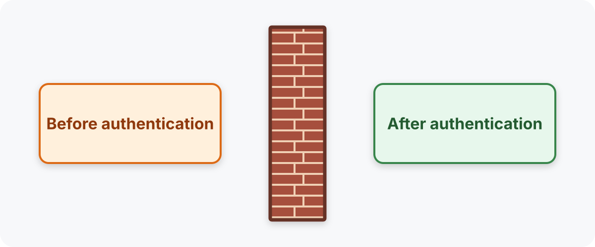
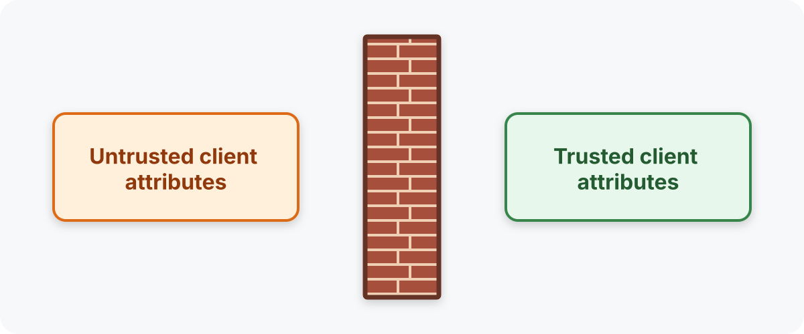

# Trusted Client Info

## Changelog

* 2026-07-02: Initial draft

## Abstract

This EIP introduces a provenance-aware security context for `ClientInfo` users. Instead of treating full runtime `ClientInfo` as authority-bearing data, post-authentication security-sensitive consumers receive a **trusted projection** derived only from EMQX-controlled fields, authenticator outputs, and explicitly validated client fields.

The goal is to give authorization, namespace, mountpoint, limiter, and related post-authentication decisions a common trust boundary.

The problem solved by this EIP may be stated as: **when we run authorization checks, we cannot know which client attributes are trusted.**

## Motivation

There are several kinds of issues we recently found. They are two large groups:

* Several severe ones where **unauthenticated publishes** happen, like [#74 MQTT-SN QoS -1 publishes bypass authentication in idle state](https://github.com/emqx/emqx-dev-team-tasks/issues/74).
* A lot of minor ones like [#167 LwM2M endpoint-name client ID unbound to authenticated credential](https://github.com/emqx/emqx-dev-team-tasks/issues/167). They all look like _"xxx is unbound to authenticated identity"_.

The danger from the first group is obvious, and we solved these issues tactically, by just inspecting the code and adding authentication calls.

The second group is more subtle:

* It is unclear what is the threat.
* It is unclear what to do about it.

### The threat of "xxx is unbound to authenticated identity" issues

#### Example 1

* We have built-in authentication enabled, with clientid + password validation.
* We have authorization enabled, with `{allow, all, publish, ["foo/${username}/bar"]}.` topic.
* A user logs in with correct clientid + password and arbitrary username, e.g. `victim`.
* User publishes a message to `foo/victim/bar` and bypasses authorization because authorization trusts the username.

#### Example 2

* We have `tns` set from user props in `init_client_attrs`.
* We have a postgresql authentication backend enabled using `${username}`.
* A user logs in with correct username and arbitrary `tns`.
* The `tns` remains unchecked and is used to mount to the namespace.
* Malicious user publishes topics to an arbitrary namespace.

In the current implicit model, we treat these threats as "user's faults", i.e. users are to blame for inconsistent configuration.

### Why to fix

Although the second group is of less severity, it gives clue to how to avoid issues from the first group.

The problem is not that we "do not call authentication", the problem may be stated as **when we run authorization checks, we cannot know which client attributes are trusted**.

* In the case of missing authentication, none of the attributes are trusted, but authorization cannot know that, so it trusts everything. We treat this as "our" fault.
* In the examples above, _some_ attributes are trusted, and some are not, but authorization does not know as that well. Since the authentication has run, we treat that as "user's fault" -- we expect that they had to verify all the attributes they use in authorization using previous authentication. To be more user-friendly, we better provide a foolproof framework that prevents users from critical configuration mistakes.

## Design

### General Idea

We propose to change the security model and boundary.

From:



To:



* We explicitly treat some `clientinfo` attributes as trusted, and some not.
* The trusted attributes are those that come from trusted sources.
  * We trust, e.g., listener/zone attributes because they are set by EMQX itself.
  * We trust attributes that come from authenticator, like `auth_expire_at`, `acl`, `is_superuser`, any additional attributes set by the authenticator.
  * We trust attributes that were validated by the authenticator, e.g. `clientid`, `tns` if clientid-based builtin authentication was used.
* When making a privileged action, e.g. message publishing, we strip the clientinfo to the trusted attributes only. 
* We implement fail closed behavior on missing necessary trusted data.

### ClientInfo changes

To operate securely in privileged contexts, we introduce a common helper that strips `clientinfo`:

```erlang
TrustedClientInfo = emqx_access_control:trusted_clientinfo(ClientInfo)
```

It has the backward compatible simple shape, but with untrusted fields stripped out.

To strip out untrusted fields from `clientinfo` we do the following:

* We have a static list of trusted fields that are always included in the output, like `listener` or `zone`.
* We move authenticator-originated fields into the trusted submap:
  ```erlang
  #{
      listener => ...,
      clientid => ...,
      trusted_attrs => #{
          authn => #{
              is_superuser => true,
              acl => ...,
              auth_expire_at => ...
              %% ... maybe some other attributes, e.g. coming from http
          },
          clientinfo => #{
              ...
          }
      }
  }
  ```
* `clientinfo` submap contains a mask map of trusted client info fields verified by the authenticator. E.g. if a client passed postgresql authenticator using `client_attrs.tns` and `username`, and `password`, then we have:
  ```erlang
  clientinfo => #{
      username => true,
      client_attrs => #{
          tns => true
      }
  }
  ```
* `authn` and `clientinfo` submaps are set by the access control layer during authentication.
* When calculating `trusted_clientinfo`, we combine static trusted fields with fields matching the mask:
  ```erlang
  #{
      listener => foo,
      clientid => c1,
      username => u1,
      client_attrs => #{
          tns => bar
      },
      trusted_attrs => #{
          authn => #{
              is_superuser => true,
              acl => [],
              auth_expire_at => 123
          },
          clientinfo => #{
              username => true,
              client_attrs => #{
                  tns => true
              }
          }
      }
  }
  ```
  goes into:
  ```erlang
  #{
      listener => foo, %% static trusted field
      %% clientid => c1, %% no clientid, it is not trusted
      username => u1, %% trusted by mask
      client_attrs => #{
          tns => bar %% trusted by mask
      },
      trusted_attrs => #{
          authn => #{ %% authn fields are trusted by default
              is_superuser => true,
              acl => [],
              auth_expire_at => 123
          }
      }
  }
  ```

For explicit anonymous access, we have just `clientinfo => true` -- a universal mask treating all fields as trusted.

### Conceptual Examples

#### Example 1 (same as above)

* We have built-in authentication enabled, with clientid + password validation.
* We have authorization enabled, with `{allow, all, publish, ["foo/${username}/bar"]}.` topic.
* A user logs in with correct clientid + password and a forged username, e.g. `victim`.
* User publishes a message to `foo/victim/bar`.
* The authorization receives the trusted set of attributes `#{clientid => trust_me_im_good, peerhost => ...}`.
* There is no `username` attribute because it was not verified.
* The rule `{allow, all, publish, ["foo/${username}/bar"}]}.` applies as `deny` because `username` cannot be evaluated.

#### Example 2 ("forgotten authn")

* We implemented a new channel/gateway.
* We made a mistake in implementation, so in some cases authentication is not called.
* A user connected and sends a message from unauthenticated channel.
* Since authentication is not called, the clientinfo carries no clientid/username/etc trusted attributes coming from authn.
* The authorization now can handle the situation, it may choose to:
  * Just deny the action because no attributes are coming from the authenticator.
  * Or allow as soon as only generally allowed topics are concerned, like `{allow, all, publish, ["free/for/all"]}.`.
* In any case, such client will never be able to publish into a restricted topic `{allow, all, publish, ["foo/${username}/bar"]}.` or pass authorization that requires placeholders like `${username}` because the authorizers just do not receive them.

### Hardened-Mode ClientInfo Consumers

In hardened mode, post-authentication security-sensitive consumers should use trusted `ClientInfo`, not full `ClientInfo`.

This includes:

* Authorization.
* Session takeover.
* `namespace_as_mountpoint`.
* Gateway `mountpoint` templates.
* Multi-tenancy namespace and quota checks.
* Limiter adjustment context.

Like `namespace_as_mountpoint`, a gateway `mountpoint` template resolves placeholders such as `${clientid}` and `${username}` from `ClientInfo`, so it must render from the trusted projection. Otherwise the mountpoint prefix is built from an unverified attribute.

### Related Issues Addressed

This design is intended to address a wide class of trust-boundary issues, including:
[#62](https://github.com/emqx/emqx-dev-team-tasks/issues/62),
[#66](https://github.com/emqx/emqx-dev-team-tasks/issues/66),
[#67](https://github.com/emqx/emqx-dev-team-tasks/issues/67),
[#74](https://github.com/emqx/emqx-dev-team-tasks/issues/74),
[#75](https://github.com/emqx/emqx-dev-team-tasks/issues/75),
[#79](https://github.com/emqx/emqx-dev-team-tasks/issues/79),
[#82](https://github.com/emqx/emqx-dev-team-tasks/issues/82),
[#109](https://github.com/emqx/emqx-dev-team-tasks/issues/109),
[#110](https://github.com/emqx/emqx-dev-team-tasks/issues/110),
[#113](https://github.com/emqx/emqx-dev-team-tasks/issues/113),
[#114](https://github.com/emqx/emqx-dev-team-tasks/issues/114),
[#115](https://github.com/emqx/emqx-dev-team-tasks/issues/115),
[#123](https://github.com/emqx/emqx-dev-team-tasks/issues/123),
[#124](https://github.com/emqx/emqx-dev-team-tasks/issues/124),
[#129](https://github.com/emqx/emqx-dev-team-tasks/issues/129),
[#136](https://github.com/emqx/emqx-dev-team-tasks/issues/136),
[#140](https://github.com/emqx/emqx-dev-team-tasks/issues/140),
[#164](https://github.com/emqx/emqx-dev-team-tasks/issues/164),
[#165](https://github.com/emqx/emqx-dev-team-tasks/issues/165),
[#166](https://github.com/emqx/emqx-dev-team-tasks/issues/166),
[#167](https://github.com/emqx/emqx-dev-team-tasks/issues/167),
[#168](https://github.com/emqx/emqx-dev-team-tasks/issues/168),
[#169](https://github.com/emqx/emqx-dev-team-tasks/issues/169),
[#188](https://github.com/emqx/emqx-dev-team-tasks/issues/188),
[#192](https://github.com/emqx/emqx-dev-team-tasks/issues/192),
[#233](https://github.com/emqx/emqx-dev-team-tasks/issues/233),
[#251](https://github.com/emqx/emqx-dev-team-tasks/issues/251),
[#261](https://github.com/emqx/emqx-dev-team-tasks/issues/261).

### Optimizations

Actually `ClientInfo.trusted_attrs.clientinfo` depends on the used authenticator not on the constant user. So we may store:

```erlang
#{
    trusted_attrs => #{
        authn => #{
            is_superuser => true,
            acl => ...,
            auth_expire_at => ...
            %% ... maybe some other attributes, e.g. coming from http
        },
        authn_ref => AuthnRef
    }
}
```

And deduce part of the mask from authentication metadata (used vars in the templates). However, normally there should not be many data in the mask, mainly `clientid`/`username` and maybe `tns`.

## Configuration Changes

Two groups of tweaks are introduced:
* Switches that loosen the trust requirements where trusted client info is applied.
* A list that marks extra client attributes as trusted.

### Per-consumer trust enforcement switches

Hardened-mode `ClientInfo` consumer get a boolean switch named `require_trusted_attributes`.
When the switch is `true`, the consumer receives the trusted projection of `ClientInfo`.
When it is `false`, the consumer receives the full `ClientInfo`, which is the current behavior.

The initial consumers of trusted attributes are the following:

| Config path | Consumer | Zone-overridable |
| --- | --- | --- |
| `authorization.require_trusted_attributes` | Authorization rule and placeholder evaluation | No |
| `multi_tenancy.require_trusted_attributes` | Namespace resolution, managed-namespace and quota checks | No |
| `mqtt.require_trusted_attributes` | Session takeover, gateway `mountpoint` rendering | Yes, as `zones.<name>.mqtt.require_trusted_attributes` |

The defaults depend on `EMQX_SECURITY_PROFILE`.

| Profile | Default of `require_trusted_attributes` |
| --- | --- |
| `legacy` | `false` |
| `hardened` | `true` |

### Marking extra attributes as trusted

New zone-overridable field:

```hocon
mqtt.trusted_client_attributes = ["clientid", "client_attrs.tns"]
```

## Backwards Compatibility

The implementation must be completely backwards compatible. The compatibility must be achieved by applying any of the methods:
* Using legacy security profile.
* Using hardened security profile but enabling introduced tweaks.

## Document Changes

## Testing Suggestions

## Declined Alternatives

* A separate `require_trusted_attributes` switch for each channel-level consumer (session takeover, `namespace_as_mountpoint`, gateway `mountpoint`, limiter adjustment). They read the same channel `ClientInfo` established at authentication time, so one switch keeps the config surface small without losing a realistic remediation path.
* Per-listener placement of `trusted_client_attributes`. Zone-level placement matches `client_attrs_init` and covers gateways and dedicated entry points through listener-to-zone binding, with less configuration.
