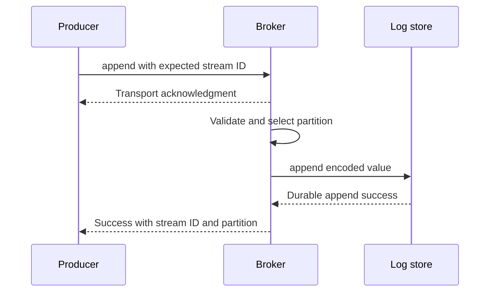
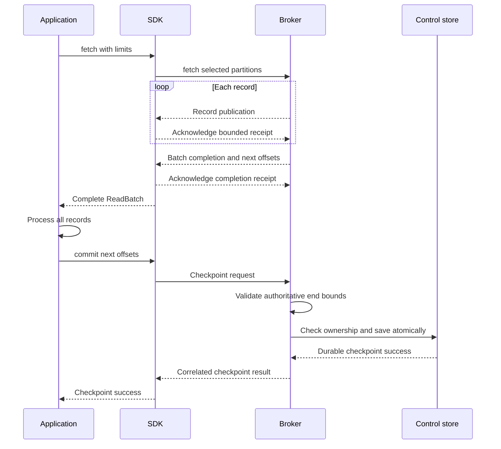

# Partitioned MQTT Streams

## Changelog

* 2026-10-07: Initial draft.

## Abstract

Add logical partitions, stable offsets, bounded batch reads, and optional durable consumer-group checkpoints to MQTT Streams.

- Existing publishers keep using ordinary MQTT PUBLISH.
- Producers that need explicit placement or a durable per-stream receipt use a single-record append operation.
- Append and all consumer operations use a small command protocol: MQTT 5 request/response over reserved topics, used directly or through client SDKs.
- The existing `$stream/<name>` subscription keeps working, including on partitioned streams.
- The contract is independent of storage. Durable Storage (DS) in its existing layout, a stream-specific DS layout, and a dedicated backend are implementation candidates.

## Motivation

MQTT Streams store matching publications in DS and replay them through `$stream/<name>` subscriptions with a `stream-offset` user property; each delivered message carries `ts` and `key` user properties. The [existing Streams tests](https://github.com/emqx/emqx/blob/release-63/apps/emqx_streams/test/emqx_streams_test_utils.erl) exercise that subscription shape. The current implementation has four shortcomings.

1. **One shard per stream.** Every record of a stream is written to a single DS shard selected from the stream ID (`emqx_streams_message_db:insert/4`). A stream cannot be written faster than one shard accepts, and consumers have no public unit of parallelism or ordering.
2. **Positions are times, not identities.**
    * `earliest` is the current time minus the stream's retention period, not the physical boundary; unlimited regular streams are expired by a global period.
    * `latest` is the current time.
    * An explicit position is a timestamp; one earlier than the retention window (now minus the retention period) is moved forward to the window's start (`emqx_streams_extsub_handler:start_time_us/2`).
    * Two readers cannot agree on a position, a position cannot be checked against retained history, and resuming where a consumer stopped depends on clocks.
3. **No durable processing progress.** The broker records nothing about what a consumer has processed. Applications persist delivered timestamps themselves and accept imprecision at the boundary.
4. **Limits are enforced late.**
    * Count and byte limits are not checked when a record is written.
    * Usage is tracked in a separate quota index updated in batches, on purpose, to keep writes fast; its settings are hidden (`emqx_streams_schema`).
    * Expiration driven by those limits runs behind the writes, and a write that would exceed a limit cannot be rejected.

Applications can track processing progress themselves, imprecisely, but have no way to get partition assignment or exact replay positions.

Design goals:

1. **Compatibility with existing publishers.** Store ordinary MQTT traffic without a Streams SDK or producer changes.
2. **A small consumer API.** Batches and a processing helper for common use; explicit partitions, fetch, seek, and checkpoints when needed.
3. **Testable guarantees.** Distinguish durable append, completed delivery, and saved application progress; bound memory and retained history.
4. **Storage independence.** Expose logical logs and positions without backend cursors, physical shards, or mandatory reuse of existing consumer machinery.

## Design

The following contract defines required behavior. Examples, the walkthrough, and implementation choices are informative. Rules that matter to implementers more than to API users are in Appendix A. Exact wire schemas and interoperability fixtures must be finalized before command protocol v1 is declared stable.

### Scope

This EIP applies to regular (append-only) streams created in the partitioned format.

Out of scope, to be specified separately:

- Last-value streams and compaction; they keep their current key-in-topic storage layout.
- Automatic consumer assignment.
- Producer batching, deduplication, filtering, limits shared across a whole stream, and repartitioning.
- Broker-side dead-lettering and per-record negative acknowledgment.
- Exactly-once delivery.
- Live backend switching.

Stream names stay unique across the cluster, as today. If the stream registry gains namespaces, names are scoped by namespace and nothing else in this contract changes.

### Walkthrough

One stream end to end: `telemetry`, topic filter `devices/#`, three partitions, default key expression `message.from` (the publisher's Client ID). Terms are defined in the sections that follow.

Writes:

- Publishers are unchanged MQTT clients.
- For every stream whose topic filter matches, the broker evaluates the key expression and hashes the key to a partition, then appends the record to that partition's log.
- A direct append may name the partition; the key is still evaluated and stored.

```text
Publishers (ordinary MQTT, unchanged)         Stream "telemetry": topic filter devices/#,
                                              key expression message.from, 3 partitions

Client "car-17"   PUBLISH devices/17/temp  --+
Client "car-17"   PUBLISH devices/17/speed --+-- key "car-17"  -- hash --> P1

Client "phone-3"  PUBLISH devices/3/temp   ----- key "phone-3" -- hash --> P0

Producer app      append(partition = 2)    ----- explicit placement -----> P2

Partition logs: each is one ordered log; offsets are strictly monotonic within a partition,
may have gaps, and are never reused

P0  | 100 | 103 | 107 | 112 |        start_offset 100   end_offset 113
P1  |  41 |  42 |  58 |              start_offset  41   end_offset  59
P2  |   7 |   9 |                    start_offset   7   end_offset  10

Records placed by key: same key, same partition, so order per key is kept.
There is no order across partitions.
```

Each stored record carries what a consumer needs to identify and replay it:

```text
{stream_id: "s-9f3c", partition: 1, offset: 58, timestamp: 1791415200123456,
 key: "car-17", topic: "devices/17/speed", payload: <bytes>}
```

Placement:

- Partitions are logical. The backend maps each one to physical storage with a mapping fixed at creation.
- Several partitions may share a DS shard; a partition never spans shards.
- Nothing physical appears in the API.

```text
P0 --+
P2 --+--> DS shard "a"
P1 -----> DS shard "b"      backend detail; consumers only ever see partition and offset
```

Nodes (DS Raft backend as the example):

- Each shard is a Raft group replicated on several nodes with one leader, the write authority.
- Shards are spread over the cluster: for a given shard a node holds the leader, a follower, or nothing.
- The control store for claims and checkpoints is replicated the same way.
- A dedicated backend would replicate partition segments instead of shards; the picture has the same shape.

```text
Four nodes, replication factor 3. Shard a holds P0 and P2, shard b holds P1.
L = leader (write authority), F = follower, - = no copy on this node.

            node 1        node 2        node 3        node 4
shard a     L             F             F             -
shard b     -             F             L             F
control     F             L             F             -

Publisher connected to node 1 publishes devices/17/speed (key "car-17" -> P1 -> shard b)
  node 1 -> shard b leader on node 3 -> append -> replicated to node 2 and node 4
  durable, and visible below end_offset, once a majority of the replica set has it

Consumer connected to node 4 reads P1 and saves progress
  fetch  -> node 4 -> shard b leader on node 3 reads and returns the records
  commit -> node 4 checks the end against shard b, then the control leader on node 2
            checks the claim, saves, answers
  (DS serves reads from the leader today; reading from followers is a possible later change)

Node 3 fails
  shard b elects a new leader on node 2 or node 4; offsets, bounds, and checkpoints do not change
  an append that was in flight has an unknown outcome; the producer must not blindly retry
  readers connected to node 3 are gone and their claims expire; those consumers reconnect
  elsewhere and reopen from their checkpoints
```

Reads: one group reader on partitions 0 and 1.

```text
1. open("telemetry", group="analytics", assignment=[0, 1], start="earliest")
   -> claims P0 and P1 for this reader instance
   -> positions {P0: 100, P1: 41}: saved checkpoints, else the group's stored
      initial positions, else start
2. fetch(max_messages=4, wait_ms=5000)
   -> records P0:100, P0:103, P0:107, P1:41;  next_offsets {P0: 112, P1: 42}
   -> active positions move to next_offsets; nothing is saved yet
3. save_batch(records)                                       application code
4. commit({P0: 112, P1: 42})
   -> broker checks positions <= end_offset, then the claim, then no regression
   -> saves the whole map atomically, then answers
5. fetch(...) continues from the active positions; repeat 3 and 4
```

Partition 0 after step 4 and one more fetch that returned offset 112. In this flow every position only moves forward; `seek` and `reset` can move the active and committed positions either way.

```text
offset:   100       103       107       112       113
           ^                             ^         ^
      start_offset                   committed    active = end_offset
      oldest retained; moves         saved by     continuation after the
      as history expires             the group    last complete fetch
```

Failure cases:

```text
Crash after step 2 or 3        reopen -> positions {P0: 100, P1: 41} -> same records
                               again (at least once)
Second instance opens the
same group and partitions      PARTITION_BUSY until the first reader closes or its
                               claim expires
History expires past the
committed position             open fails with POSITION_EXPIRED, or moves to the new
                               start_offset with on_expired=earliest
```

- An independent reader omits `group`: no claims and no broker checkpoints; it keeps its own `SavedPositions`.
- A legacy `$stream/telemetry` subscriber sees the same records from all partitions merged into one flow, with `partition` and `offset` user properties.

### Streams and partitions

- A stream has a name, unique among the streams that exist in the cluster, and an immutable `stream_id`.
- Deleting a stream and creating another with the same name produces a different `stream_id`. `StreamRef` values and saved positions refer to the old ID and never apply to the new stream silently.
- A stream has `partition_count` partitions, numbered `0` to `partition_count - 1`, fixed at creation. Each partition is an independent ordered log.
- Partitions are logical. The mapping to physical storage is a backend detail that never appears in the API.
- A key rule maps a record to a partition. It consists of the key expression, the encoding of the expression's result, and the hash that turns the encoded key into a partition number. Each rule carries a version. New EMQX releases may add rule versions, but a stream keeps the version it was created with, so the same message maps to the same partition for the life of the stream.
- Records placed by key land in the partition their key hashes to, in append order. An explicit partition can put a record with any key in any partition. There is no order across partitions.

### Data model and positions

```text
StreamRef     = {name, stream_id}
OffsetMap     = map<partition, nonnegative integer>
SavedPositions = {stream_id, offsets: OffsetMap}

Record = {
    stream_id, partition, offset,
    timestamp,             # Stored broker acceptance time, epoch microseconds.
    key: bytes, topic: UTF-8 string, payload: bytes,
    message_id: bytes      # Optional, producer-supplied; stored and replayed
                           # verbatim, not interpreted in v1. Ordinary publishes leave it unset.
}
ReadBatch = {stream_id, records: list<Record>, next_offsets: OffsetMap}
```

- `(stream_id, partition, offset)` identifies a record permanently; replay preserves all its fields.
- Offsets are stable record identities. They are not dense counters, and they carry no time meaning for clients even when a backend allocates them from a clock. Within a partition they are strictly monotonic: each append receives an offset greater than every earlier offset in that partition. They may contain gaps and never reset, wrap, or get reused.
- The wire encodes offsets as decimal strings; comparisons are numeric.
- `SavedPositions` carries the `stream_id` so that saved progress can never be applied to a different stream with the same name.
- `message_id` is reserved so a later deduplication capability needs no new record format.

Each partition exposes two bounds. Both are durable and never decrease.

| Bound | Meaning |
| --- | --- |
| `start_offset` | Minimum valid read position; moves forward as history expires. |
| `end_offset` | Exclusive upper bound. Every record below it is durable and visible, and no new record can appear below it. |

### Producers and durability

Ordinary publish:

- A PUBLISH whose topic matches a stream's topic filter is written to that stream as a record. The broker evaluates the key expression and picks the partition; the publisher needs no knowledge of streams, keys, or partitions.
- One PUBLISH can match several streams. PUBACK acknowledges the publish, not the write into any stream. If the write into one stream fails, the publisher is not told; the failure is visible only in that stream's metrics, and the message is still delivered live and still written to the other streams it matched. A producer that needs a per-stream receipt uses direct append.

Direct append:

- Targets one `StreamRef`. Carries one raw payload, the record's topic, an optional `message_id`, and optionally a partition. Without a partition the key selects it; an explicit partition overrides placement, not the key.
- Validated before storage: stream identity, append permission and publish permission on the record's topic, topic-filter match, partition, key evaluation, and size.
- A direct append is not delivered to live subscribers of the topic and is not written to other streams whose topic filter matches. The append's outcome depends only on the target stream: not on live delivery and not on another stream's limits. A producer that wants live delivery publishes normally instead of appending; doing both stores the record twice.
- The broker answers each append with a correlated result message; the PUBACK of the append request is only transport acknowledgment. A success result means the record is durably stored under the durability profile below, and carries the stream ID and partition, optionally the assigned offset. A rejection result carries the reason.
- No result within the append timeout is an unknown outcome. Retrying can duplicate records; SDKs must not resubmit automatically.

Key expression:

- Both paths evaluate the stream's key expression over three inputs: `message.topic`, the record's topic (the PUBLISH topic for an ordinary publish, the carried topic for a direct append); `message.payload`, the raw payload bytes; and `message.from`, the Client ID of the publishing client as authenticated by the broker. Protocol properties and other MQTT fields are excluded. The default expression is `message.from`, so by default all records from one client go to one partition.
- This is narrower than the current `key_expression`, which may reference any field of the message map, including user properties and peer address. The restriction makes a direct append produce the same key as the same message published normally. Existing-format streams keep their expressions.
- Expression semantics, result encoding, and hashing are frozen by the key rule version. Unsupported expressions are rejected at creation. An evaluation failure rejects the append, including explicit placement, with no fallback.
- Applications that need custom routing supply a partition.

Durability profile:

- Acknowledged appends and checkpoints survive a restart with intact storage and the loss of one storage replica.
- When a partition's write authority cannot be reached, the write returns an availability error.
- All backend candidates are evaluated under this profile.

### Consumers

Operations that are part of the contract. `append` is specified in Producers and durability, and `describe` in Configuration Changes.

```text
describe(name) -> definition, capabilities, limits, bounds, effective policy and pending revision
append(StreamRef, topic, payload, partition = auto, message_id = none) -> append outcome
open(StreamRef, assignment, start, group = none, on_expired = fail) -> reader, positions, liveness
fetch(reader, {max_messages, max_bytes, wait_ms}, partitions = assigned) -> ReadBatch
commit(reader, offsets) -> checkpoint outcome
committed(reader) -> saved checkpoints, revision
committed(StreamRef, group) -> checkpoints, initial positions, revision
seek(reader, offsets) -> new active positions and reader generation
renew(reader) -> liveness
close(reader) -> result
reset(StreamRef, group, expected_revision, offsets) -> reset outcome
```

Parameters and results:

- Every remote operation has a correlated application-level result. MQTT acknowledgment alone never completes it.
- `assignment` is all partitions or an explicit nonempty set. Automatic assignment is a later advertised capability. Fetch selects a nonempty subset of the assignment; without a subset, fetch reads every assigned partition.
- `start` is `earliest` (each partition's `start_offset`), `latest` (its `end_offset`), or identity-bearing `SavedPositions`. Group recovery uses checkpoints first, then the group's stored initial positions; `start` initializes only partitions that have neither.
- `on_expired` governs a partition whose recovered or requested position is below `start_offset`.
- `on_expired = fail` (default) returns `POSITION_EXPIRED` with the expired positions and current bounds, and acquires nothing.
- `on_expired = earliest` moves those positions to `start_offset` and reports the skipped ranges in the open result. For a group, the move is stored durably under a new group-state revision. For an independent reader, only the open result changes; the broker stores nothing.
- A privileged `reset` remains the operator path.
- `liveness` is the claim expiry time and the renewal interval the broker grants; `open` and `renew` return it.
- Name-based SDK calls resolve and pin `stream_id`. Applications persist that identity to detect replacement across their own restarts.
- Fetch obeys message, byte, and wait budgets. The byte budget counts payload and record metadata as delivered; it is a transport budget, distinct from how retained bytes are counted in Retention and limits. A record that cannot fit an empty batch returns `RECORD_TOO_LARGE` without advancing that partition. A failed fetch is not a successful empty one.
- Append, checkpoint, and reset outcomes distinguish success, definite rejection, and unknown outcome.
- `seek` changes active positions only and invalidates outstanding fetches. The SDK serializes it with commits and reports commits whose outcome is still unknown when the seek runs.
- `pause`, `resume`, and `position` are SDK-local: `pause` and `resume` select partitions for later fetches, and `position` returns the active positions.

Positions and reads:

- Valid read positions: `start_offset <= position <= end_offset`. The end is a valid position that waits for new records or returns an empty batch.
- A read starts at the first retained offset at or above the requested position. Positions in gaps are valid.
- A read at a position below `start_offset` or above `end_offset` returns `OFFSET_OUT_OF_RANGE` with the current bounds, even if the position was valid when the client chose it. The broker never silently moves a read forward past expired records.

Batches:

- A batch belongs to one stream. Records are ordered within each partition, and `next_offsets` holds broker-supplied continuation positions.
- An empty batch may advance across gaps below `end_offset`.
- Clients use `next_offsets`, not offset arithmetic. Omitted partitions keep their positions.
- A batch is a delivery unit, not a cross-partition snapshot.
- Only a complete fetch advances the reader's active position. That position is separate from processed or saved progress.

#### Reader lifetime and serving node

- A reader belongs to the MQTT connection that opened it and to the node serving that connection. The channel holds the reader's state: the ownership versions of its claims, its active positions, the outstanding fetch, and the retry cache. The claims themselves live in the control store. This mirrors where the state of the current external-subscription (ExtSub) handler lives.
- A reader does not survive its connection. Session expiry, `clean_start`, and session takeover never carry readers across connections or nodes.
- After a reconnect, a request naming an old handle returns `UNKNOWN_READER`. Recovery is a reopen from saved progress.
- The broker releases a reader's claims when its channel terminates. After a node failure they expire by timeout; a reopen in that window returns `PARTITION_BUSY`, and the SDK helper retries open until the advertised expiry.
- Fetches are served by the connection's node, which reads the log store. Whether a read uses a local replica or the write authority is a backend decision. Bounds and `next_offsets` returned to a client are at or below the authoritative end, and commit validation refreshes against the authority before rejecting a higher position.

#### Claims

- A **claim** is a broker-managed, renewable ownership grant to one reader instance for `(stream_id, group, partition)`. At most one claim is live per tuple.
- Each claim carries an **ownership version**, a fencing token that increases on every claim takeover. Requests that carry an old version are rejected.
- A claim protects group checkpoints against two live instances of the same consumer. It does not make external side effects exclusive; replay is at least once.
- Assignment selects partitions; a claim authorizes their checkpoint updates; a checkpoint persists progress after the claim ends.
- Independent readers need no claims. Different groups read the same partition concurrently.
- Group `open` acquires all requested claims atomically or returns `PARTITION_BUSY` and acquires none. It durably resolves new initial positions before delivery, so recovery never re-evaluates `latest`.
- The reader handle binds its claims and ownership versions. There is no separate claim operation.
- `renew` extends live claims, `close` releases them, and a missed renewal expires them. MQTT keepalive, pause, and seek neither renew nor release.
- A claim takeover uses a new ownership version; old requests cannot revive an expired claim. The control authority checks expiry when it applies an update.
- Known claim loss stops new fetch and checkpoint work for that partition. Running application work may continue.
- Groups do not pin expired data. An expired recovery position is handled by `on_expired` at open or by `reset`.

#### Committing offsets

A checkpoint is the group's saved position for one partition. Committing is explicit: nothing is saved by fetching, acknowledging, or closing.

Saving progress:

- Saving progress is optional; continuing to fetch never requires it.
- A group reader calls `commit` after processing.
- An independent reader omits `group`, keeps its own `SavedPositions` (the full map from `open`, merged with each batch's `next_offsets`), and gets `NO_GROUP` from broker checkpoint operations.
- The SDK helper wraps fetch, process, commit. For a group it commits only after the handler succeeds, never commits a failed batch, and reopens from saved progress after a failure. The common case:

```text
reader = open("telemetry", group="analytics", assignment="all", start="earliest")
consume_batch(reader, handler)        # Fetch, process, checkpoint, repeat.
```

Meaning:

- A committed position is the offset to resume from, not the last record processed. It states that every record in that partition below it has been processed. One value per partition carries all progress; there are no per-record acknowledgments.
- The natural value is the batch's `next_offsets`.
- The broker does not check that the reader fetched up to the position. Any value between the saved position and the partition's end is accepted; this is how an application skips a record it cannot process.

Request:

- `commit(reader, offsets)` carries an `OffsetMap` with one entry per partition to save. Omitted partitions keep their saved positions.
- A commit may be issued while a fetch is outstanding.

Validation, in order. Every entry is checked before anything is written; the whole map is saved or nothing changes:

1. The reader is a group reader; independent readers get `NO_GROUP`.
2. Every position is at or below the partition's authoritative end, or the result is `OFFSET_OUT_OF_RANGE` with current bounds. The end never decreases, so cached bounds may be used, but the broker refreshes them before rejecting a position higher than its cache. A position below `start_offset` is accepted, because processed records may have expired since they were read.
3. The reader holds a live claim with the current ownership version on every partition in the map, as checked by the control authority when it applies the update; otherwise `NOT_OWNER`. A commit that arrives after expiry or claim takeover is rejected even if its positions are valid.
4. No position is below the saved one, or the result is `CHECKPOINT_REGRESSION`. Equal positions are accepted, so a retry of a successful commit succeeds while the claim is live.

Durability and outcome:

- The control store persists the map and a new group-state revision atomically. The broker answers success only after that write is durable under the durability profile.
- Outcomes: success; definite rejection with one of the codes above; unknown, when the response is lost or the request times out after submission.
- After an unknown outcome the SDK queries `committed(reader)` and compares the saved positions and revision. It never infers success from PUBACK and never resets positions on its own.

Ordering:

- The SDK sends a reader's commits in order and serializes them with `seek`; a later commit from the same reader is never applied before an earlier one.
- Commit never changes the reader's active position. After a seek, the next commit carries whatever the application chooses.

Recovery:

- On the next group `open`, each partition with a checkpoint at or above `start_offset` resumes at the first retained offset at or above it. `start` applies only to partitions that were never committed or initialized.
- A checkpoint below `start_offset` is handled by `on_expired`.
- Records between the checkpoint and the active position at the time of a crash are delivered again.

Reset:

- `reset` is privileged and requires no live claims in the group.
- It validates the requested positions against current read bounds.
- It replaces the group's progress only if the request's expected stream ID and group-state revision match, and it advances the ownership versions.
- A revision conflict is returned to the caller, never retried with a freshly read revision.

### MQTT binding and operation flows

- Transport: MQTT 5 request/response. No new packet types; works through existing clients, proxies, and authorization.
- Command topics carry the stream name and, for group operations, the group. The expected `stream_id` travels in the request body.

```text
$streams/v1/<name>/<operation>                  describe, append, open (independent), fetch, seek, renew, close
$streams/v1/<name>/groups/<group>/<operation>   open (group), commit, committed, reset
```

- The group is in the topic so topic-based authorization can allow or deny group progress updates per group with ordinary publish rules. Stream reads and appends are governed by the stream path.
- Fetch, seek, renew, and close use the stream path for both reader kinds; their authorization was decided at open. Commit and committed always use the group path, so group rules govern every progress update.
- The prefix is `$streams`, not `$stream`: a stream named `v1` or `groups` is valid today and would collide with the fixed segments, and the older `$s/<start>/<topic-filter>` subscription form already embeds a start selector in the topic.
- Clients subscribe to a private response inbox and await SUBACK before issuing commands. Handles and inbox access are bound to the authenticated connection. Stream and group access are authorized.
- Requests and results are non-retained QoS 1 messages with `Response-Topic` and `Correlation-Data`. Protocol traffic is never stored in streams.
- Control bodies and results are JSON. Append payloads and fetched record payloads are raw bytes; metadata travels in MQTT properties, binary keys as base64. A `message-kind` property distinguishes records from results; payload content is never used to guess the type.

Direct append: transport acknowledgment and storage success are separate.



Fetch and optional group checkpoint: record delivery and receipt acknowledgment repeat for every record. The SDK exposes only the completed batch.



- The initial binding sends one PUBLISH per record, then a completion result with the unique-record count and `next_offsets`.
- A batch is a semantic unit with one safe continuation position, not a wire-efficiency mechanism: each record costs one PUBLISH and one PUBACK, and Receive Maximum `1` must work. A packed multi-record codec is a later capability.
- The broker allows one outstanding fetch per reader. Buffer reservation, acknowledgment order, duplicate suppression, the retry cache, and reader generations are specified in Appendix A.3.

### Retention and limits

- Three limits, each applied per partition: `max_age_ms`, `max_records_per_partition`, `max_bytes_per_partition`.
- Age: a record older than `max_age_ms` expires regardless of the other settings.
- Count and bytes: `overflow` decides what happens when a write arrives at a full partition. `drop_old` expires the oldest records to make room; `reject_new` refuses the write.
- These rules shape the write path and the storage layout, so they are fixed before a backend is chosen.
- Hard limits are expensive. The broker must know the partition's exact usage on every write, which puts a usage counter on the write path and turns each append into a conditional transaction. The current implementation keeps usage tracking off the write path on purpose.
- A stream picks a `limit_mode` at creation. It cannot be changed later.

| `limit_mode` | How limits are enforced | `overflow` allowed |
| --- | --- | --- |
| `soft` (default) | Usage is tracked off the write path, as today. A partition may exceed its count or byte limit for a short, advertised time until expiration catches up. | `drop_old` only. |
| `hard` | Usage is exact and checked on every write. The check, the usage update, any expiration it triggers, and the append happen as one recoverable operation per partition. The limit is never exceeded. | `drop_old` or `reject_new`. |

- Soft limits ship first, with all three limits. Hard limits, and with them `reject_new`, ship only after a backend prototype shows they fit a throughput budget agreed during review. Until then `limit_mode = hard` returns `HARD_LIMITS_UNSUPPORTED` at creation.

Rules in both modes:

- One policy per stream, applied to each partition on its own. A busy partition cannot use another partition's share.
- Consumer groups never hold back expiration, however far behind they are.
- Age expiration applies under either `overflow` setting, as in [JetStream](https://docs.nats.io/learn/jetstream/shaping-the-stream).
- A record larger than the append size limit, or larger than `max_bytes_per_partition`, is rejected before anything is stored.
- The broker records the new `start_offset` before it reclaims space, and exposes how far reclamation lags.
- Partitions that share physical storage never expire each other's data.
- Policy changes are versioned and applied in order.
- Retained bytes count each uncompressed broker-encoded value once: the broker's per-record framing, topic, key, timestamp, `message_id`, and payload.
- Detailed rules, storage interfaces, and recovery requirements: Appendix A.1 and A.2.

## Configuration Changes

- Partitioned-format stream definitions add the fields below. Existing formats keep their configuration semantics.
- `describe` returns the stream definition, capabilities, limits, per-partition bounds, and the effective retention policy with any pending revision.

| Field | Meaning |
| --- | --- |
| `partition_count` | Number of partitions. Fixed at creation. |
| `key_expression` | Key expression over `message.topic`, `message.payload`, and `message.from`. Fixed at creation. |
| `key_rule_version` | Version of the result encoding and hash. Set by the broker at creation; read-only. |
| `limit_mode` | `soft` (default) or `hard`. Fixed at creation. `hard` is rejected until it ships. |
| `max_age_ms` | Time-expiration limit. |
| `max_records_per_partition` | Maximum number of retained records per partition. |
| `max_bytes_per_partition` | Maximum retained bytes per partition, counted as described in Retention and limits. |
| `overflow` | `drop_old` (default) or `reject_new` when a count or byte limit is reached. `reject_new` requires `limit_mode = hard`. |

- Limits accept positive values or explicit unlimited. An omitted limit takes the deployment default at creation.
- Also configured or advertised:
    * the append size limit and the fetch budget limits;
    * per-connection buffer and request budgets;
    * the claim renewal interval and expiry;
    * the soft-limit expiration lag bound.
- Failed stream writes are counted in per-stream metrics.
- Exact configuration paths and defaults remain to be agreed.

## Backwards Compatibility

- `$stream/<name>` subscriptions and existing-format storage semantics stay intact. Partitioned streams are opt-in at creation, and their commands use a separate versioned topic prefix. Ordinary publishers are unaffected.
- `$stream/<name>` subscriptions also work on partitioned streams, so existing consumers need no change when a stream is recreated in the partitioned format:
    * partitions are merged into one delivery flow with no cross-partition order;
    * `earliest` and `latest` resolve per partition to `start_offset` and `end_offset`;
    * `stream-offset` timestamp selectors are resolved per partition against stored acceptance time;
    * the `ts` and `key` user properties stay, and `partition` and `offset` properties are added so a consumer can move to the command protocol from a known position;
    * a timestamp selector is a start hint, not a stable position; existing timestamp bookmarks are not converted to offsets.
- Last-value streams keep their current format, layout, and API.
- Copying history from an existing-format stream into a partitioned stream, if offered, allocates a new stream ID like any restore or import (Appendix A.2), so consumers must supply explicit start positions. No live backend switching or in-place repartitioning is implied.

## Backend Feasibility

- DS is a candidate, not a dependency of the contract. Its [append API](https://github.com/emqx/emqx/blob/release-63/apps/emqx_durable_storage/src/emqx_ds.erl) accepts a physical shard, so explicit producer placement can use a stored logical-partition mapping.
- The same API warns that dirty appends (writes that bypass the transaction's conflict check) are outside optimistic-transaction conflict tracking: a quota check followed by an unchanged dirty append does not give hard limits.
- Hard limits on DS need a single writer per partition in front of the log. With optimistic transactions, writers on several nodes conflict on the partition's usage counter.
- Either all appends for a partition go through one process with its own failover, or the backend checks the limit on the leader. That cost is measured on the prototype and does not apply to soft limits.

| Log candidate | Mapping and work to prove |
| --- | --- |
| Existing DS layout | One ordered internal DS stream per public partition per storage generation, with a stable partition-to-shard mapping. The key stays in the value, not the topic, so a partition is one ordered DS stream rather than one per key as today. Prove ordered traversal, authoritative bounds, and limit checks with recovery. Per-partition retention isolation is a layout change, not a mapping: unlimited regular streams today expire by dropping generations shared by every regular stream under one global period, and per-stream limits exist only by moving the stream into the transactional lastvalue database with per-record deletion. Prove per-stream age, count, and byte policies without putting every record on that transactional path. |
| Stream-specific DS layout | Store/index by public partition and offset, with bounds, usage, and policy state; retain useful DS replication. Identify any write/recovery API changes beyond the layout itself. |
| Dedicated backend | Replicated stream segments or an ordered transactional store. Include replication, recovery, cleanup, backup, and operating tools in its cost. |

The control store needs conditional atomic updates with revisions, not an ordered log:

| Control candidate | Mapping and work to prove |
| --- | --- |
| DS pmap transactions (default candidate) | `emqx_mq_state_storage` already persists message-queue consumer progress through `emqx_ds_pmap` inside DS transactions, whose conflict tracking gives conditional atomic updates. Prove ownership-version and revision checks, expiry evaluation at apply time, and recovery-cut compatibility with the log store. |
| Mria/Mnesia transactions | Cluster-wide transactions exist today. Prove the durability profile under replica loss and a consistent backup/restore cut with the log. |
| Backend-native store | If a dedicated log backend is selected, its transactional store. Include its tooling in the backend cost. |

- DS's [monotonic timestamp allocator](https://github.com/emqx/emqx/blob/release-63/apps/emqx_durable_storage/src/emqx_ds_optimistic_tx.erl) is a candidate sparse offset source, subject to failover and generation-rotation proof: the leader resumes from the last persisted timestamp, and the generation-rotation path notes that the timestamp it advanced is not yet persisted. Its use does not establish the authoritative end or the retention contract.
- Legacy timestamp selectors on partitioned streams need a per-partition timestamp-to-offset lookup: trivial when offsets are allocated from DS timestamps and those equal the acceptance time, a sparse index otherwise.
- The DS API is the reuse boundary. Adapting the message queue (MQ) consumer, the ExtSub handler, or shared-subscription coordination is optional.
- Storage-independent mapping: an ordered database keyed by `(stream_id, partition, offset)` that serializes allocation, append, usage, and logical expiration in a partition transaction, with conditional transactions for group state. This is a feasibility model, not measured evidence; compare it against DS rather than making current DS behavior part of the API.

## Declined Alternatives

- **Expose DS cursors or physical shards:** would couple public replay positions and partition ownership to storage layout and movement.
- **Extend the subscription API instead of adding a command protocol:** partition and offset selectors could be added to `$stream/<name>` subscriptions, with MQTT flow control providing batching. A subscription has no batch boundary: the client must track per-record positions, there is no bounded wait or safe continuation across gaps, and checkpoints still need a command channel. The command protocol does not win on wire efficiency, so the subscription path stays for simple consumers and gains partition and offset metadata.
- **Hard limits for every stream:** would put a per-partition conditional transaction on every write and reverse the deliberate decision to keep usage tracking off the write path. Made a per-stream mode and staged on measured cost.
- **Privileged reset as the only way past an expired checkpoint:** would require an operator whenever a consumer is down longer than retention. `on_expired` at open covers the common case explicitly.
- **Commands under the existing `$stream` prefix:** a stream named `v1` or `groups` is valid today, so the command namespace cannot share the prefix.
- **Readers that survive reconnects or session takeover:** would require replicated reader state and a second ownership mechanism inside the broker. A reader that dies with its connection and recovers from saved progress gives the same at-least-once result with one mechanism.
- **Require client-side automatic partitioning:** would require publisher changes and duplicate routing-expression implementations; explicit placement already enables application-specific routing.
- **Use MQTT acknowledgments as checkpoints:** transport receipt cannot establish completed application processing or a durable group update.
- **Defer retention design until after selecting storage:** hard limits and per-partition policies determine the write path and layout.
- **Require producer batches or JSON/CBOR payload envelopes at launch:** raw single-record append is sufficient initially. Producer batching, deduplication, filtering, limits shared across a whole stream, and repartitioning need separately specified capabilities.

## Appendix A: Contract details

Rules that bind implementations and their acceptance tests.

### A.1 Retention rules

- `drop_old` expires the smallest prefix needed for the new record to fit. `reject_new` rejects a write that would exceed a limit without removing history for that attempt.
- Age expiration uses persisted, nondecreasing partition append-age metadata, separate from acceptance timestamps and offsets; advertise expiration delay and clock assumptions.
- With hard limits, the limit check, the exact usage update, any expiration it triggers, and the append itself form one recoverable operation. Appends with an unknown outcome keep the room they reserved. A definite rejection leaves no append or associated expiration; oversized records are rejected before dropping history.
- With soft limits, usage is tracked off the write path and size-based expiration may run behind the writes by an advertised bound. Oversized records are still rejected before storage.
- Persist a retention boundary before physical reclamation. Expose cleanup lag; shared physical storage must not expire another partition outside its policy.
- Policy changes use durable revisions serialized with partition writes.
- Expose the desired revision and each partition's effective revision; acknowledge full application only after all partitions apply it.
- Allow one pending rollout and reject stale revisions.
- Lowering limits under `reject_new` may leave existing usage above the limit; new writes stay blocked until usage fits. `drop_old` applies the required expiration. Raising limits cannot restore history.
- Physical copies, indexes, and expired bytes awaiting cleanup are metrics separate from retained bytes.

### A.2 Storage interfaces and recovery

The backend receives encoded values, with no MQTT-specific data model:

```text
LogEntry = {offset, value: bytes}

LogStorage:
    create(stream_id, definition) -> result
    append(stream_id, partition, values) -> success | rejected | outcome_unknown
    bounds(stream_id, partition) -> {start_offset, end_offset}
    read(stream_id, partition, from_offset, limits) -> {entries, next_offset, bounds}
    offset_at(stream_id, partition, timestamp) -> offset   # Legacy timestamp selectors.
    apply_retention_policy(stream_id, partition, revision, policy) -> result
    retention_state(stream_id, partition) -> policy, revision, retained/reserved usage
    advance_retention(stream_id, partition, new_start_offset) -> result
    delete(stream_id) -> result

ControlState:
    read(scope) -> {state, revision}
    update(scope, conditions, changes) -> {new_revision} | rejected | outcome_unknown
```

- Creation, deletion, and policy application are retry-safe. Partially created streams stay unavailable. Deletion invalidates the ID before asynchronous cleanup and prevents late writes.
- Retention advancement must remain authorized by the current policy.
- Append preserves input order within one partition. A multi-value call allows broker batching but gives no all-or-nothing guarantee: success covers every value, a definite rejection stores none, and an unknown outcome can include a stored subset.
- Control updates validate all conditions and persist all changes atomically within one stream definition or one group. The log store and control store may use different backends. No transaction across log append, checkpoint, and external side effects is required.
- Backends distinguish invalid input, expired positions, lost ownership, rejection by a limit, unavailable authority, and unknown write outcomes.
- Lossless recovery preserves identity, bounds, acknowledged control state, and retention usage and policies; resolves pending work; and invalidates old reader handles and claims.
- Historical restore or import allocates a new `stream_id` and starts with no consumer groups.
- Recovery cuts across the log, the stream definitions, and the control store are validated. Progress above the recovered log end is rejected, not clamped. Progress below retention remains an explicit replay error.
- Two independent deployments cannot serve the same stream ID as competing authorities.

### A.3 Transport rules

- Bounded receipt means a record has been placed in a buffer the SDK reserved before the fetch. Bounded discard means dropping the rest of a batch from those buffers while still acknowledging it.
- The SDK reserves bounded record, metadata, duplicate-suppression, and completion buffers before a fetch. All packets fit the negotiated MQTT limits.
- The SDK acknowledges each inbox publication on bounded receipt, including completion, so Receive Maximum `1` works. It never waits for processing or for the rest of the batch before PUBACK.
- Clients that acknowledge manually, or share one MQTT connection among several consumers, need an SDK integration that preserves connection-wide acknowledgment order. The SDK rejects unsupported configurations before open or fetch.
- On a buffer violation the SDK fails the reader and performs bounded discard, or disconnects. Discarded progress is never saved.
- The broker allows one outstanding fetch per reader. The SDK correlates responses by request ID, reader handle and generation, and an increasing fetch sequence, and drops duplicates within a fetch.
- The broker retains accepted request identity after retry-cache eviction: an expired retry returns `REQUEST_EXPIRED` and never executes a new fetch. The retry cache belongs to the reader and ends with its connection; after a reconnect a retried request returns `UNKNOWN_READER`.
- The broker invalidates old reader generations on seek. After an unrecoverable incomplete fetch the SDK reopens from saved progress. A crash after receipt acknowledgment may replay the batch.
