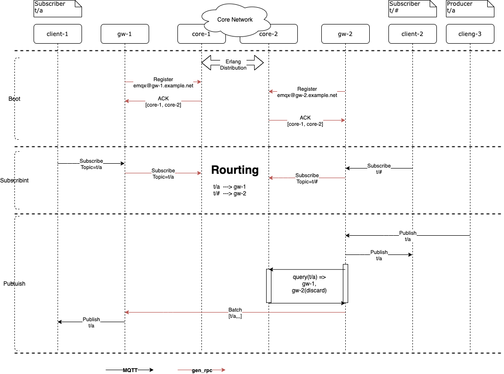

# Stateless Brokers in EMQ X v5.0

```
Author: Shawn <liuxy@emqx.io>
Status: Draft
Type: Design
Created: 2020-10-27
EMQ X Version: 5.0
Post-History:
```

## Abstract

This proposal gives a suggestion that breaks the emqx to two node types
('gateway' and 'core').  We could specify the node type when starting an emqx
node. By default (when node type is not specified) it is a 'core' type node.

## Motivation

To improve the scalability of emqx cluster without having to extend the number
of database (which is so far a full-mesh network) nodes to allow the broker
elastically scale according to the number of concurrent connections. The goal
is to scale the number of brokers up to 1,000 nodes.

## Rationale

A distributed system improves it scalability by adding more nodes to handle
the growing amount of requests, but it also introduces more complexities,
especially when we have to maintain states across multiple nodes.

For availability we need to maintain multiple replicas of the state, to avoid
single point of failure or to improve the performance of read operations;
For consistency we need to keep the replicas synchronized, to make the entire
cluster works like a single server.

ACID transactions in a large cluster also become a challenge. For example,
to globally create session for a client-id, some synchronization mechanism like
distributed locking might be necessary, but it may significantly affect the
performance of session creation.

All the above problems limit the scalability of EMQX clusters. we propose to
splist the cluster to two parts:

1. Confine the state mutations in a relatively small, stateful cluster
   (the core cluster)
2. Push the heavy lifting network IO management to the stateless nodes
   (the gateway nodes)

## Design

### Architecture

This proposal suggests breaking EMQX node into 2 types: the (stateless)
gateway nodes, and the (stateful) core nodes.

- A core node is a fully featured MQTT broker, with a distributed database.
  It can work as a single node, or join other nodes to form a cluster. It also
  manages below states/data in a globally replicated database (Mnesia):

  * All configs like rules (emqx-rule-engine) and plugin settings

  * Stateful processes such as persisted sessions

  * Queued messages in persisted sessions

  Some of the states may have to be partitioned in the future, but not in the
  scope of this proposal.

- A gateway node is a db-less front-end which handles connections and requests
  from MQTT clients. Without having to do the booking work like the core nodes
  it should allow such node to be tuned for dedicating resources to serve
  the clients. It's statelessness should also make it easier and quicker to
  create or destroy a node in morden service orchestration platforms such as
  AWS and k8s.

To the gateway nodes, the core nodes should work like a database or storage
engine which helps sharing persisted states globally.

```
                 [Gateway Nodes] | [Core Nodes]
                                 |
    +---+           +--------+   |   +--------+
    |   |           |        |   |   |        |
    |   |     +-----> Gateway|   |   |  Core  |
    |   |     |     |        |   |   |        |
    |   |     |     +--------+   |   +--------+
    | L |     |                  |
    |   |     |     +--------+   |
    |   |     |     |        |   |
    |   +-----------> Gateway|   |
    |   |     |     |        |   |
    |   |     |     +--------+   |
    | B |     |                  |
    |   |     |     +--------+   |   +--------+
    |   |     |     |        |   |   |        |
    |   |     +-----> Gateway|   |   |  Core  |
    |   |           |        |   |   |        |
    +---+           +--------+   |   +--------+
                                 |
                                 |
                                 +
```

### Cluster and communication between nodes

There's no clustering for gateway nodes. In other words, the gateway nodes do
not communicate with each other, but only through the core nodes.

Gateway nodes and core nodes communicate over `gen_rpc`, either side can be
both caller and callee. `gen_rpc` may reuse the underlying tcp connections
but logically the communication is unidirectional.

#### Core Node to Core node

The core network is a fully meshed Erlang cluster. This may change in the future
when we employee other protocols such as gossip for data replication.
Messages are passed using Erlang distribution.

#### Discovery of Core nodes by Gateway nodes

At start/restart, a gateway node should issue a registration request,
announcing its presence to (random) one of the core nodes.
The serving core node sends back a list of serving core nodes in the
response.

The registration API could be HTTP(S) to make management easier. e.g.

```
curl -XPOST http://core-1:12333/register?endpoint=gateway-1:2333
```

This command registers endpoint `gateway-1:2333` to the core network so the
core nodes can send `gen_rpc` messages for publishing messages to the gateway.
In the reply, HTTP body may look like:

```
{"reg_id":1, "core_nodes": ["core-1:2333","core-2:2333"]}
```

Where "reg_id" is an integer assigned by the core cluster.
This ID should be a globally unique integer replicated to all core nodes.

Depending on the capacity of a gateway node, there could be a very large number
of topics pointing to the same gateway, so it makes sense to have a compact
value (integer) instead of the full `host:port` string for its reference.

#### Broking messages

The subscription info is the data related to the mapping from topics to
subscribers. The subscription info may involve the following tables:

- Subscriber table:
  Maintains the mapping from TopicFilter -> SubPid | RegID
  SubPid implies a local subscription.
  RegID points to a remote node.

- Trie table:
  Used for matching a TopicName to all the possible wildcard topic-filters in
  the system.

When MQTT client subscribes to a node (gateway or core), the node frist updates
its local routing tables, then forward the subscription information to the core
cluster if it is a gateway node. Within the core cluster, all routing
inforamtion is replicated to all core nodes.

When MQTT client publishes messages, the target topic is used to query for
subscribers both locally (the 'Local' subscribers) and remotely (the 'Remote'
subscribers). When it is a local subscriber, the query should return the
subscriber connection's Erlang pid. When it's a remote subscriber, the query
should return the node ID.

Upon a node (gateway or core) receiving messages from publishers, the node
should query for both local and remote subscribers. For local subscribers,
the messages are forwarded using erlang:send. For remote subscribers,
messages can be batched for a `gen_rpc` call towards the remote node.

When issuing `gen_rpc` calls, we can use `{ClientId, Topic}` as the `gen_rpc`
[shard key](https://github.com/priestjim/gen_rpc#per-key-sharding).



#### Benefits

The benefit of this architecture is that we could set up thousands of gateway
nodes without needing to keep a global view of the nodes.
Adding/Removing a gateway is simplified because of their statelessness.
The drawback is that messages forwarding between gateway nodes have to go
through the core network.

However, considering that we may need to maintain message queues in the core
nodes for persistent sessions, this starts making sense because we would have
to pass the messages to the core nodes for queuing anyway.

Messages sent between the gateway and core nodes can be batched for higher
throughput.

Another benefit of this approach is that we could set up connections between
multiple geographically deployed core clusters to enable the cross data-center
message passing. In this case, only the core nodes will require direct
connectivity from one core cluster to another. It's nice as there are probably
much more gateway nodes than core nodes, so that setting up connections between
core nodes ar easier than doing that between the gateway nodes.

### Mnesia/ETS Tables

- Tables in Gateway Nodes

    emqx_coap

    |           Name            | Type |                Structure                |     |
    | ------------------------- | ---- | --------------------------------------- | --- |
    | coap_topic                | local-ram | {Topic, MaxAge, CT, Payload, MilliSec)} |     |
    | coap_response_process     | local-ram | {Name, Pid, MonitorRef}                 |     |
    | coap_response_process_ref | local-ram | {MonitorRef, Name, Pid}                 |     |

    emqx_lwm2m

    |            Name             | Type |       Structure        |     |
    | --------------------------- | ---- | ---------------------- | --- |
    | lwm2m_object_def_tab        | local-ram | {ObjectId, ObjectXml}  |     |
    | lwm2m_object_name_to_id_tab | local-ram | {NameBinary, ObjectId} |     |
    | lwm2m_clients **newly added** | local-ram | {EndpointName, ...} |     |

    emqx_sn

    |            Name             | Type |       Structure        |     |
    | --------------------------- | ---- | ---------------------- | --- |
    | emqx_sn_registry_<Variable> | local-ram | {TopicId, TopicName}  |     |

    emqx_rule_engine

    |            Name             | Type |      Structure       |                                            |
    | --------------------------- | ---- | -------------------- | ------------------------------------------ |
    | emqx_rule_action | local-ram  | {action, Name, Category, For, App, Types, Module, OnCreate, OnDestroy, Title, Descr} | Actions |
    | emqx_action_instance | local-ram | {ID, Name, Fallbacks, Args}  | Action Instances  |
    | emqx_action_instance_params | local-ram | {ID, Params, Apply}  | Anonymous Func Table for Action instances  |
    | emqx_resource_type | local-ram  | {resource_type, Name, Provider, ParamSpec, OnCreate, OnStatus, OnDestroy, Title, Descr} | Resources |
    | emqx_resource | local-ram | {ID, Type, Config, CreateAt, Descr} | Resource instances |
    | emqx_resource_params | local-ram | {ID, Params, Status} | Dynamic param/status Table for resource instances |

    emqx_core

    |            Name             | Type |      Structure  | |
    | --------------------------- | ---- | -------------------- | --- |
    | emqx_suboption | local-ram | {SubPid, Topic} -> SubOption  |  |
    | emqx_subscriber | local-ram | Topic -> SubPid  |   |
    | emqx_subscription | local-ram | SubPid -> Topic  |   |

    |            Name             | Type |      Structure  | |
    | --------------------------- | ---- | -------------------- | --- |
    | emqx_broker_helper | local-ram | {shards, Integer}  |  |
    | emqx_subid | local-ram | {SubId, SubPid}  |  |
    | emqx_submon | local-ram | {SubPid, SubId}  |  |
    | emqx_subseq | local-ram | Integer  | Topic Subscribed Counter |

    |            Name             | Type |      Structure  | |
    | --------------------------- | ---- | -------------------- | --- |
    | emqx_channel | local-ram | {ClientId, ChanPid}  |  |
    | emqx_channel_conn | local-ram | {{ClientId,Pid}, ConnMod}  |  |
    | emqx_channel_info | local-ram | {{ClientId,Pid}, Info} |  |

    |            Name             | Type |      Structure  | |
    | --------------------------- | ---- | -------------------- | --- |
    | emqx_command | local-ram | {{Seq, Cmd}, MF, Opts}  |  |
    | emqx_flapping| local-ram | {Clientid, PeerHost, StartedAt, DetetCount}  |  |
    | emqx_hooks| local-ram | {Name, Callbacks}  |  |
    | emqx_metrics | local-ram | {Name, Type, Idx} |  |
    | emqx_mod_topic_metrics | local-ram | {Topic, CounterRef} |  |
    | emqx_shared_subscriber | local-ram | {{Group, Topic}, SubPid} |  |
    | emqx_alive_shared_subscribers | local-ram | SubPid |  |
    | emqx_stats | local-ram | [{Key, Counter}] |  |

    |            Name             | Type |      Structure  | |
    | --------------------------- | ---- | -------------------- | --- |
    | emqx_active_alarm | local-ram  | {activated_alarm, Name, Details, Message, ActivateAt} |  |
    | emqx_deactive_alarm | local-ram  | {deactivated_alarm, ActivateAt, Name, Details, Message, DeactivateAt} |  |

- Tables in Core Nodes (in addition to tables in gateway nodes)

    |            Name             | Type |      Structure  | |
    | --------------------------- | ---- | -------------------- | --- |
    | emqx_channel_registry |  global-ram | {channel,ClientID,Pid} |  |
    | emqx_route |  global-ram | {route,Topic,Node} |  |
    | emqx_routing_node |  global-ram | {emqx_routing_node, Node, _} |  |
    | emqx_shared_subscription |  global-ram | {emqx_shared_subscription,GroupName,Topic,SubPid} |  |
    | emqx_trie |  global-ram | {trie,Edge,TrieNodeId} |  |
    | emqx_trie_node |  global-ram | {trie_node, TrieNodeId, EdgeCount, Topic, Flags}  |  |
    | emqx_mod_delayed |  global-disc | {delayed_message, Key, Msg}  |  |
    | emqx_psk_file | local-ram  | {psk_id :: binary(), psk_str :: binary()}  |     |
    | emqx_banned | local-ram  | {banned, Who, By, Reason, At, Until}  |    |
    | emqx_telemetry | global-disc  | {telemetry, Id, UUID, Enabled} |  |
    | emqx_rule | global-disc  | {rule, ID, For, RawSQL, IsForeach, Fields, DoEach, InCase, Conditions, OnActionFailed, Actions, Enabled, Descr} |  |
    | mqtt_admin | global-disc  | {mqtt_amdin, Username, Password, Tags} |  |
    | mqtt_app | global-disc  | {mqtt_app, Id, Secret, Name, Desc, Status, Expired} |  |
    | emqx_user | global-disc  | {emqx_user, Login, Password, IsSuperUser} |  |
    | emqx_acl | global-disc  | {emqx_acl, Login, Topic, Action, Allow} |  |
    | scram_auth | global-disc  | {scram_auth, Username, StoredKey, ServerKey, Salt, IterationCount} |  |
    | emqx_retainer | global-disc  | {retained, Topic, Msg, ExpiryTime} |  |

### Core Network Federation

If we need to deploy two more active-active clusters cross data centers,
two core networks can be federated using the same mechanism as a core network
serving multiple gateway nodes.

That is, for topics of interest for federation, one or more nodes in Net2
may subscribe to Net1 as if it is a gateway node, and viceversa.

The only exception is that there is no client ID given in the federation
subscription requests, so the network acceptin the subscription does not have
to suddenly expand its database to include all client IDs.
This implies a client (or a gateway node) is able to subscribe in both networks.

### Session Management

The session can be temporary or persistent, controlled by `Session Expiry
Interval`. A session consists of:

- The session state:

  RocksDB Table: session_state

  ```
  client: "c1"  ## the key of the table
  subscriptions: [{"t/1", qos2}, {"t/2", qos0}]
  subids: [1: "t/1", 2: "t/2"]
  will_msg: ""
  will_delay_internal: ""
  session_expiry_interval: 2h
  ```

- The message queue that is pending to be sent to the client:

  RocksDB Table: message_queue

  ```
  key: {client: "c1", topic: "t/1", qos: 2}
  msg_q: [5:"okay", 4:"good job", 3:"nice", 2:"great", 1:"hello"]
  ```

- The inflight queue the has been sent to the client but not ACKed:

  RocksDB Table: inflight_queue

  ```
  key: {client: "c1", topic: "t/1", qos: 2}
  inflight: [2:"b", 1:"a"]
  ```

- The QoS2 message received but not completed:

  RocksDB Table: incomplete_qos2_msgs

  ```
  key: {client: "c1", topic: "t/1"}
  msgs: [msg1, msg2]
  ```

One session is split to several tables here. The session_state is always stored
in the tables, no matter it is a persistent session or not.
We keep session states in the core cluster simply because the gateway
nodes do not have the global view of client's uniqueness in the whole network.

We also store a copy of the message queues and inflight queues for the
persistent session in core nodes, as we have to keep a long-lived state and
messages for the client, without worrying about the creation/destroy of the
gateway nodes.

The other tables are only necessary when the session is persistent, and they
are only located in the core nodes.

The message queues and inflight queues are maintained by the MQTT connection
process located in the gateway nodes, we call it "active" message queue or
"active" inflight queue. The copy of the queues are created/updated while the
messages are passing through the core nodes. When the persistent client
subscribes a topic, the gateway also subscribes the topic-filter to the core
nodes with a "persistent" flag. So if a matched PUBLISH message comes, it
will be queued in the core node.

### Retained Messages

The retained messages are stored in core nodes and also partitioned by topic
like the persistent message queues. Unlike the retained message queue,
only the latest retained message will be stored on a specific topic.
When a client subscribes to the topic-filter, the retained message will be sent
to the client.

### State Management of Other Protocols

#### LwM2M

LwM2M is a M2M protocol based on CoAP and it is more and more popular in low
battery device solutions, especially in the NB-IoT network.

A client in LwM2M protocol is identified by the peername (source IPAddress
and source port), but in practical the IP and port are probably changed
frequently, so in most cases we use endpoint-name as the identifier of a client.

LwM2M have no session but it do have a state that lasts for some period of time
defined by "lifetime" in the protocol, if a client with the same endpoint-name
connected again within the lifetime, no matter from which gateway node, the
state should be restored.

The LwM2M state consists of:

1. The messages pending to be sent to the client but the client is in the sleep
   state.

2. The CoAP tokens of messages.

The LwM2M state is maintained in the LwM2M channel process, and there's also a
copy in the core node. The core node is selected by the hash of endpoint-name.

```
+---------+     +---------+     +---------+
|  Core1  |     |  Core3  |     |  Core2  |
|   c1    |     |   c2    |     |   c3    |
+----^----+     +----^----+     +----^----+
     |               |               |
     +---------------+---------------+
                     |
                +----------+    REGISTER
                |  Gateway | <----------- c1,c2,c3
                | c1,c2,c3 |
                +----------+
```

Every "NOTIFY" message sent from the device will also go to their state in the
core nodes. The copy of the state in core node works like the "shadow" process
of the state running in the gateway.

### Presence Notifications

Presence notifications are sent by the session/state from the core node:

When the session/state is created, the core node invokes the callback functions
in plugins which may send out a "client_online" message to the user's
application server.

When the session/state is terminated, the core node invokes the callback
functions in plugins which may send out a "client_off" message.

The hooks "client.connected" and "client.disconnected" are not good for sending
out this kind of notifications, as the might be more than one competing
connections using the same client-id/endpoint-name.

There will be eventually only one connection left in the system, but it hard to
control the order of the "connected" and "disconnected" notification if they
are sent from different gateway nodes.

## References
